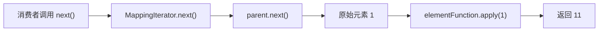
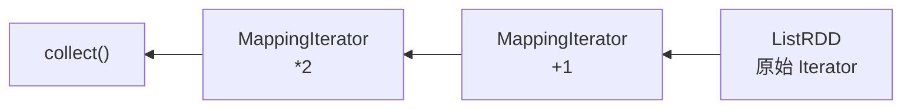
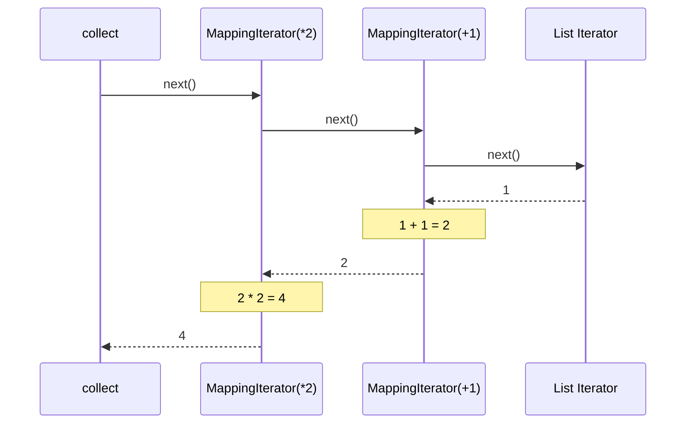

# 第 3 章 · MapPartitionsRDD 与惰性流水线

> 💻 本章完整代码：[GitHub 查看](https://github.com/rchaocai/mini-spark/tree/main/ch03-mappartitions-pipeline)
>
> 构建运行：`mvn -pl ch03-mappartitions-pipeline package && java -cp ch03-mappartitions-pipeline/target/classes com.sparklearn.Main`

上一章，我们造出了第一个 RDD：

```java
ListRDD<String> rdd = new ListRDD<>(words);
Iterator<String> iterator = rdd.compute();
```

它已经能代表一批数据，也知道该如何提供一个新的 `Iterator`。但它还只能把数据原样交出来。真实的数据处理显然不会止步于此：我们要把数字乘 2、筛掉无效记录、把一行文本拆成多个单词。

这一章，我们给 RDD 加上三个最基础的**变换算子**：

```java
rdd.map(...)
   .filter(...)
   .flatMap(...);
```

真正重要的不是把这三个方法写出来，而是回答一个更深的问题：

> 连续写下多个算子后，程序怎样做到不提前生成中间 `List`，而是在消费结果时让每个元素一次穿过整条计算链？

答案没有复杂的执行计划。我们只需要把一个 `Iterator` 套在另一个 `Iterator` 外面。

## 3.1 第一步：在 next() 里完成变换

先把 RDD 放到一边。假设手里只有一个整数迭代器：

```java
Iterator<Integer> parent = Arrays.asList(1, 2, 3).iterator();
```

现在希望从它读到的不是 `1、2、3`，而是 `11、12、13`。最直接的办法，是再写一个迭代器：

> 为了突出本章的核心调用链，正文代码片段省略了 `Objects.requireNonNull` 等参数和返回值校验；可运行源码保留了这些防御性检查。

```java
public final class MappingIterator<T, U> implements Iterator<U> {
    private final Iterator<T> parent;
    private final Function<T, U> elementFunction;

    public MappingIterator(Iterator<T> parent, Function<T, U> elementFunction) {
        this.parent = parent;
        this.elementFunction = elementFunction;
    }

    @Override
    public boolean hasNext() {
        return parent.hasNext();
    }

    @Override
    public U next() {
        return elementFunction.apply(parent.next());
    }
}
```

完整实现见 [`MappingIterator.java`](https://github.com/rchaocai/mini-spark/tree/main/ch03-mappartitions-pipeline/src/main/java/com/sparklearn/MappingIterator.java)。

这个类只做两件事：

1. `hasNext()` 直接询问父迭代器。
2. `next()` 从父迭代器拿到一个元素，再用 `elementFunction` 变换它。

用它包装刚才的 `parent`：

```java
Iterator<Integer> mapped =
        new MappingIterator<>(parent, number -> number + 10);
```

这行代码执行完后，`number -> number + 10` **一次都没有运行**。构造函数只是保存了父迭代器和函数。只有外部真正调用 `mapped.next()` 时，变换才发生：

```text
mapped.next()
    -> parent.next()
    -> elementFunction.apply(父元素)
    -> 返回变换后的元素
```

`MappingIterator` 没有保存结果列表，也没有提前遍历父数据。它只是站在父迭代器外面，每次有人要下一个元素时，临时加工一次。



这就是本章最小、也最关键的一块积木：**变换不是先生成一批新数据，而是在读取下一个元素的过程中发生。**

## 3.2 第二步：把迭代器变换接到 RDD 上

`MappingIterator` 已经能边读边变换，但它还只是一个独立的迭代器。我们希望写出的是：

```java
RDD<Integer> plusOne = rdd.map(number -> number + 1);
```

这里有两个要求：

- `map()` 应该返回一个新的 RDD，原来的 `rdd` 保持不变。
- 调用 `map()` 时不能立刻消费数据，只记录“以后怎么算”。

为此，我们引入 `MapPartitionsRDD`：

```java
public final class MapPartitionsRDD<T, U> extends RDD<U> {
    private final RDD<T> parent;
    private final Function<Iterator<T>, Iterator<U>> iteratorTransform;

    public MapPartitionsRDD(
            RDD<T> parent,
            Function<Iterator<T>, Iterator<U>> iteratorTransform) {
        this.parent = parent;
        this.iteratorTransform = iteratorTransform;
    }

    @Override
    public Iterator<U> compute() {
        Iterator<T> parentIterator = parent.compute();
        return iteratorTransform.apply(parentIterator);
    }
}
```

完整实现见 [`MapPartitionsRDD.java`](https://github.com/rchaocai/mini-spark/tree/main/ch03-mappartitions-pipeline/src/main/java/com/sparklearn/MapPartitionsRDD.java)。

注意这里保存的 `iteratorTransform`：

```java
Function<Iterator<T>, Iterator<U>>
```

它接收父 RDD 的迭代器对象，再返回一个新的迭代器对象。至于这个新迭代器内部做的是 `map`、`filter` 还是 `flatMap`，`MapPartitionsRDD` 并不关心。

这里最容易误会的一行是：

```java
return iteratorTransform.apply(parentIterator);
```

看起来像“把整个父迭代器执行一遍”，但其实不是。`apply` 在这里只是一次普通的方法调用：把 `parentIterator` 这个对象交进去，拿回一个包装后的迭代器对象。以 `map` 为例，它等价于：

```java
return new MappingIterator<>(parentIterator, elementFunction);
```

这行代码只是在父迭代器外面套一层壳，不会调用 `parentIterator.next()`，也不会遍历数据。后面 `collect()` 会反复调用最外层迭代器的 `hasNext()` 和 `next()`，由这两个方法共同拉动数据。`map` 的元素变换发生在 `next()` 中；后面看到的 `filter` 和 `flatMap` 还会在 `hasNext()` 中向父迭代器取数据。

本章代码里其实有两种不同层次的函数，必须把它们分清：

| 函数 | 类型 | 什么时候调用 | 做什么 |
|---|---|---|---|
| `iteratorTransform` | `Iterator<T> -> Iterator<U>` | 每次 `compute()` 时调用一次 | 包装迭代器对象，不读取元素 |
| `elementFunction` | `T -> U` | 每次 `MappingIterator.next()` 时调用一次 | 读取并变换一个元素 |

所以，`iteratorTransform.apply(...)` 中的 `apply` 并不等于“遍历”。`Function.apply` 具体做什么，完全取决于传进去的 Lambda。我们传入的是：

```java
iterator -> new MappingIterator<>(iterator, elementFunction)
```

这个 Lambda 的函数体只有一个 `new`，没有 `while`、没有 `for`、也没有 `next()`。因此调用它只会创建一个 `MappingIterator`。

于是，`RDD.map()` 可以写成：

```java
public <U> MapPartitionsRDD<T, U> map(Function<T, U> elementFunction) {
    return new MapPartitionsRDD<>(
            this,
            iterator -> new MappingIterator<>(iterator, elementFunction));
}
```

把这段代码从内往外读：

1. `this` 是父 RDD。
2. 父 RDD 将来会通过 `compute()` 提供一个 `iterator`。
3. 新建 `MappingIterator` 包住这个父迭代器。
4. 最终返回一个新的 `MapPartitionsRDD`。

调用 `map()` 时，`parent.compute()` 还没有发生，`MappingIterator` 也还没有创建，更没有元素经过 `elementFunction`。现在保存下来的只是两层配方：

```text
ListRDD：以后创建原始 Iterator
MapPartitionsRDD：以后在原始 Iterator 外包装 MappingIterator
```

直到 `collect()` 调用 `compute()`，这张配方才按下面的顺序展开：

```text
1. parent.compute()
   创建 List 的原始迭代器，但不读取元素

2. iteratorTransform.apply(parentIterator)
   创建 MappingIterator，把原始迭代器包在里面，但仍不读取元素

3. compute() 返回最外层 MappingIterator

4. collect() 进入 while 循环
   调用最外层 iterator.hasNext()
   调用最外层 iterator.next()

5. MappingIterator.next()
   调用 parent.next() 取一个原始元素
   调用 elementFunction.apply(...) 变换这一个元素
```

第 1 到第 3 步是在**搭建迭代器链**，第 4、5 步才是在**让数据流过迭代器链**。`compute()` 返回的是“准备好以后逐个计算”的迭代器，不是已经计算完成的整批数据。

> [!INFO]
> **为什么叫 MapPartitionsRDD？我们明明还没有 Partition**
>
> 这个名字来自 Spark 的核心实现。真实 Spark 会对某个具体分区调用 `compute(split)`，再把该分区的父迭代器交给变换函数。本章还没有把 `Partition` 写进类型系统，所以暂时只有一条数据流；但 `Function<Iterator<T>, Iterator<U>>` 已经保留了“对一整个分区的数据流做变换”的关键形状。第 4 章加入分区和依赖后，这个名字会变得更加直观。

## 3.3 Transformation 只记账，Action 才执行

现在的 `map()` 只会构造新 RDD。要看到结果，还需要一个真正消费迭代器的方法：

```java
public List<T> collect() {
    List<T> result = new ArrayList<>();
    Iterator<T> iterator = compute();
    while (iterator.hasNext()) {
        T element = iterator.next();
        result.add(element);
    }
    return result;
}
```

这就是我们的第一个 **action（行动算子）**：`collect()`。

这里故意不用 Java 更短的写法：

```java
iterator.forEachRemaining(result::add);
```

因为这行代码会把最关键的过程藏起来。`forEachRemaining` 本质上就是在内部做同样的循环：只要还有下一个元素，就调用一次 `next()`，再把拿到的元素交给 `result.add(...)`。

写成 `while` 后，`collect()` 的动作就完全摊开了：

```text
while (iterator.hasNext())     // 问最外层迭代器：还有结果吗？
    iterator.next()            // 向最外层迭代器要一个结果
    result.add(element)        // 把这个结果放进 List
```

在当前这条只包含两层 `map` 的流水线里，`iterator.next()` 是元素变换真正发生的地方。如果 `iterator` 是最外层的 `MappingIterator(*2)`，它的 `next()` 会继续调用父迭代器的 `next()`；父迭代器如果又是 `MappingIterator(+1)`，它还会继续向更里面要数据。请求就这样一层层向内传，直到最底层的 `List` 迭代器吐出原始元素。

与它相对，`map()`、`filter()`、`flatMap()` 都是 **transformation（转换算子）**。

两者的区别不是名字，而是会不会消费数据：

| 类型 | 本章中的方法 | 调用时发生什么 |
|---|---|---|
| Transformation | `map`、`filter`、`flatMap` | 构造一个新 RDD，记录父 RDD 和变换函数 |
| Action | `collect` | 调用 `compute()` 拿到最外层迭代器，再用 `while` 循环反复调用 `hasNext()` 和 `next()` |

可以用带打印的函数验证：

```java
RDD<Integer> plusOne = new ListRDD<>(Arrays.asList(1, 2, 3))
        .map(number -> {
            System.out.println("map(+1): " + number);
            return number + 1;
        });

System.out.println("map 已构造");
List<Integer> result = plusOne.collect();
```

输出顺序是：

```text
map 已构造
map(+1): 1
map(+1): 2
map(+1): 3
```

`map 已构造` 先出现，证明 `map()` 本身没有执行函数。直到 `collect()` 里的 `iterator.next()` 开始向最外层迭代器索要元素，三个数字才依次流过 `map`。

这就是**惰性求值**在当前 mini-Spark 中的具体含义：

> Transformation 只扩展计算配方；Action 才按配方创建最外层迭代器，并通过 `hasNext()` / `next()` 消费数据流。

> [!WARNING]
> **`collect()` 会把结果全部放进内存**
>
> 它很适合本书目前的小数据演示，但真实 Spark 中，如果 RDD 很大，`collect()` 会把所有分区结果拉回 Driver，可能导致内存溢出。生产代码通常只在结果量确定很小时使用它。本章先用它作为最简单的执行触发器，后面再逐步加入真正的 Task 和调度过程。

## 3.4 顿悟时刻：元素逐个穿透整条流水线

单层 `map` 还看不出流水线的特别之处。现在连续写两层：

```java
RDD<Integer> pipeline = new ListRDD<>(Arrays.asList(1, 2, 3))
        .map(number -> {
            System.out.println("[+1] " + number);
            return number + 1;
        })
        .map(number -> {
            System.out.println("[*2] " + number);
            return number * 2;
        });

List<Integer> result = pipeline.collect();
```

如果每一层 `map` 都先生成完整的中间 `List`，打印顺序应该是：

```text
[+1] 1
[+1] 2
[+1] 3
[*2] 2
[*2] 3
[*2] 4
```

但实际输出是：

```text
[+1] 1
[*2] 2
[+1] 2
[*2] 3
[+1] 3
[*2] 4
```

第一个元素先完成 `+1`，紧接着完成 `*2`，变成最终结果 `4`；然后程序才去读取第二个原始元素。

为什么会这样？先看 `collect()` 调用 `compute()` 时构造出的嵌套关系：



`collect()` 消费的是最外层 `MappingIterator(*2)`。当它调用一次 `next()`，请求会由外向内传递，数据则由内向外返回：



把这次调用展开，就是：

```java
// 概念上的展开，不是实际源码
outerFunction.apply(
    innerFunction.apply(
        listIterator.next()
    )
);
```

这里有两个方向，很容易混淆：

- **请求方向**：`collect` 从外向内调用 `next()`。
- **数据方向**：原始元素从内向外经过每层函数，最终回到 `collect`。

我们没有在 `collect()` 中反向遍历 RDD 链，也没有先生成一个“正向执行计划”。`collect()` 只知道消费最外层迭代器。流水线之所以形成，是因为每层迭代器都知道该向自己的父迭代器索要数据。

这也解释了惰性流水线的两个直接好处：

1. **不物化中间结果。** `+1` 后的完整列表不会被保存。
2. **逐元素处理。** 一个元素可以连续穿过多层窄变换，然后才轮到下一个元素。

注意，我们记录的是“对这条数据流统一应用什么变换”，而不是为每条记录单独保存一份修改历史。这种面向整批数据、以统一算子描述变换的方式叫作**粗粒度变换（coarse-grained transformation）**。先记住这个词，第 8 章讨论容错重算时还会回来。

## 3.5 同一个骨架，装下 filter 和 flatMap

`map` 是一对一变换，父迭代器每提供一个元素，`MappingIterator` 就返回一个元素。`filter` 和 `flatMap` 仍然复用 `MapPartitionsRDD`，只是各自需要不同的迭代器包装器。

### filter：为什么必须暂存下一个元素

`filter` 不能把 `hasNext()` 直接委托给父迭代器。父迭代器还有元素，不代表剩余元素中一定有满足过滤条件的元素。因此，`FilteringIterator.hasNext()` 必须向后寻找下一个匹配项：

```java
public boolean hasNext() {
    if (hasBufferedElement) {
        return true;
    }

    while (parent.hasNext()) {
        T candidate = parent.next();
        if (predicate.test(candidate)) {
            nextElement = candidate;
            hasBufferedElement = true;
            return true;
        }
    }
    return false;
}
```

再看配套的 `next()`：

```java
public T next() {
    if (!hasBufferedElement && !hasNext()) {
        throw new NoSuchElementException();
    }

    T result = nextElement;
    nextElement = null;
    hasBufferedElement = false;
    return result;
}
```

把这两段放在一起看，`hasBufferedElement` 的作用就很清楚了。它不是性能优化，而是把“已经找到、但还没交出去的元素”保住。

假设父迭代器是 `[1, 2, 3]`，过滤条件是“只保留偶数”。`collect()` 的一次循环是：

```java
while (iterator.hasNext()) {
    T element = iterator.next();
    result.add(element);
}
```

调用过程如下：

```text
1. collect() 调用 filteringIterator.hasNext()
2. hasNext() 读到 1，不满足条件，继续读
3. hasNext() 读到 2，满足条件
4. hasNext() 把 2 存进 nextElement，并把 hasBufferedElement 设为 true
5. hasNext() 返回 true

6. collect() 调用 filteringIterator.next()
7. next() 看到 hasBufferedElement 已经是 true，直接取出 nextElement
8. next() 清空缓存，把 hasBufferedElement 改回 false
9. collect() 把 2 加进 result
```

这里最关键的是第 6、7 步：`next()` 不是重新扫描父迭代器，而是返回刚才 `hasNext()` 已经找到的那个元素。

如果删掉：

```java
if (hasBufferedElement) {
    return true;
}
```

调用者连续调用两次 `hasNext()` 时，第二次就会继续读取父迭代器，导致第一个匹配元素被覆盖或跳过。Java 的 `Iterator` 允许多次检查 `hasNext()`，检查本身不能改变下一次 `next()` 应该返回的结果。

而 `next()` 中的短路判断：

```java
if (!hasBufferedElement && !hasNext())
```

表达的是另一件事：已有缓存就直接返回；只有调用者没有先执行 `hasNext()`、直接调用 `next()` 时，才由 `next()` 自己寻找下一个匹配元素。

因此，缓存一个待返回元素是惰性 `filter` 的最小正确实现，不是提前加入的性能优化。完整代码见 [`FilteringIterator.java`](https://github.com/rchaocai/mini-spark/tree/main/ch03-mappartitions-pipeline/src/main/java/com/sparklearn/FilteringIterator.java)。

接到 RDD 上仍然只有一层包装：

```java
public MapPartitionsRDD<T, T> filter(Predicate<T> predicate) {
    return new MapPartitionsRDD<>(
            this,
            iterator -> new FilteringIterator<>(iterator, predicate));
}
```

### flatMap：在父迭代器与当前子迭代器之间切换

`flatMap` 会把一个父元素展开成多个子元素。例如，一行文本展开成多个单词：

```java
line -> Arrays.asList(line.split(" "))
```

`FlatMappingIterator` 保存一个 `current`，代表当前父元素展开后的子迭代器。当 `current` 耗尽时，再从 `parent` 取下一个元素：

```java
public boolean hasNext() {
    while (!current.hasNext() && parent.hasNext()) {
        current = elementFunction.apply(parent.next()).iterator();
    }
    return current.hasNext();
}
```

完整代码见 [`FlatMappingIterator.java`](https://github.com/rchaocai/mini-spark/tree/main/ch03-mappartitions-pipeline/src/main/java/com/sparklearn/FlatMappingIterator.java)。

三个算子虽然内部不同，接入 RDD 的骨架完全一致：

```text
父 RDD
  -> parent.compute()
  -> 用特定 Iterator 包装
  -> 返回 MapPartitionsRDD
```

所以它们可以自由串联：

```java
List<Integer> result = new ListRDD<>(Arrays.asList(1, 2, 3, 4, 5, 6))
        .map(number -> number * 3)
        .filter(number -> number > 10)
        .collect();

// [12, 15, 18]
```

## 3.6 本章小结

这一章，我们让 RDD 从“能够提供数据”进化成了“能够描述一串数据变换”。

核心零件有五个：

1. **`MappingIterator`**：在 `next()` 中应用函数，实现边读边变换。
2. **`MapPartitionsRDD`**：保存父 RDD 和 `Iterator -> Iterator` 的分区级变换。
3. **`FilteringIterator` 与 `FlatMappingIterator`**：分别实现过滤和一对多展开。
4. **`map`、`filter`、`flatMap`**：构造新 RDD 的 transformations，不立即消费数据。
5. **`collect()`**：第一个 action，从最外层迭代器持续拉取结果。

到这里，惰性求值已经不再是一个抽象名词。它就是一条清晰的调用链：外层要数据，内层逐级提供；原始元素返回时，顺路经过每一层变换。

不过，当前的每个 RDD 只知道自己的父 RDD，却还没有正式描述“我和父 RDD 是什么关系”。下一章，我们会引入**分区、血缘和依赖**，让这条计算链第一次成为可以被分析的结构。
