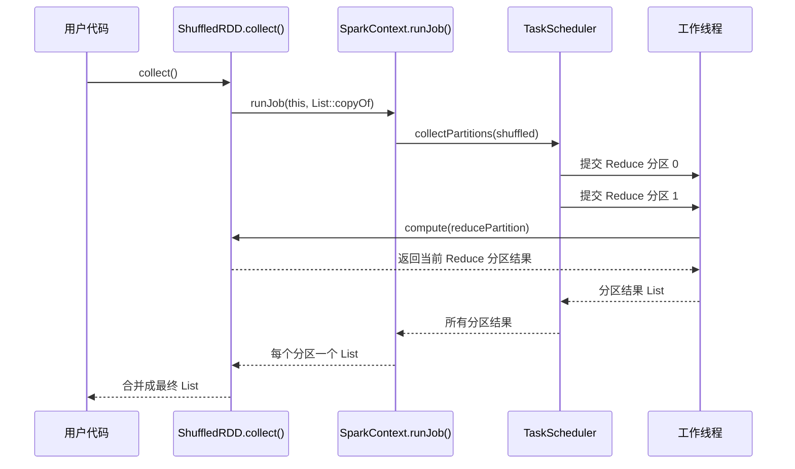
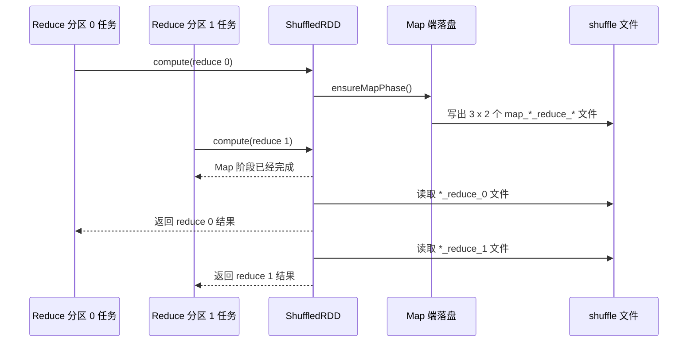

# 第 6 章 · 亲手写一个 Shuffle

> 💻 本章完整代码：[GitHub 查看](https://github.com/rchaocai/mini-spark/tree/main/ch06-shuffle)
>
> 构建运行：`mvn -pl ch06-shuffle package && java -Dfile.encoding=UTF-8 -cp ch06-shuffle/target/classes com.sparklearn.Main`

上一章完成了一个重要跃迁：RDD 的每个分区都可以变成一个 Task，交给 `TaskScheduler` 并行执行。

不过，到目前为止，所有流水线都有一个共同特点：

```text
分区 0 只读分区 0
分区 1 只读分区 1
分区 2 只读分区 2
```

`map`、`filter`、`flatMap` 都是这样。一个分区从头算到尾，最多沿着窄依赖去读同号父分区，不需要知道其他分区发生了什么。

本章要处理第一个真正麻烦的算子：`reduceByKey`。

先看一组键值对：

```text
分区 0:  (hello,1), (world,1), (hello,1)
分区 1:  (spark,1), (world,1), (hello,1)
分区 2:  (java,1),  (spark,1), (hello,1)
```

我们想得到词频：

```text
hello -> 4
world -> 2
spark -> 2
java  -> 1
```

问题来了：`hello` 分散在 3 个分区里。上一章的 Task 只会计算自己负责的分区，分区 0 的 Task 看不到分区 1 和分区 2。只靠原来的“同号父分区一路算下去”，已经不够了。

这就是 Shuffle 要解决的问题：

> 把原来按输入分区摆放的数据，重新按 key 摆放，让相同 key 的值最终来到同一个 Reduce 分区。

代码上，本章不是重写上一章的调度器，而是在上一章快照上只新增两样东西：

| 新增类 | 职责 |
|---|---|
| `KeyValuePair<K, V>` | 表示 `(key, value)` |
| `ShuffledRDD<K, V>` | 实现硬编码版 `reduceByKey` |

## 6.1 单个分区算不出全局答案

如果只看分区 0：

```text
(hello,1), (world,1), (hello,1)
```

它能算出：

```text
hello -> 2
world -> 1
```

这个结果不是“算错了”。在分区 0 自己的世界里，它完全正确。

但全局答案里，`hello` 应该是 4，`world` 应该是 2。差出来的部分，在别的分区里。

也就是说，`reduceByKey` 和 `map` 不一样。`map` 的每条输入记录只影响一条输出记录，分区之间互不打扰；`reduceByKey` 要把相同 key 的值收拢到一起，天然会跨分区。

最朴素的想法是：那就让几个 Task 共享一个 `HashMap`，大家一起往里面加。

单机 Java 当然做得到。加个锁，或者用 `ConcurrentHashMap`，技术上都能跑。

但这条路和上一章刚建立的 Task 边界冲突：每个 Task 只计算自己的分区，通过返回值交出结果，不写共享容器。这个约束让 Task 天然容易并行，也为后面跨机器执行留下空间。

更重要的是，一旦 Task 不在同一个 JVM 里，共享内存这条路就不存在了。线程之间还能共享对象，机器之间不能共享内存地址。

所以本章坚持一个规则：

```text
Task 之间不直接通信。
```

要跨分区交换数据，就必须把上游产物放到一个下游能够重新读取的位置。我们先用最朴素、最容易观察的办法：写本地文件。

先把整体入口摆出来：

> [!INFO]
> **`SparkContext` 是什么？**
>
> 它不是为了把代码“包装得好看”才加的类，而是为了解决 action 入口的问题。
>
> 上一章的调用方式是从外面把 RDD 交给 `TaskScheduler`。到了这里，action 写在 RDD 自己身上：用户调用的是 `shuffled.collect()`。那么 `collect()` 里面必须能找到一个调度器，否则它就不知道该把分区任务交给谁。
>
> `SparkContext` 就是这个连接点：源头 RDD 从它这里创建，并记住这个上下文；等 `collect()` 触发时，RDD 再通过同一个上下文进入 `runJob(...)`，最后由上下文里持有的 `TaskScheduler` 提交分区任务。

```java
try (SparkContext sc = new SparkContext(2, true)) {
    RDD<KeyValuePair<String, Integer>> rdd = sc.parallelize(words, 3);
    ShuffledRDD<String, Integer> shuffled = rdd.reduceByKey(
            Integer::sum, 2);

    System.out.println("reduceByKey 结果: " + shuffled.collect());
}
```

前三行只是在搭 RDD 血缘。真正开始执行的是最后的 `shuffled.collect()`。

先看 `RDD.collect()`：

```java
public List<T> collect() {
    List<List<T>> partitionResults = sparkContext.runJob(this, List::copyOf);
    List<T> result = new ArrayList<>();
    for (List<T> partitionResult : partitionResults) {
        result.addAll(partitionResult);
    }
    return result;
}
```

它没有自己遍历分区，而是把当前 RDD 交给 `SparkContext.runJob(...)`：

```java
public <T, U> List<U> runJob(
        RDD<T> rdd,
        Function<List<T>, U> partitionFunction) {
    List<List<T>> partitions = taskScheduler.collectPartitions(rdd);
    List<U> result = new ArrayList<>();
    for (List<T> partition : partitions) {
        result.add(partitionFunction.apply(partition));
    }
    return result;
}
```

这几段代码连起来，执行顺序是：



后面的小节就沿着这条线往里拆：先把 `(key, value)` 落成代码，再看 `reduceByKey` 怎么写文件、怎么读文件。

## 6.2 先把键值对落成代码

`reduceByKey` 的名字里有一个关键字：`Key`。

也就是说，系统不能只看到一个普通元素。它必须能回答两个问题：

```text
这条记录按谁分组？  -> key
分组以后合并什么？  -> value
```

词频统计里，`hello` 是 key，`1` 是 value。Shuffle 会根据 key 决定这条记录去哪个 Reduce 分区；到了 Reduce 分区以后，再把同一个 key 的 value 合并起来。

所以先把一条输入记录写成一个很小的 record：

```java
public record KeyValuePair<K, V>(K key, V value) implements Serializable {
}
```

完整实现见 [`KeyValuePair.java`](https://github.com/rchaocai/mini-spark/tree/main/ch06-shuffle/src/main/java/com/sparklearn/KeyValuePair.java)。

有了它，示例输入和源头 RDD 就可以连在一起看：

```java
List<KeyValuePair<String, Integer>> words = Arrays.asList(
        new KeyValuePair<>("hello", 1),
        new KeyValuePair<>("world", 1),
        new KeyValuePair<>("hello", 1),
        new KeyValuePair<>("spark", 1),
        new KeyValuePair<>("world", 1),
        new KeyValuePair<>("hello", 1),
        new KeyValuePair<>("java", 1),
        new KeyValuePair<>("spark", 1),
        new KeyValuePair<>("hello", 1));

RDD<KeyValuePair<String, Integer>> rdd = sc.parallelize(words, 3);
```

这段代码里有三个层次。

第一，`KeyValuePair<String, Integer>` 表示 key 是 `String`，value 是 `Integer`。也就是按单词分组，合并计数。

第二，`words` 只是普通 Java List，还不是 RDD。它只是把输入数据准备好。

第三，`sc.parallelize(words, 3)` 把这个 List 切成 3 个 Map 分区。这里的切分逻辑沿用上一章的 `ListRDD`：按连续区间切分，先算每个分区的基础大小，再把余数分给前面的分区。当前例子有 9 条数据、3 个分区，所以每个分区正好 3 条。

上一章会直接写：

```java
RDD<KeyValuePair<String, Integer>> rdd =
        new ListRDD<>(words, 3);
```

现在多了一个 `SparkContext`，所以源头 RDD 也从上下文创建：

```java
public <T> RDD<T> parallelize(List<T> data, int numberOfPartitions) {
    return new ListRDD<>(this, data, numberOfPartitions);
}
```

也就是说，`parallelize` 没有发明新的数据结构。它只是把“从本地 List 创建 RDD”这件事放到 `SparkContext` 入口下。这样后面的 `collect()` 才能沿着同一个上下文进入 `runJob(...)`，再交给调度器运行。

变量类型写成 `RDD<KeyValuePair<String, Integer>>`，是因为后面的代码只需要依赖 RDD 抽象；当前数据源底下实际仍然是 `ListRDD`。

## 6.3 Map 端：按 key 哈希写文件

现在开始写 `reduceByKey`。

先看调用方式：

```java
ShuffledRDD<String, Integer> shuffled = rdd.reduceByKey(
        Integer::sum, 2);
```

完整实现见 [`ShuffledRDD.java`](https://github.com/rchaocai/mini-spark/tree/main/ch06-shuffle/src/main/java/com/sparklearn/ShuffledRDD.java)。

这里的 2 表示有 2 个 Reduce 分区。构造 `ShuffledRDD` 时不会立刻计算，也不会写文件。它和前几章的 `map`、`filter` 一样，只是记录一份“将来怎么算”的配方。

先把 `ShuffledRDD.compute()` 当成一条完整路线看：

```java
public Iterator<KeyValuePair<K, V>> compute(Partition partition) {
    ensureMapPhase();
    return toKeyValuePairs(readAndMergeReducePartition(partition.index()));
}
```

这段代码先做两件事：保证 Map 阶段已经写完文件，再读取当前 Reduce 分区对应的文件并合并。整体就这么简单。后面再把这两步拆开看。

> [!INFO]
> **这里为什么由 `ShuffledRDD` 同时写和读？**
>
> 用户写的是 `rdd.reduceByKey(...)`，底层返回的是 `ShuffledRDD`。这是当前 API 的一个小妥协：方法暂时挂在所有 `RDD` 上，Java 类型系统还不能阻止你在非键值对 RDD 上误用它。专门的键值对 RDD 可以解决这个类型边界；这里先保持调用方向简单。
>
> 另外，本章还没有调度器来拆分“先跑 Map 任务、再跑 Reduce 任务”，所以“通知上游 Map 分区先落盘”这件事，暂时放在 `ShuffledRDD.compute()` 里面做。
>
> 当前代码的执行顺序是：`collect(shuffled)` 先提交 2 个 Reduce 分区任务；第一个进入 `compute()` 的线程拿到锁，顺序遍历父 RDD 的 3 个分区，写出 `3 × 2` 个文件；随后 2 个 Reduce 分区任务分别读自己的文件。
>
> 当执行层继续展开以后，这个物理过程会被拆开：Map 任务先在持有输入分区的位置写出 shuffle 文件，Reduce 任务再读取这些文件并合并。逻辑 API 上仍然是 `rdd.reduceByKey(...)` 返回一个下游 `ShuffledRDD`，不是两个逻辑 RDD；只是执行层会分成两批任务。

### 先保证 Map 阶段只跑一次

```java
private void ensureMapPhase() {
    if (!mapPhaseDone) {
        synchronized (this) {
            if (!mapPhaseDone) {
                runMapPhase();
                mapPhaseDone = true;
            }
        }
    }
}
```

为什么这里要加一个小小的 `synchronized`？因为上一章的 `TaskScheduler` 会并行计算多个 Reduce 分区。两个工作线程可能同时进入 `compute()`，Map 阶段只应该写一次文件，所以这里用一个很小的临界区守住“只跑一次”。

### 再写出 Map 端文件

进入 `runMapPhase()` 后，先看完整代码：

```java
private void runMapPhase() {
    for (Partition mapPart : parent.partitions()) {
        int mapId = mapPart.index();

        List<Map<K, V>> buckets = new ArrayList<>();
        for (int i = 0; i < numReducePartitions; i++) {
            buckets.add(new HashMap<>());
        }

        Iterator<KeyValuePair<K, V>> it = parent.iterator(mapPart);
        while (it.hasNext()) {
            KeyValuePair<K, V> kv = it.next();
            int bucketId = partition(kv.key(), numReducePartitions);
            buckets.get(bucketId).merge(kv.key(), kv.value(), reduceFunc);
        }

        for (int reduceId = 0; reduceId < numReducePartitions; reduceId++) {
            writeMapOutput(mapId, reduceId, buckets.get(reduceId));
        }
    }
}
```

这段代码分三层。

第一层，遍历父 RDD 的每个 Map 分区：

```java
for (Partition mapPart : parent.partitions()) {
    int mapId = mapPart.index();
    // ...
}
```

第二层，对每个 Map 分区准备 N 个桶，N 等于 Reduce 分区数：

```java
List<Map<K, V>> buckets = new ArrayList<>();
for (int i = 0; i < numReducePartitions; i++) {
    buckets.add(new HashMap<>());
}
```

每读到一条键值对，就用 key 的哈希值决定它进入哪个桶：

```java
static int partition(Object key, int numPartitions) {
    return (key.hashCode() & Integer.MAX_VALUE) % numPartitions;
}
```

这行代码很普通，却是 Shuffle 的核心：它把“原来在哪个输入分区”这件事抹掉，重新按 key 决定“应该去哪个 Reduce 分区”。

然后把值放进对应桶里：

```java
int bucketId = partition(kv.key(), numReducePartitions);
buckets.get(bucketId).merge(kv.key(), kv.value(), reduceFunc);
```

`merge` 做了两件事。

如果这个 key 第一次进入桶，就把它放进去。如果桶里已经有这个 key，就用 `reduceFunc` 把旧值和新值合并。

这叫 Map 端本地 combine。它的好处很直接：同一个 Map 分区里重复出现的 key，不用一条一条写到磁盘，而是先合并成一条再写。

例如分区 0 里有两个 `hello`：

```text
(hello,1), (world,1), (hello,1)
```

写盘前就可以先变成：

```text
hello -> 2
world -> 1
```

最后，每个桶写成一个文件。文件名同时记录来源和去向：

```java
for (int reduceId = 0; reduceId < numReducePartitions; reduceId++) {
    writeMapOutput(mapId, reduceId, buckets.get(reduceId));
}
```

```text
map_0_reduce_0
map_0_reduce_1
map_1_reduce_0
map_1_reduce_1
map_2_reduce_0
map_2_reduce_1
```

3 个 Map 分区，2 个 Reduce 分区，所以一共 6 个文件。空桶也会写一个表示 `size=0` 的文件。这样 Reduce 端可以清楚地区分“这个桶为空”和“这个文件丢了”。

文件格式不是本章重点。代码里直接用了 Java 自带的 `ObjectOutputStream`：

```java
private void writeMapOutput(int mapId, int reduceId, Map<K, V> data) {
    File file = mapOutputFile(mapId, reduceId);
    try (ObjectOutputStream out = new ObjectOutputStream(
            new BufferedOutputStream(new FileOutputStream(file)))) {
        out.writeInt(data.size());
        for (var entry : data.entrySet()) {
            out.writeObject(entry.getKey());
            out.writeObject(entry.getValue());
        }
    } catch (IOException e) {
        throw new UncheckedIOException("写入 shuffle 文件失败: " + file, e);
    }
}
```

先写一个整数 `data.size()`，表示这个桶里有几条记录；然后把每个 key 和 value 按对象写进去。因为用了对象序列化，本章示例默认 key 和 value 都能被序列化；`String` 和 `Integer` 没问题，如果换成自定义对象，就要自己实现可序列化。现在先关心 Shuffle 的物理过程：谁写、写到哪、谁再读。

## 6.4 Reduce 端：读属于自己的那批文件

Reduce 端的整体逻辑也先看一眼：

```java
private Map<K, V> readAndMergeReducePartition(int reduceId) {
    Map<K, V> merged = new HashMap<>();
    for (int mapId = 0; mapId < numMapPartitions; mapId++) {
        Map<K, V> mapOutput = readMapOutput(mapId, reduceId);
        for (var entry : mapOutput.entrySet()) {
            merged.merge(entry.getKey(), entry.getValue(), reduceFunc);
        }
    }
    return merged;
}
```

它做的事很直白：给定一个 Reduce 分区编号，把所有对应的 Map 文件都读出来，顺手合并成一个结果 `Map`。真正的细节，还是要拆开看。

Map 端写完以后，Reduce 分区开始计算。

Reduce 分区 0 只读所有 `*_reduce_0` 文件：

```text
map_0_reduce_0
map_1_reduce_0
map_2_reduce_0
```

Reduce 分区 1 只读所有 `*_reduce_1` 文件：

```text
map_0_reduce_1
map_1_reduce_1
map_2_reduce_1
```

对应代码也很直接：

```java
Map<K, V> merged = readAndMergeReducePartition(reduceId);
```

`readMapOutput(...)` 会按 Map 端写入的格式读回来：

```java
@SuppressWarnings("unchecked")
private Map<K, V> readMapOutput(int mapId, int reduceId) {
    File file = mapOutputFile(mapId, reduceId);
    Map<K, V> result = new HashMap<>();
    try (ObjectInputStream in = new ObjectInputStream(
            new BufferedInputStream(new FileInputStream(file)))) {
        int size = in.readInt();
        for (int i = 0; i < size; i++) {
            K key = (K) in.readObject();
            V value = (V) in.readObject();
            result.put(key, value);
        }
    } catch (IOException | ClassNotFoundException e) {
        throw new RuntimeException("读取 shuffle 文件失败: " + file, e);
    }
    return result;
}
```

这里先读 `size`，再循环读取对应数量的 key/value。也就是说，Map 端和 Reduce 端不是靠“猜文件内容”配合，而是共享同一个很小的文件格式。

注意，Reduce 端又用了一次同样的 `merge`。

Map 端的 `merge` 是把同一个 Map 分区内部的重复 key 先合并。Reduce 端的 `merge` 是把来自多个 Map 分区的局部结果合并成全局结果。

也就是说，`reduceByKey` 在这个 mini 实现里就是两段合并：

```text
Map 端：同一输入分区内先合并
Reduce 端：不同输入分区的局部结果再合并
```

同一个 `reduceFunc` 被用了两次。对于整数求和，这完全自然：

```java
Integer::sum
```

这也解释了为什么这类 reduce 函数要满足结合律。先局部合并，再全局合并，结果应该和从头到尾一次性合并一样。本章用整数加法，因为它既满足结合律，也满足交换律；像减法这类和合并顺序强相关的函数，就不适合直接拿来做 `reduceByKey`。

## 6.5 跑一次，看见中间文件

先看 demo 入口，运行的就是这段流程。完整实现见 [`Main.java`](https://github.com/rchaocai/mini-spark/tree/main/ch06-shuffle/src/main/java/com/sparklearn/Main.java)。

```java
public static void main(String[] args) {
    demonstrateShuffle();
}

private static void demonstrateShuffle() {
    List<KeyValuePair<String, Integer>> words = Arrays.asList(
            new KeyValuePair<>("hello", 1),
            new KeyValuePair<>("world", 1),
            new KeyValuePair<>("hello", 1),
            new KeyValuePair<>("spark", 1),
            new KeyValuePair<>("world", 1),
            new KeyValuePair<>("hello", 1),
            new KeyValuePair<>("java", 1),
            new KeyValuePair<>("spark", 1),
            new KeyValuePair<>("hello", 1));

    try (SparkContext sc = new SparkContext(2, true)) {
        RDD<KeyValuePair<String, Integer>> rdd = sc.parallelize(words, 3);
        ShuffledRDD<String, Integer> shuffled = rdd.reduceByKey(
                Integer::sum, 2);

        System.out.println("reduceByKey 结果: " + shuffled.collect());
    }
}
```

前两步只是准备数据和构造 `ShuffledRDD`。真正触发 Shuffle 的，是最后这一句 `shuffled.collect()`。

运行本章 demo：

```bash
mvn -pl ch06-shuffle package
java -Dfile.encoding=UTF-8 -cp ch06-shuffle/target/classes com.sparklearn.Main
```

前半段会打印输入数据和 Map 分区：

```text
分区 0: [KeyValuePair[key=hello, value=1], KeyValuePair[key=world, value=1], KeyValuePair[key=hello, value=1]]
分区 1: [KeyValuePair[key=spark, value=1], KeyValuePair[key=world, value=1], KeyValuePair[key=hello, value=1]]
分区 2: [KeyValuePair[key=java, value=1], KeyValuePair[key=spark, value=1], KeyValuePair[key=hello, value=1]]
```

然后构造 `ShuffledRDD`：

```text
这里只是构造结果 RDD，还没有真正写文件
```

这句话很重要。`reduceByKey` 仍然是 transformation，不是 action。真正触发计算的是后面的：

```java
shuffled.collect()
```

这时可以把前面的调用链继续展开到 `ShuffledRDD.compute()` 内部：



也就是说，`TaskScheduler` 只知道“有 2 个 Reduce 分区要并行算”。至于第一次进入 `ShuffledRDD.compute()` 时为什么会先写 `3 × 2` 个文件，是 `ShuffledRDD` 在当前结构里的职责。

结果里 key 的顺序不重要，因为当前实现最后从 `HashMap` 取出结果：

```java
private Iterator<KeyValuePair<K, V>> toKeyValuePairs(Map<K, V> merged) {
    List<KeyValuePair<K, V>> result = new ArrayList<>();
    for (var entry : merged.entrySet()) {
        result.add(new KeyValuePair<>(entry.getKey(), entry.getValue()));
    }
    return result.iterator();
}
```

`HashMap.entrySet()` 不承诺固定顺序，所以输出顺序可能和前面列出的期望顺序不同。只要每个 key 的计数对上，就是正确结果。

demo 还会打印 Shuffle 目录：

```text
Shuffle 目录: /var/folders/.../spark-shuffle-...
  map_0_reduce_0  (...)
  map_0_reduce_1  (...)
  map_1_reduce_0  (...)
  map_1_reduce_1  (...)
  map_2_reduce_0  (...)
  map_2_reduce_1  (...)
```

你不需要关心临时目录的具体路径。关键是这 6 个文件真的出现在磁盘上了。

到这里，`reduceByKey` 的路线已经完整：

```text
父 RDD 的 3 个 Map 分区
  -> 按 key 哈希写成 3 × 2 个文件
  -> 2 个 Reduce 分区分别读属于自己的文件
  -> 合并相同 key
  -> collect 收回结果
```

## 6.6 删除文件，Reduce 端立刻失败

demo 最后做了一件有点“粗暴”的事：先成功 `collect` 一次，又对同一个 `ShuffledRDD` 再 `collect` 一次，确认它会复用已经写好的中间文件；随后删除刚才那 6 个中间文件，再对同一个 `ShuffledRDD` 第三次 `collect`。

对应代码在 `Main.java` 里：

```java
System.out.println("=== 6. 再次 collect ===");
System.out.println("再次 collect 成功: " + shuffled.collect());

System.out.println("=== 7. 删除中间文件后再次 collect ===");
if (files != null) {
    for (File file : files) {
        file.delete();
    }
}
dir.delete();
try {
    shuffled.collect();
    System.out.println("（不应该走到这里）");
} catch (RuntimeException e) {
    String message = e.getCause() != null
            ? e.getCause().getMessage()
            : e.getMessage();
    System.out.println("失败: " + message);
}
```

第三次会失败。

这不是 bug。恰恰相反，它说明我们真的写出了 Shuffle。

在本章 mini 实现里，`ShuffledRDD` 的 Map 阶段已经完成过一次，后面的 Reduce 分区不再重新走父 RDD 的迭代器，而是读磁盘上的 Map 输出文件。文件删掉以后，下游就没有输入了。

任何 shuffle 系统都必须先有 Map 输出，Reduce 端才能读取。成熟的分布式执行器可以重新调度丢失的 Map 任务，把缺失的 shuffle 输出再写出来。本章还没有容错和重试，所以会直接失败。

换句话说，中间文件不是日志，不是调试产物，也不是“顺手写一下”。它就是 Map 端和 Reduce 端之间传递数据的物理介质。

这也是本章最重要的一点：

```text
Shuffle 不是一个抽象名词。
它首先是一批被写下来的中间数据。
```

现在先不要急着给这条边界起更多名字。先把手感建立起来：只要同 key 数据散在多个分区里，就必须先重新分布；重新分布，就一定要有一个中间落点。等调度器开始关心执行顺序时，这个中间落点就会变成一条清晰的执行边界。

## 6.7 从哈希分桶到 Partitioner

6.3 里已经用 `partition(...)` 完成了哈希分桶：

```java
int bucketId = partition(kv.key(), numReducePartitions);
```

当时只关心一个直接问题：当前 key 应该写进哪个桶。现在再往前走一步，会发现这里其实包含一套完整的**分区规则**：

```text
输入：一个 key
规则：对 key 计算哈希值
输出：0 到 numPartitions - 1 之间的分区编号
```

这套“给定 key，返回分区编号”的规则叫作 **Partitioner**。它不只包含哈希计算，还要知道一共有多少个分区。把这两个部分合在一起，它的形状大致如下：

```java
interface Partitioner {
    int numPartitions();

    int getPartition(Object key);
}
```

当前实现只有一种哈希分区规则，所以用一个静态方法就够了：

```java
static int partition(Object key, int numPartitions) {
    return (key.hashCode() & Integer.MAX_VALUE) % numPartitions;
}
```

这里的两个运算各有作用：

- `& Integer.MAX_VALUE` 清掉符号位，把可能为负数的哈希值变成非负数。
- `% numPartitions` 再把这个非负数压到 `0` 到 `numPartitions - 1` 的范围内。

因此，只要 key 和分区数不变，算出的分区编号就不会变。不过，这个公式只保证“相同 key 去同一个分区”，不保证每个分区的数据量一定相等；数据是否均匀，还取决于 key 的哈希值分布。

当前 `ShuffledRDD` 会按照这套规则写文件，但规则只存在于计算过程里。计算结束后，下游 RDD 只能看到“这里有 2 个分区”，却不知道这 2 个分区是不是按 key 哈希得到的。

如果把 `Partitioner` 记录在 RDD 上，下游算子就能判断：这份数据是否已经按照自己需要的规则分好了。`Partitioner` 的价值不只是给一行取模代码起名字，更重要的是保存数据当前的分布方式。

> [!INFO]
> **Spark 为什么要让 RDD 记住 Partitioner？**
>
> 键值对 RDD 可以带有一个可选的 `partitioner`。`reduceByKey`、`partitionBy` 这类操作完成 Shuffle 后，会把所用的分区器记录在结果 RDD 上。
>
> `join` 需要把两个 RDD 中相同的 key 放到一起。它会先确定一个目标 `Partitioner`，再分别检查两个父 RDD：
>
> ```java
> if (parent.partitioner().equals(targetPartitioner)) {
>     // 第 i 个子分区直接读取第 i 个父分区
>     addOneToOneDependency(parent);
> } else {
>     // 先按目标分区器重新分布
>     addShuffleDependency(parent, targetPartitioner);
> }
> ```
>
> 例如，join 之前，两份数据都做过相同分区数的 `reduceByKey`：
>
> ```java
> RDD<KeyValuePair<String, Integer>> left =
>         leftInput.reduceByKey(Integer::sum, 2);
> RDD<KeyValuePair<String, Integer>> right =
>         rightInput.reduceByKey(Integer::sum, 2);
>
> left.join(right);
> ```
>
> 两次 `reduceByKey` 都使用“2 个分区的哈希分区器”。经过前面的 Shuffle，`left` 和 `right` 中相同的 key 已经位于编号相同的分区。`join` 只需让第 i 个子分区读取两边的第 i 个父分区，不必再把两份数据重新 Shuffle 一遍。
>
> 如果只有 `left` 做过 `reduceByKey`，那么 `left` 的分区结果仍然可以复用，但 `right` 还要经过一次 Shuffle。如果两边使用的分区数或分区规则不同，也不能直接逐分区 join。
>
> 多个 RDD 已经按照同一个 `Partitioner` 排列的状态，叫作 **co-partitioning**。它的作用不是让所有 Shuffle 消失，而是让系统识别出哪些父 RDD 已经满足分布要求，只重新分布不满足要求的那一部分。

现在可以更准确地理解 `Partitioner`：它既负责计算 key 的目标分区，也让后续算子知道这次分区结果能不能继续使用。

## 6.8 本章小结

本章在上一章的 TaskScheduler 基础上，只增加了一个最小版 `reduceByKey`。

它做的事情可以压缩成三步：

1. Map 端遍历父 RDD 分区，按 key 哈希进入 Reduce 桶。
2. 每个 Map 分区把每个 Reduce 桶写成一个本地文件。
3. Reduce 分区读取属于自己的那批文件，再次合并相同 key。

这套实现很小，但它已经抓住了 Shuffle 最核心的事实：跨分区的同 key 数据不会自己聚到一起，必须被重新分布；重新分布需要中间产物。在本章 mini 实现里，中间文件一旦丢失，下游计算就无法继续；后面的容错章节会再补上“如何重算回来”。

下一章，我们会把这道物理边界交给调度器。到那时，再来回答一个更大的问题：一条 RDD 血缘里，哪些计算可以放在一起跑，哪些地方必须切开？
