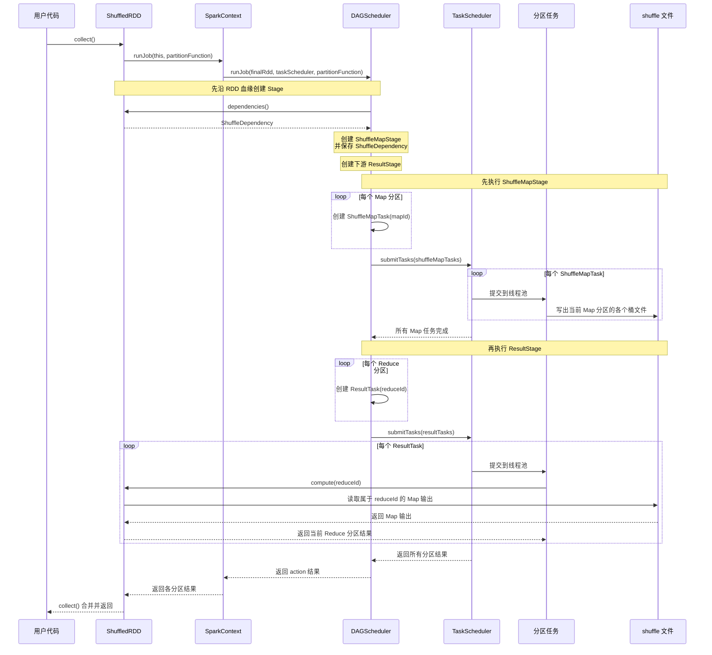
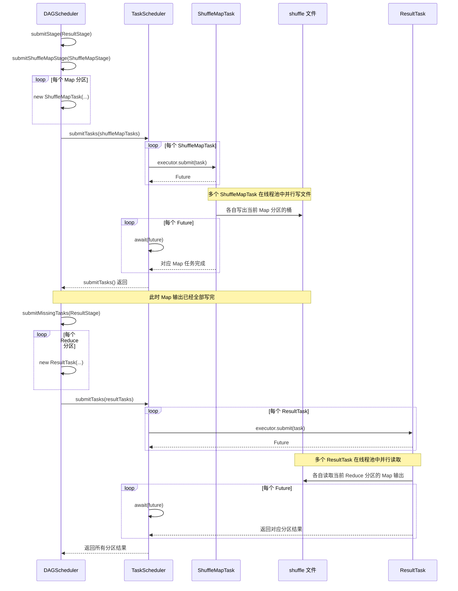

# 第 7 章 · 划分 Stage 与 DAG

> 💻 本章完整代码：[GitHub 查看](https://github.com/rchaocai/mini-spark/tree/main/ch07-stage-dag)
>
> 构建运行：`mvn -pl ch07-stage-dag package && java -Dfile.encoding=UTF-8 -cp ch07-stage-dag/target/classes com.sparklearn.Main`

上一章已经把 Shuffle 的物理边界摆在了台面上：Map 端会写出中间文件，Reduce 端再读取这些文件。

文件已经看见了。现在问题变成另一个：

```text
Reduce 端要读文件
文件必须先存在
所以写文件那一批计算，必须先完成
```

上一章为了先看清 Shuffle 文件，把写文件这件事放在了 `ShuffledRDD.compute()` 里面：Reduce 分区第一次被计算时，先推动上游 Map 分区写文件，然后自己再读文件。

这个安排可以跑通，但调度位置不对。因为此时 Reduce 分区任务已经开始执行了，才临时发现自己要读的文件还没有准备好。

现在要把这件事上移一层：

```text
提交 Reduce 分区任务之前
  -> 先让上游 Map 分区写出 shuffle 文件
  -> 再提交下游 Reduce 分区任务
```

调度器先看完整条血缘，发现中间有 Shuffle，就把作业切成两段：先主动触发写文件的那段，再提交读文件的那段。在一次 action 的执行过程中，`ShuffledRDD.compute()` 只负责 Reduce 端：读取父 Stage 刚刚写好的文件，并合并相同 key。

这个调度器每次收到 action，都会重新创建并执行对应的 `ShuffleMapStage`。它还不会记录哪些 Map 输出可以跨 action 复用，也不会只重算某一个丢失的文件。

`reduceByKey` 仍然返回 `ShuffledRDD`，因为 Shuffle 之后的数据仍然需要一个 RDD 来表示。变化的是它的执行职责：`ShuffledRDD` 不再决定“什么时候写 Map 输出”，只记录自己依赖一条 Shuffle 边，并在 `compute()` 中读取已经写好的 Map 输出。

分工可以整理成三层：

```text
ShuffledRDD
  -> 保存 ShuffleDependency
  -> compute() 读取 shuffle 输出

DAGScheduler
  -> 看到 ShuffleDependency
  -> 创建 ShuffleMapStage

ShuffleMapTask
  -> 计算父 RDD 的一个 Map 分区
  -> 写出 map 输出
```

为此，需要新增三样东西：

| 新增类 | 职责 |
|---|---|
| `Stage` | 表示沿 Shuffle 边界切出来的一段计算 |
| `DAGScheduler` | 沿 RDD 血缘回溯，遇到宽依赖切 Stage，并按父 Stage 先、子 Stage 后执行 |
| `ShuffleMapTask` | 运行父 RDD 的一个 Map 分区，并写出该分区的 shuffle 文件 |

这里不引入网络，不引入失败重试，也不把 join、partitioner 都实现出来。先只补一条最关键的规则：

```text
窄依赖不切 Stage。
宽依赖切 Stage。
```

## 7.1 从中间文件推出 Stage

先回到这个最小的 `reduceByKey` 例子。

输入数据被切成 3 个 Map 分区：

```text
分区 0:  (hello,1), (world,1), (hello,1)
分区 1:  (spark,1), (world,1), (hello,1)
分区 2:  (java,1),  (spark,1), (hello,1)
```

`reduceByKey(Integer::sum, 2)` 会产生 2 个 Reduce 分区。Map 端写出的文件是：

```text
map_0_reduce_0
map_0_reduce_1
map_1_reduce_0
map_1_reduce_1
map_2_reduce_0
map_2_reduce_1
```

3 个 Map 分区，2 个 Reduce 分区，所以一共 6 个文件。

Reduce 分区 0 只读所有 `*_reduce_0` 文件，Reduce 分区 1 只读所有 `*_reduce_1` 文件。

于是，执行顺序自然分成两段：

```text
第一段：把父 RDD 的所有 Map 分区算完，并写出 shuffle 文件
第二段：让下游 Reduce 分区读取这些文件，并合并相同 key
```

这两段之间的分界线，就是 **Stage 边界**。

更准确地说：

```text
Stage 是沿 Shuffle 边界切出来的一段计算。
```

在 `reduceByKey` 这个例子里，前一段叫 `ShuffleMapStage`，后一段叫 `ResultStage`：

```text
Stage 0: ShuffleMapStage，输出是 shuffle 中间文件
Stage 1: ResultStage，输出是用户要的最终结果
```

名字听起来像新概念，但它背后的物理事实很简单：那些 shuffle 文件必须先存在，下游才有东西可读。

## 7.2 窄依赖为什么不切

如果所有依赖都切 Stage，系统会变得很笨。

比如这条链：

```text
ListRDD -> map -> filter -> flatMap
```

这里没有跨分区重新分布。一个子分区只需要读自己对应的父分区，迭代器可以一层套一层往前拉数据。

前面已经看过这种执行方式：

```text
取一条数据
  -> 经过 map
  -> 经过 filter
  -> 经过 flatMap
  -> 交给 action
再取下一条数据
```

中间不需要把整个父 RDD 算完，也不需要落盘。数据可以像流水一样穿过整条窄依赖链。

所以，`map`、`filter`、`flatMap` 这类窄依赖不应该切 Stage。它们留在同一个 Stage 里，才能保持流水线执行。

和它相反的是 `reduceByKey`。

`reduceByKey` 的一个 Reduce 分区，可能要读所有 Map 分区写给它的文件。它不能只跟一个父分区打交道。它必须等一批上游输出准备好。

因此判据非常朴素：

```text
NarrowDependency：不切 Stage，继续往父 RDD 走。
ShuffleDependency：切 Stage，父 Stage 先把中间文件写出来。
```

引入 `Dependency` 时，我们只是把血缘分成了窄依赖和宽依赖。现在，这个分类第一次变成真正的调度规则。

## 7.3 RDD、Dependency 和 Stage 怎么接起来

现在把三个对象的关系连起来看：

```text
RDD 保存自己的依赖
  -> DAGScheduler 读取这些依赖
  -> 遇到 ShuffleDependency，就创建一个父 Stage
```

先看所有 RDD 都有的接口：

```java
public abstract class RDD<T> {
    public abstract List<Partition> partitions();

    public abstract Iterator<T> compute(Partition partition);

    public abstract List<Dependency<?>> dependencies();
}
```

`partitions()` 回答“这个 RDD 有几个分区”。

`compute(partition)` 回答“某个分区怎么算”。

`dependencies()` 回答“这个 RDD 依赖谁”。

Stage 划分只看第三个问题：**这个 RDD 的依赖是什么类型？**

对于普通的 `map`，依赖是窄依赖。一个子分区只读一个父分区，所以 `MapPartitionsRDD` 返回的是 `OneToOneDependency`：

```java
@Override
public List<Dependency<?>> dependencies() {
    return List.of(new OneToOneDependency<>(parent));
}
```

对于 `reduceByKey`，情况不同。`ShuffledRDD` 的每个 Reduce 分区都要读多个 Map 分区写出的文件，所以它返回的是 `ShuffleDependency`：

```java
private final ShuffleDependency<K, V> shuffleDependency;

private ShuffledRDD(RDD<KeyValuePair<K, V>> parent,
                    int numReducePartitions,
                    BinaryOperator<V> reduceFunc) {
    // ...
    this.shuffleDependency = new ShuffleDependency<>(
            parent,
            numReducePartitions,
            shuffleDir,
            reduceFunc);
}

@Override
public List<Dependency<?>> dependencies() {
    return List.of(shuffleDependency);
}
```

`dependencies()` 返回 `ShuffleDependency`，调度器沿 RDD 血缘回溯时，就能从这里发现 Shuffle 边界。至于 Map 输出该怎样写，则由这条依赖保存所需信息：

```java
public final class ShuffleDependency<K, V>
        implements Dependency<KeyValuePair<K, V>> {

    private final RDD<KeyValuePair<K, V>> rdd;
    private final int numReducePartitions;
    private final File shuffleDir;
    private final BinaryOperator<V> reduceFunc;

    public ShuffleDependency(
            RDD<KeyValuePair<K, V>> rdd,
            int numReducePartitions,
            File shuffleDir,
            BinaryOperator<V> reduceFunc) {
        this.rdd = Objects.requireNonNull(rdd, "rdd");
        this.numReducePartitions = numReducePartitions;
        this.shuffleDir = Objects.requireNonNull(shuffleDir, "shuffleDir");
        this.reduceFunc = Objects.requireNonNull(reduceFunc, "reduceFunc");
    }

    @Override
    public RDD<KeyValuePair<K, V>> rdd() {
        return rdd;
    }
}
```

`rdd()` 返回父 RDD，让调度器知道上游是谁。`numReducePartitions` 决定每个 Map 分区要写几个文件。`shuffleDir` 决定这些文件放在哪里。`reduceFunc` 用来在 Map 端先做一次本地 combine。

这里要抓住一个边界：`ShuffleDependency` 描述 shuffle，不亲自调度 shuffle。谁来调度，要等 `DAGScheduler` 看完整条血缘以后再决定。

接下来才轮到 Stage。Stage 不是 RDD 的替代品，它只是调度器根据 RDD 依赖切出来的执行段。完整实现见 [`Stage.java`](https://github.com/rchaocai/mini-spark/tree/main/ch07-stage-dag/src/main/java/com/sparklearn/Stage.java)。

```java
public record Stage(
        int id,
        RDD<?> rdd,
        boolean shuffleMap,
        List<Stage> parents,
        Optional<ShuffleDependency<?, ?>> shuffleDependency) {
}
```

`id` 是 Stage 编号。示例程序里会看到 `ShuffleMapStage 0` 和 `ResultStage 1`。

`rdd` 表示这个 Stage 要算到哪里。对于最终 Stage，它就是用户提交的最终 RDD；对于 ShuffleMapStage，它是宽依赖的父 RDD，也就是写 shuffle 文件之前那段窄依赖链的末端。

`shuffleMap` 区分两种 Stage：

| 值 | 含义 |
|---|---|
| `true` | 这是 `ShuffleMapStage`，输出是 shuffle 中间文件 |
| `false` | 这是 `ResultStage`，输出是最终结果 |

`parents` 是必须先完成的父 Stage。

`shuffleDependency` 只在 `ShuffleMapStage` 上有值。因为只有 ShuffleMapStage 需要写出 shuffle 文件，ResultStage 只需要读取最终结果。

最后看调度器如何把依赖变成 Stage：

```java
private void visit(RDD<?> rdd, Set<Stage> parents, Set<RDD<?>> visited) {
    if (!visited.add(rdd)) {
        return;
    }

    for (Dependency<?> dependency : rdd.dependencies()) {
        if (dependency instanceof ShuffleDependency<?, ?> shuffleDependency) {
            parents.add(newShuffleMapStage(shuffleDependency));
        } else {
            visit(dependency.rdd(), parents, visited);
        }
    }
}
```

这段代码只做一个判断：

```text
看到 OneToOneDependency 这类窄依赖：继续往父 RDD 走。
看到 ShuffleDependency：停下来，创建一个父 Stage。
```

创建 ShuffleMapStage 时，调度器把 `ShuffleDependency` 放进 Stage：

```java
private Stage newShuffleMapStage(ShuffleDependency<?, ?> dependency) {
    List<Stage> parents = getParentStages(dependency.rdd());
    return new Stage(
            nextStageId.getAndIncrement(),
            dependency.rdd(),
            true,
            parents,
            Optional.of(dependency));
}
```

把 Stage 的创建和执行放到同一条时间线上，关系会更直观：



时序图的前半段只是在创建 Stage，还没有运行分区任务。`DAGScheduler` 从 `ShuffledRDD.dependencies()` 取得 `ShuffleDependency`，把它保存在 `ShuffleMapStage` 中。

真正执行时，`DAGScheduler` 把 `ShuffleMapStage` 展开成一批 `ShuffleMapTask`，把 `ResultStage` 展开成一批 `ResultTask`。`TaskScheduler` 不再判断应该创建哪种任务，只负责把收到的任务提交到线程池。

注意，`ShuffledRDD.compute()` 不再补做 Map 端落盘。它的职责变窄了：只读取当前 Reduce 分区需要的 `map_*_reduce_i` 文件。写文件这一步已经被 Stage 调度提前完成。

为了保持 transformation 的惰性语义，`ShuffledRDD` 的构造方式没有改成“构造时就写文件”。它仍然只记录配方：

```java
ShuffledRDD<String, Integer> shuffled = mapped.reduceByKey(
        Integer::sum, 2);
```

此时 shuffle 目录里仍然没有文件。只有 `collect()` 这样的 action 真正执行时，文件才会出现。

## 7.4 DAGScheduler 怎么切 Stage

先不要急着看代码。把 RDD 血缘画成图，会更容易理解为什么需要一个叫 `DAGScheduler` 的东西。

示例程序里的 RDD 血缘是：

```text
ListRDD ──窄依赖──> MapPartitionsRDD ──宽依赖──> ShuffledRDD
```

这已经是一张图。箭头表示依赖方向：下游 RDD 需要上游 RDD 的结果。因为 RDD 不会原地修改，每一次 transformation 都创建新的 RDD，所以这张图不会绕回自己。这样的图叫 DAG，也就是有向无环图。

Stage 则是在这张 RDD DAG 上沿 Shuffle 边界切出来的更大节点：


这样看，`DAGScheduler` 的职责就很小了：沿 RDD DAG 往回走，遇到窄依赖就继续走，遇到 `ShuffleDependency` 就切出一个父 Stage。

示例血缘是一条直线，所以切出来的是一棵只有两层的 Stage 树。这里的调度器会从最终 RDD 递归寻找父 Stage，但不会在不同分支之间复用同一个 Stage，也不会把 Stage 状态保留到下一次 action。

完整实现见 [`DAGScheduler.java`](https://github.com/rchaocai/mini-spark/tree/main/ch07-stage-dag/src/main/java/com/sparklearn/DAGScheduler.java)。

入口很小：

```java
Stage createResultStage(RDD<?> finalRdd) {
    return newResultStage(finalRdd);
}
```

最终 RDD 对应的是 `ResultStage`。创建它时，调度器先调用 `getParentStages(rdd)`，沿着 `dependencies()` 往回找父 Stage：

```java
private List<Stage> getParentStages(RDD<?> rdd) {
    Set<Stage> parents = new LinkedHashSet<>();
    Set<RDD<?>> visited = new HashSet<>();
    visit(rdd, parents, visited);
    return List.copyOf(parents);
}
```

真正的判断规则，就是上一节看到的 `visit()`：遇到窄依赖就继续沿父 RDD 走；遇到 `ShuffleDependency` 就停下来，创建 `ShuffleMapStage`。

拿示例程序的血缘来说：

```text
ListRDD -> MapPartitionsRDD -> ShuffledRDD
```

从 `ShuffledRDD` 往回看，第一条依赖就是 `ShuffleDependency`。所以这里切开：

```text
Stage 0: ListRDD -> MapPartitionsRDD
Stage 1: ShuffledRDD
```

`ListRDD -> MapPartitionsRDD` 之间是 `OneToOneDependency`，属于窄依赖，不再继续切。

这就是从 RDD DAG 到 Stage 图的转换。RDD 图保留每一步 transformation，Stage 图只保留必须分段执行的边界。

## 7.5 先跑父 Stage，再跑子 Stage

Stage 树已经切出来了：

```text
ResultStage（计算 ShuffledRDD）
  └─ ShuffleMapStage（计算 MapPartitionsRDD）
```

现在只看一个问题：调用 `submitStage(ResultStage)` 后，代码怎样保证父 Stage 完成以前，ResultStage 的任务不会开始？

入口就是 `submitStage()`：

```java
private <T, U> List<U> submitStage(
        Stage stage,
        TaskScheduler taskScheduler,
        Function<Iterator<T>, U> partitionFunction,
        Set<Integer> finishedStages) {
    for (Stage parent : stage.parents()) {
        submitShuffleMapStage(parent, taskScheduler, finishedStages);
    }

    if (verbose) {
        System.out.println("提交 " + stage);
    }
    return submitMissingTasks(stage, taskScheduler, partitionFunction);
}
```

把当前 Stage 树代入这段代码，可以得到一张更小的时序图：



关键不只是代码先调用了父 Stage，而是 `submitShuffleMapStage(...)` 返回时，父 Stage 的所有任务已经执行完毕。`for` 循环结束以后，Map 输出文件已经准备好，代码才会继续提交 ResultStage：

```java
return submitMissingTasks(stage, taskScheduler, partitionFunction);
```

`DAGScheduler` 负责守住这个先后顺序。真正把每个分区任务交给线程池的，仍然是 `TaskScheduler`。

`ResultStage` 只记录最终要计算哪个 RDD。真正创建 `ResultTask` 时，还要回答另一个问题：计算完一个分区以后，当前 action 想得到什么结果？

同一个 RDD 可以调用不同的 action：

```java
rdd.collect();
rdd.count();
rdd.reduce(Integer::sum);
```

三种 action 计算的是同一条 RDD 血缘，区别只发生在最后一步：

| action | 拿到一个最终分区后做什么 | 单个分区的返回值 |
|---|---|---|
| `collect()` | 把迭代器中的元素放进 List | `List<T>` |
| `count()` | 一边遍历，一边计数 | `Long` |
| `reduce()` | 一边遍历，一边用 operator 合并 | `PartitionResult<T>` |

因此，`SparkContext.runJob(...)` 除了接收最终 RDD，还要接收一个**分区函数**：

```java
public <T, U> List<U> runJob(
        RDD<T> rdd,
        Function<Iterator<T>, U> partitionFunction) {
    return dagScheduler.runJob(rdd, taskScheduler, partitionFunction);
}
```

它的输入是最终 RDD 一个分区的 `Iterator<T>`，输出是这个分区交给 action 的结果 `U`。三个 action 只是传入不同的分区函数：

```java
// collect：当前分区 -> 元素列表
sparkContext.runJob(this, RDD::collectPartition);

// count：当前分区 -> 元素个数
sparkContext.runJob(this, RDD::countPartition);

// reduce：当前分区 -> 局部合并结果
sparkContext.runJob(
        this, iterator -> reducePartition(iterator, operator));
```

> [!INFO]
> **为什么 ResultTask 不先把分区收集成 List？**
>
> 因为“把分区变成 List”只是 `collect()` 的需要，不是所有 action 的共同需要。如果统一收集，`count()` 和 `reduce()` 也要额外保存整个分区。
>
> 分区函数直接接收 `Iterator<T>` 后，`collect()` 可以选择创建 List，`count()` 和 `reduce()` 则可以边遍历边计算。使用迭代器不是让 `collect()` 不再收集，而是让每个 action 自己决定是否需要保存全部元素。

`submitMissingTasks()` 是 Stage 真正变成 Task 的地方。先看 `ResultStage`：

```java
private <T, U> List<U> submitMissingTasks(
        Stage stage,
        TaskScheduler taskScheduler,
        Function<Iterator<T>, U> partitionFunction) {
    RDD<T> rdd = (RDD<T>) stage.rdd();
    List<ResultTask<T, U>> tasks = new ArrayList<>();
    for (Partition partition : rdd.partitions()) {
        tasks.add(new ResultTask<>(
                rdd, partition, partitionFunction, verbose));
    }
    return taskScheduler.submitTasks(tasks);
}
```

这里的 `stage.rdd()` 就是最终的 `ShuffledRDD`。循环每看到一个 Reduce 分区，就创建一个 `ResultTask`。因此，两个 Reduce 分区会得到两个 `ResultTask`。

`ResultTask` 计算一个最终 RDD 分区，再执行当前 action 传入的 `partitionFunction`：

```java
public U call() {
    return partitionFunction.apply(rdd.iterator(partition));
}
```

这行代码很关键：`ResultTask` 不关心当前 action 是 `collect()`、`count()` 还是 `reduce()`。它只负责把当前分区的迭代器交给分区函数。

对 `collect()` 来说，分区函数会把元素收进 List，所以每个 `ResultTask` 返回当前分区的元素列表；最后 `RDD.collect()` 再把这些列表合并起来。`count()` 和 `reduce()` 也使用同一个 `ResultTask`，但它们会直接遍历迭代器并返回计数或局部合并结果。

再看 `ShuffleMapStage`。`submitShuffleMapStage()` 先递归完成更早的父 Stage，然后调用另一个 `submitMissingTasks()`：

```java
private void submitShuffleMapStage(
        Stage stage,
        TaskScheduler taskScheduler,
        Set<Integer> finishedStages) {
    if (!finishedStages.add(stage.id())) {
        return;
    }

    for (Stage parent : stage.parents()) {
        submitShuffleMapStage(parent, taskScheduler, finishedStages);
    }
    if (!stage.shuffleMap()) {
        throw new IllegalArgumentException("stage must be a ShuffleMapStage");
    }

    if (verbose) {
        System.out.println("提交 " + stage);
    }
    submitMissingTasks(stage, taskScheduler);
    if (verbose) {
        System.out.println("  shuffle map 输出已写入磁盘");
    }
}
```

`finishedStages` 用来避免同一个 Stage 被重复提交。

中间的 `for` 循环处理更早的父 Stage。当前例子里只有两段，所以父 Stage 没有再往上的 Stage。

最后的 `submitMissingTasks(stage, taskScheduler)` 取得这条 Stage 保存的 `ShuffleDependency`：

```java
private void submitMissingTasks(Stage stage, TaskScheduler taskScheduler) {
    ShuffleDependency<?, ?> dependency = stage.shuffleDependency()
            .orElseThrow(() -> new IllegalStateException("missing shuffle dependency"));
    submitShuffleMapTasks(stage, taskScheduler, dependency);
}
```

接着，`DAGScheduler` 为父 RDD 的每个 Map 分区创建一个 `ShuffleMapTask`：

```java
private <K, V> void submitShuffleMapTasks(
        Stage stage,
        TaskScheduler taskScheduler,
        ShuffleDependency<K, V> dependency) {
    RDD<KeyValuePair<K, V>> rdd =
            (RDD<KeyValuePair<K, V>>) stage.rdd();
    List<ShuffleMapTask<K, V>> tasks = new ArrayList<>();
    for (Partition partition : rdd.partitions()) {
        tasks.add(new ShuffleMapTask<>(rdd, partition, dependency));
    }
    taskScheduler.submitTasks(tasks);
}
```

两类 Task 都创建好以后，进入的是同一个 `TaskScheduler.submitTasks(...)`：

```java
public <T> List<T> submitTasks(List<? extends Callable<T>> tasks) {
    List<Future<T>> futures = new ArrayList<>();
    for (Callable<T> task : tasks) {
        futures.add(executor.submit(task));
    }

    List<T> result = new ArrayList<>();
    for (Future<T> future : futures) {
        result.add(await(future));
    }
    return result;
}
```

`TaskScheduler` 不需要知道这些任务属于哪个 Stage，也不需要判断它们是写 Shuffle 文件还是计算最终结果。它只提交任务、等待 Future，并按提交顺序返回结果。

现在再总结 Stage 和 Task 的关系：

```text
ShuffleMapStage
  -> DAGScheduler 为每个 Map 分区创建一个 ShuffleMapTask
  -> TaskScheduler 提交这些任务

ResultStage
  -> DAGScheduler 为每个结果分区创建一个 ResultTask
  -> TaskScheduler 提交这些任务
```

`ShuffleMapTask` 做的事很单纯：读取父 RDD 的一个分区，按 key 分桶，然后写出属于各个 Reduce 分区的文件。

```java
public Void call() {
    List<Map<K, V>> buckets = new ArrayList<>();
    for (int i = 0; i < dependency.numReducePartitions(); i++) {
        buckets.add(new HashMap<>());
    }

    Iterator<KeyValuePair<K, V>> iterator = rdd.iterator(partition);
    while (iterator.hasNext()) {
        KeyValuePair<K, V> kv = iterator.next();
        int bucketId = dependency.partition(kv.key());
        buckets.get(bucketId).merge(
                kv.key(), kv.value(), dependency.reduceFunc());
    }

    for (int reduceId = 0;
         reduceId < dependency.numReducePartitions();
         reduceId++) {
        writeMapOutput(partition.index(), reduceId, buckets.get(reduceId));
    }
    return null;
}
```

写文件的方法和上一章的文件格式保持一致：先写条数，再写每个 key/value。

```java
private void writeMapOutput(int mapId, int reduceId, Map<K, V> data) {
    File file = dependency.mapOutputFile(mapId, reduceId);
    try (ObjectOutputStream out = new ObjectOutputStream(
            new BufferedOutputStream(new FileOutputStream(file)))) {
        out.writeInt(data.size());
        for (var entry : data.entrySet()) {
            out.writeObject(entry.getKey());
            out.writeObject(entry.getValue());
        }
    } catch (IOException e) {
        throw new UncheckedIOException("写入 shuffle 文件失败: " + file, e);
    }
}
```

到这里，三个对象的职责就分开了：

| 对象 | 职责 |
|---|---|---|
| `ShuffleDependency` | 保存写 Map 输出所需的信息：父 RDD、Reduce 分区数、shuffle 目录、合并函数 |
| `ShuffleMapTask` | 计算一个 Map 分区，并把这个分区的数据写成多个 Reduce 桶文件 |
| `ShuffledRDD` | 表示 shuffle 之后的结果 RDD，在 Reduce 阶段读取已经写好的 Map 输出 |

也就是说，写文件属于 `ShuffleMapTask`，读文件属于 `ShuffledRDD`。二者通过同一个 `ShuffleDependency` 连接到同一批 shuffle 文件。

对应到 `ShuffledRDD.compute()`，代码里已经没有“补写 Map 输出”的动作：

```java
@Override
public Iterator<KeyValuePair<K, V>> compute(Partition partition) {
    Objects.requireNonNull(partition, "partition");
    if (partition.index() < 0 || partition.index() >= partitions.size()) {
        throw new IllegalArgumentException("unknown partition: " + partition);
    }

    return toKeyValuePairs(readAndMergeReducePartition(partition.index()));
}
```

它只读取当前 Reduce 分区需要的 Map 输出，并合并相同 key：

```java
private Map<K, V> readAndMergeReducePartition(int reduceId) {
    Map<K, V> merged = new HashMap<>();
    for (int mapId = 0; mapId < numMapPartitions; mapId++) {
        Map<K, V> mapOutput = readMapOutput(mapId, reduceId);
        for (var entry : mapOutput.entrySet()) {
            merged.merge(entry.getKey(), entry.getValue(), reduceFunc);
        }
    }
    return merged;
}
```

到这里，两个调度器的分工就清楚了：

| 调度器 | 关心的问题 |
|---|---|
| `DAGScheduler` | 作业要切成几个 Stage，每个 Stage 应该创建哪些 Task |
| `TaskScheduler` | 把收到的 Task 提交给线程池，并等待执行结果 |

两个调度器处理的是不同层次的问题：先按 Shuffle 边界安排大步骤，再把具体的分区任务交给线程池执行。

## 7.6 跑一次，看 Stage 树

示例程序先构造一条稍长一点的血缘。完整实现见 [`Main.java`](https://github.com/rchaocai/mini-spark/tree/main/ch07-stage-dag/src/main/java/com/sparklearn/Main.java)。

```java
try (SparkContext sc = new SparkContext(2, true)) {
    RDD<KeyValuePair<String, Integer>> rdd = sc.parallelize(words, 3);

    MapPartitionsRDD<KeyValuePair<String, Integer>, KeyValuePair<String, Integer>> mapped =
            rdd.map(Function.identity());

    ShuffledRDD<String, Integer> shuffled = mapped.reduceByKey(
            Integer::sum, 2);

    System.out.println("reduceByKey 结果: " + shuffled.collect());
}
```

这里特意加了一个 `map(Function.identity())`。它不改变数据，只是让血缘里出现一个窄依赖，方便观察“不切 Stage”的规则。

运行：

```bash
mvn -pl ch07-stage-dag package
java -Dfile.encoding=UTF-8 -cp ch07-stage-dag/target/classes com.sparklearn.Main
```

你会看到 Stage 划分结果：

```text
ResultStage 1 (rdd=ShuffledRDD, parents=[0])
  ShuffleMapStage 0 (rdd=MapPartitionsRDD, parents=[])
```

这棵树要从下面往上读。

`ShuffleMapStage 0` 负责把 `MapPartitionsRDD` 之前的窄依赖链算完，并写出 shuffle 文件。

`ResultStage 1` 表示最终要提交的 `ShuffledRDD` 计算。它会在父 Stage 完成后，交给 `TaskScheduler` 启动 Reduce 分区任务。

执行时会先看到下面这个顺序：

```text
提交 ShuffleMapStage 0 (rdd=MapPartitionsRDD, parents=[])
  shuffle map 输出已写入磁盘
提交 ResultStage 1 (rdd=ShuffledRDD, parents=[0])
  提交 ResultStage 的分区任务
```

随后底层的 `TaskScheduler` 启动 `ShuffledRDD` 的 Reduce 分区任务，读文件并返回结果。用户侧只写了 `shuffled.collect()`。

结果里 key 的顺序仍然不重要，因为最后仍然是从 `HashMap` 转成结果列表：

```java
private Iterator<KeyValuePair<K, V>> toKeyValuePairs(Map<K, V> merged) {
    List<KeyValuePair<K, V>> result = new ArrayList<>();
    for (var entry : merged.entrySet()) {
        result.add(new KeyValuePair<>(entry.getKey(), entry.getValue()));
    }
    return result.iterator();
}
```

只要计数对上即可：

```text
hello -> 4
world -> 2
spark -> 2
java  -> 1
```

## 7.7 不是按算子名切

最后补一个容易误会的点。

Stage 不是按算子名字切的。不是看到 `reduceByKey`、`join` 这类名字就机械地切，也不是看到 `map` 就永远不切。

真正的判断只有一个：

```text
这个计算需不需要跨分区重新分布数据？
```

`reduceByKey` 需要把散在多个分区里的相同 key 聚到一起，所以这里一定会出现 Shuffle 边界。

判断更复杂的算子时，也要回到这个问题。只要数据不需要跨分区重新摆放，它就仍然可以留在同一个 Stage 里；一旦需要重新摆放，就会变成 Shuffle 边界。

## 7.8 本章小结

到这里，`Stage` 和 `DAGScheduler` 已经有了最小形状。

核心规则只有一句：

```text
窄依赖留在同一个 Stage，宽依赖切出新的 Stage。
```

这条规则把前面的几个概念串了起来：

1. 迭代器流水线，解释了窄依赖为什么可以放在同一个 Stage。
2. `Dependency` 分类，提供了切 Stage 的类型判据。
3. Shuffle 文件，解释了宽依赖为什么必须成为物理边界。

执行 `reduceByKey` 的 action 时，DAGScheduler 会先沿血缘找到 Shuffle 边界，创建父 `ShuffleMapStage`，主动写好中间文件；随后最终 `ResultStage` 才会创建 `ResultTask`，读取这些文件并返回结果。

下一章会继续追问一个更现实的问题：如果 `ShuffleMapStage` 写到一半失败，或者某个中间文件丢了，能不能只重算丢失的那一小块，而不是把整个作业从头来过？
