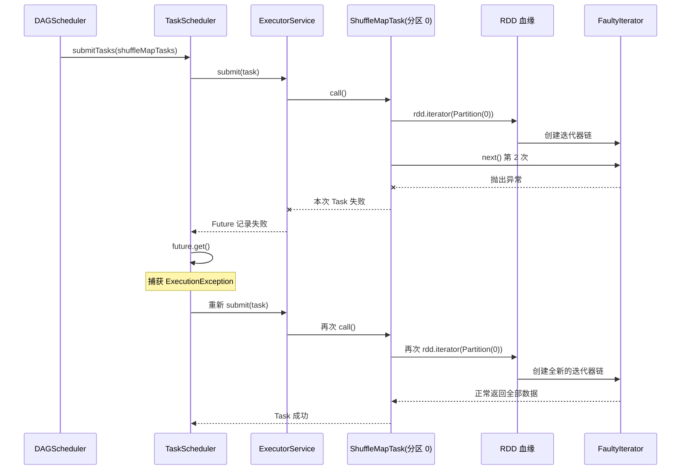

# 第 8 章 · 容错：FaultyIterator 与重算

> 💻 本章完整代码：[GitHub 查看](https://github.com/rchaocai/mini-spark/tree/main/ch08-fault-tolerance)
>
> 构建运行：`mvn -pl ch08-fault-tolerance package && java -Dfile.encoding=UTF-8 -cp ch08-fault-tolerance/target/classes com.sparklearn.Main`

上一章已经把一个 `reduceByKey` 作业切成了两个 Stage：

```text
ShuffleMapStage
  -> 计算 Map 分区
  -> 写出 shuffle 文件

ResultStage
  -> 读取 shuffle 文件
  -> 返回最终结果
```

顺序也已经固定：父 Stage 的所有 `ShuffleMapTask` 完成以后，才能提交下游 `ResultTask`。

但是，上一章默认每个 Task 都能一次成功。

真实执行环境不会这么配合。读文件可能失败，网络可能短暂超时，进程可能退出。即使暂时不引入网络，只在一个 JVM 里运行，Task 本身也可能在计算中抛出异常。

假设 3 个 Map 分区正在并行计算：

```text
Map 分区 0：失败
Map 分区 1：成功
Map 分区 2：成功
```

最浪费的做法，是把整个作业从头再跑一次。分区 1 和分区 2 明明已经完成，却要陪着分区 0 一起重算。

更合理的目标是：

```text
哪个 Task 失败，就只重试哪个 Task。
```

本章先在第 7 章代码上增加这样一个最小回路：

```text
Task 执行
  -> 失败
  -> TaskScheduler 捕获失败
  -> 重新提交同一个分区任务
  -> 沿 RDD 血缘重新计算该分区
```

把这个回路跑通以后，再处理第二种失败：

```text
ShuffleMapStage 已经完成
  -> 某个 Map 输出文件丢失
  -> Reduce Task 读取失败
  -> DAGScheduler 定位丢失输出的来源
  -> 只重算对应的 Map 分区
  -> 重新提交下游 Stage
```

两种失败看起来都表现为“Task 抛异常”，恢复位置却不同。运行中的普通异常可以在 TaskScheduler 内重试；丢失 shuffle 输出时，反复重试 Reduce Task 没有意义，必须回到 DAGScheduler 修复父 Stage 的输出。

先从第一层开始：**一个正在运行的 Task 失败以后，为什么重新执行它就能恢复？**

## 8.1 先制造一次可控的失败

要观察容错，第一步不是写重试，而是稳定地制造一次失败。

第 5 章已经用 `ExecutorService.submit(...)` 把 Task 交给线程池。Task 内部抛出的异常不会凭空消失，也不会因为来自工作线程就自动结束整个 JVM。线程池会把异常记录在对应的 `Future` 中：

```text
工作线程执行 Callable.call()
  -> call() 抛异常
  -> Future 记录失败
  -> 调用 future.get() 时抛出 ExecutionException
```

所以，单机上模拟 Task 失败并不需要杀线程。只要在 Task 的计算路径中选一个位置抛异常即可。

本章选择的位置是 `Iterator.next()`。

原因很直接：RDD 的一个分区最终就是通过迭代器被消费的。

```java
Iterator<T> iterator = rdd.iterator(partition);
while (iterator.hasNext()) {
    T value = iterator.next();
    // 处理 value
}
```

如果某次 `next()` 抛出异常，当前 Task 就会失败。其他 Task 在自己的线程中运行，不会因此停止。

于是，本章新增 `FaultyIterator`：

```java
public final class FaultyIterator<T> implements Iterator<T> {

    private final Iterator<T> parent;
    private final int failOnNextCall;
    private final AtomicInteger remainingFailures;
    private int nextCalls;

    @Override
    public T next() {
        if (!parent.hasNext()) {
            throw new NoSuchElementException();
        }

        nextCalls++;
        if (nextCalls == failOnNextCall && consumeOneFailure()) {
            throw new RuntimeException(
                    "FaultyIterator 在第 "
                            + failOnNextCall
                            + " 次 next() 时模拟失败");
        }
        return parent.next();
    }
}
```

完整实现见 [`FaultyIterator.java`](https://github.com/rchaocai/mini-spark/tree/main/ch08-fault-tolerance/src/main/java/com/sparklearn/FaultyIterator.java)。

构造时传入 `failOnNextCall = 2`，表示当前迭代器第二次调用 `next()` 时制造故障。

注意，这里先判断是否失败，再调用 `parent.next()`：

```java
if (nextCalls == failOnNextCall && consumeOneFailure()) {
    throw new RuntimeException(...);
}
return parent.next();
```

因此，失败发生时第二条数据还没有被父迭代器取走。当前 Task 会直接结束，这一轮已经算出的局部结果也不会交给调度器。

这和真实 Task 失败的语义一致：不是把“前半段结果”先交出去，再从中间继续；而是本次尝试整体失败。

## 8.2 为什么要共享剩余失败次数

如果 `FaultyIterator` 每次走到第二条都抛异常，那么重试多少次都不会成功。

```text
第一次尝试：第二条失败
第二次尝试：第二条仍然失败
第三次尝试：第二条仍然失败
```

这种故障更像永久故障。有限重试只能防止无限循环，不能让它恢复。

本章要模拟的是一次**瞬态故障**：第一次读取失败，下一次尝试时故障已经消失。

所以 `FaultyIterator` 接收一个共享的 `AtomicInteger`：

```java
AtomicInteger remainingFailures = new AtomicInteger(1);
```

它表示还要制造几次失败。

第一次迭代到故障点时，计数器从 1 减到 0，然后抛异常。调度器重试以后，会为同一个分区创建新的迭代器链，也会创建新的 `FaultyIterator`，但它们共享同一个 `remainingFailures`：

```text
第一次 FaultyIterator
  -> remainingFailures: 1 -> 0
  -> 抛异常

第二次 FaultyIterator
  -> remainingFailures: 0
  -> 不再抛异常
```

共享计数器只决定“这次是否模拟故障”，不参与数据变换，也不会改变任何输出元素。

这里使用 `AtomicInteger`，是因为不同分区的 Task 可能并发经过故障注入层。原子更新可以保证“只剩一次故障”不会被两个线程同时消费。

`consumeOneFailure()` 没有直接使用 `getAndDecrement()`：

```java
private boolean consumeOneFailure() {
    while (true) {
        int current = remainingFailures.get();
        if (current <= 0) {
            return false;
        }
        if (remainingFailures.compareAndSet(current, current - 1)) {
            return true;
        }
    }
}
```

这样计数器归零以后不会继续减成负数。多个线程同时竞争时，也只有成功把计数从 1 改成 0 的那个线程会制造失败。

## 8.3 只让指定分区失败

如果直接在普通 `MapPartitionsRDD` 外面套 `FaultyIterator`，每个分区都会经过它。并发执行时，哪一个分区先到达故障点取决于线程调度，演示结果就不稳定。

本章希望每次运行都明确看到：

```text
Map 分区 0 第一次失败
Map 分区 1 正常完成
Map 分区 2 正常完成
```

因此增加一个很薄的 `FaultyRDD`。它只负责把 `FaultyIterator` 放到指定分区外面：

```java
@Override
public Iterator<T> compute(Partition partition) {
    Iterator<T> iterator = parent.iterator(partition);
    if (partition.index() != faultyPartitionIndex) {
        return iterator;
    }
    return new FaultyIterator<>(
            iterator,
            failOnNextCall,
            remainingFailures);
}
```

完整实现见 [`FaultyRDD.java`](https://github.com/rchaocai/mini-spark/tree/main/ch08-fault-tolerance/src/main/java/com/sparklearn/FaultyRDD.java)。

它和普通 `MapPartitionsRDD` 一样，不改变分区数，也不跨分区搬数据，所以依赖仍然是 `OneToOneDependency`：

```java
this.dependencies = List.of(new OneToOneDependency<>(parent));
```

血缘会变成：

```text
ListRDD
  -> MapPartitionsRDD
  -> FaultyRDD
  -> ShuffledRDD
```

其中前三个 RDD 之间都是窄依赖，仍然留在同一个 `ShuffleMapStage`。`FaultyRDD` 不会额外切 Stage。

> [!INFO]
> **FaultyRDD 不是运行时容错机制**
>
> 它只是本章的故障注入工具，用来稳定指定“哪个分区、读到第几条时失败”。真正的容错变化发生在 `TaskScheduler` 中。
>
> 这样做也避免了为了演示故障而修改 `MapPartitionsRDD` 的通用接口。教学辅助代码和 RDD 核心抽象保持分离。

## 8.4 异常怎样走到 TaskScheduler

现在把一次失败放进第 7 章的执行链。

示例程序在 Shuffle 之前插入 `FaultyRDD`：

```java
RDD<KeyValuePair<String, Integer>> source =
        sc.parallelize(words, 3);

RDD<KeyValuePair<String, Integer>> mapped =
        source.map(Function.identity());

RDD<KeyValuePair<String, Integer>> faulty =
        new FaultyRDD<>(mapped, 0, 2, remainingFailures);

ShuffledRDD<String, Integer> shuffled =
        faulty.reduceByKey(Integer::sum, 2);
```

这里指定分区 0 的第二次 `next()` 失败一次。

调用 `shuffled.collect()` 后，`DAGScheduler` 仍然按上一章的规则切 Stage：

```text
ResultStage（ShuffledRDD）
  └─ ShuffleMapStage（FaultyRDD）
```

接着，它为 3 个 Map 分区创建 3 个 `ShuffleMapTask`。

分区 0 的调用链是：

```text
ShuffleMapTask.call()
  -> FaultyRDD.iterator(Partition(0))
  -> FaultyRDD.compute(Partition(0))
  -> MapPartitionsRDD.iterator(Partition(0))
  -> ListRDD.iterator(Partition(0))
  -> 创建 FaultyIterator
  -> 第二次 next() 抛异常
```

异常继续向外传播：

```text
FaultyIterator.next()
  -> ShuffleMapTask.call() 失败
  -> 工作线程结束本次 Callable
  -> Future 记录异常
  -> future.get() 抛出 ExecutionException
  -> TaskScheduler 看到失败
```

可以把这条链画成时序图：



到这里还没有任何“血缘恢复算法”。只是异常沿 Java 已有的 `Callable -> Future -> ExecutionException` 路径，被送到了调度器手里。

下一步才是决定：看到失败以后怎么办。

## 8.5 在统一入口增加重试

第 7 章的 `TaskScheduler.submitTasks(...)` 分两步：

```java
List<Future<T>> futures = new ArrayList<>();
for (Callable<T> task : tasks) {
    futures.add(executor.submit(task));
}

List<T> result = new ArrayList<>();
for (Future<T> future : futures) {
    result.add(await(future));
}
```

先把所有 Task 提交到线程池，再按提交顺序等待结果。

上一章的 `await(future)` 遇到 `ExecutionException` 会直接报告失败。本章把它换成 `awaitWithRetry(...)`：

```java
for (int index = 0; index < futures.size(); index++) {
    result.add(awaitWithRetry(
            tasks.get(index),
            futures.get(index)));
}
```

新的等待方法同时拿到 Task 和它第一次执行返回的 Future：

```java
private <T> T awaitWithRetry(
        Callable<T> task,
        Future<T> initialFuture) {
    Future<T> future = initialFuture;
    int retries = 0;

    while (true) {
        try {
            return future.get();
        } catch (InterruptedException e) {
            Thread.currentThread().interrupt();
            throw new IllegalStateException("task interrupted", e);
        } catch (ExecutionException e) {
            if (retries >= maxTaskRetries) {
                throw new IllegalStateException(
                        task + " failed after "
                                + (retries + 1) + " attempts",
                        e.getCause());
            }

            retries++;
            if (verbose) {
                System.out.println("  [重试] " + task
                        + " 失败: " + e.getCause().getMessage()
                        + "，开始第 " + retries + " 次重试");
            }
            future = executor.submit(task);
        }
    }
}
```

完整实现见 [`TaskScheduler.java`](https://github.com/rchaocai/mini-spark/tree/main/ch08-fault-tolerance/src/main/java/com/sparklearn/TaskScheduler.java)。

这段代码要分四步读。

第一步，正常完成时直接返回：

```java
return future.get();
```

第二步，线程被中断时不重试，而是恢复中断标记并退出：

```java
Thread.currentThread().interrupt();
throw new IllegalStateException("task interrupted", e);
```

中断通常表示上层正在要求当前线程停止，不应该被当成普通计算失败反复吞掉。

第三步，Task 抛异常时，`future.get()` 会抛出 `ExecutionException`。只要还没超过上限，就重新提交同一个 Task：

```java
future = executor.submit(task);
```

第四步，失败次数超过上限后，把最后一次异常作为 cause 交给调用方：

```java
throw new IllegalStateException(
        task + " failed after " + (retries + 1) + " attempts",
        e.getCause());
```

有限重试非常重要。瞬态故障可能在下一次尝试时恢复；代码错误、坏数据和永久硬件故障则不会。没有上限，永久故障会让作业永远循环。

本章默认每个 Task 最多重试 3 次，也可以通过 `SparkContext` 显式设置：

```java
try (SparkContext sc = new SparkContext(
        2,  // 工作线程数
        2,  // 每个 Task 最多重试 2 次
        true)) {
    // ...
}
```

## 8.6 为什么只改一处就够了

第 7 章已经把 Stage 和 Task 的职责拆开：

```text
DAGScheduler
  -> 为 ShuffleMapStage 创建 ShuffleMapTask
  -> 为 ResultStage 创建 ResultTask

TaskScheduler
  -> 统一提交 Callable
```

两类 Task 最终都会进入同一个方法：

```java
taskScheduler.submitTasks(tasks);
```

所以重试逻辑只需要放在 `TaskScheduler.submitTasks(...)` 这一处。

这意味着：

| 失败位置 | 被重试的任务 |
|---|---|
| 最终 RDD 分区计算失败 | `ResultTask` |
| Shuffle Map 分区计算失败 | `ShuffleMapTask` |

不需要分别实现：

```text
collect 重试
count 重试
reduce 重试
shuffle 写文件重试
```

`collect()`、`count()` 和 `reduce()` 的差别只在 `ResultTask` 最后应用的分区函数。它们共享相同的 Task 提交路径，所以自然共享相同的失败处理。

这也是为什么第 7 章要先把 action 统一成：

```java
SparkContext.runJob(
        rdd,
        partitionFunction);
```

如果每个 action 都自己管理线程池和 Future，本章就不得不复制三份重试循环。先把职责边界整理清楚，后面的功能才能长在正确的位置。

## 8.7 重新提交，为什么会沿血缘重算

现在来到本章最关键的一步。

`TaskScheduler` 做的只是：

```java
executor.submit(task);
```

它没有显式遍历 `dependencies()`，也没有写一个名为 `recomputeLineage()` 的方法。

为什么这仍然叫沿血缘重算？

先看 `ShuffleMapTask.call()` 的开头：

```java
Iterator<KeyValuePair<K, V>> iterator =
        rdd.iterator(partition);
```

每次执行 `call()`，都会重新调用一次 `rdd.iterator(partition)`。

而 `RDD.iterator(...)` 会进入当前 RDD 的 `compute(...)`：

```java
public final Iterator<T> iterator(Partition partition) {
    return compute(partition);
}
```

当前 Stage 的末端是 `FaultyRDD`。它的 `compute()` 先向父 RDD 请求同号分区：

```java
Iterator<T> iterator = parent.iterator(partition);
```

父 RDD 是 `MapPartitionsRDD`，它又会继续向 `ListRDD` 请求同号分区：

```java
Iterator<T> parentIterator = parent.iterator(partition);
return iteratorTransform.apply(parentIterator);
```

于是，每次 Task 尝试都会重新创建整条迭代器链：

```text
ListRDD 分区迭代器
  -> MappingIterator
  -> FaultyIterator
  -> ShuffleMapTask
```

第一次尝试失败以后，这条迭代器链会随失败的 Task 调用一起被丢弃。第二次 `call()` 不会接着使用旧迭代器，而是从 `ListRDD` 的同一个分区重新创建一条新链。

这就是重算。

```text
重试不是“从第 2 条继续”
重试是“从这个分区的起点再算一遍”
```

血缘在这里不是一份需要调度器手工解释的文本。它已经被编码在 RDD 对象之间的父子引用和 `compute()` 调用里。只要重新请求同一个分区，窄依赖链就会自然向上回溯。

对于本章的 `ShuffleMapTask`，失败发生在读取父分区期间。它先把记录放进内存桶，完整读完以后才写文件：

```java
while (iterator.hasNext()) {
    KeyValuePair<K, V> kv = iterator.next();
    int bucketId = dependency.partition(kv.key());
    buckets.get(bucketId).merge(
            kv.key(),
            kv.value(),
            dependency.reduceFunc());
}

for (int reduceId = 0;
     reduceId < dependency.numReducePartitions();
     reduceId++) {
    writeMapOutput(...);
}
```

因此，`FaultyIterator` 抛异常时，这一次尝试还没有开始写 shuffle 文件。重试会重新读取完整 Map 分区，再一次性写出它的所有 Reduce 桶文件。

如果故障发生在更复杂的外部写入中，就还要考虑临时文件、原子提交和残留清理。本章暂时把失败点放在读取阶段，是为了只观察“Task 失败 -> 分区重算”这条主线。

## 8.8 只重试失败的 Task

`submitTasks(...)` 一开始仍然会把所有 Task 全部提交：

```java
for (Callable<T> task : tasks) {
    futures.add(executor.submit(task));
}
```

假设 3 个 Map Task 的执行结果是：

```text
分区 0：失败
分区 1：成功
分区 2：成功
```

等待分区 0 的 Future 时，调度器重新提交的是：

```java
tasks.get(0)
```

分区 1 和分区 2 的 Future 不会被替换，它们已经得到的成功结果也不会被丢弃。

自动化测试专门验证了这一点：

```java
AtomicInteger firstTaskAttempts = new AtomicInteger();
AtomicInteger secondTaskAttempts = new AtomicInteger();

Callable<Integer> failsOnce = () -> {
    if (firstTaskAttempts.incrementAndGet() == 1) {
        throw new IllegalStateException("transient failure");
    }
    return 10;
};

Callable<Integer> succeedsImmediately = () -> {
    secondTaskAttempts.incrementAndGet();
    return 20;
};
```

执行完成后：

```text
第一个 Task 执行 2 次：失败 1 次，重试成功 1 次
第二个 Task 执行 1 次：没有陪着失败任务重跑
```

对应断言是：

```java
assertEquals(2, firstTaskAttempts.get());
assertEquals(1, secondTaskAttempts.get());
```

完整测试见 [`FaultToleranceTest.java`](https://github.com/rchaocai/mini-spark/tree/main/ch08-fault-tolerance/src/test/java/com/sparklearn/FaultToleranceTest.java)。

这里实现的是 Task 粒度的恢复。失败范围有多大，重算范围就尽量缩到多大。

## 8.9 跑一次，看失败怎样恢复

本章 `Main` 先运行一次无故障作业，再运行一次注入普通 Task 故障的作业。

无故障版本：

```java
ShuffledRDD<String, Integer> shuffled =
        sc.parallelize(words, 3)
                .map(Function.identity())
                .reduceByKey(Integer::sum, 2);

Map<String, Integer> expected =
        toSortedMap(shuffled.collect());
```

故障版本在 Shuffle 前加入 `FaultyRDD`：

```java
AtomicInteger remainingFailures = new AtomicInteger(1);

RDD<KeyValuePair<String, Integer>> faulty =
        new FaultyRDD<>(
                mapped,
                0,
                2,
                remainingFailures);

ShuffledRDD<String, Integer> shuffled =
        faulty.reduceByKey(Integer::sum, 2);
```

运行：

```bash
mvn -pl ch08-fault-tolerance package
java -Dfile.encoding=UTF-8 \
  -cp ch08-fault-tolerance/target/classes \
  com.sparklearn.Main
```

关键日志如下：

```text
=== 2. 让 Map 分区 0 第一次读取到第 2 条时失败 ===
Stage 划分结果:
ResultStage 3 (rdd=ShuffledRDD, parents=[2])
  ShuffleMapStage 2 (rdd=FaultyRDD, parents=[])

提交 ShuffleMapStage 2 (rdd=FaultyRDD, parents=[])
  [重试] ShuffleMapTask(partition=0) 失败:
  FaultyIterator 在第 2 次 next() 时模拟失败，开始第 1 次重试

  shuffle map 输出已写入磁盘
提交 ResultStage 3 (rdd=ShuffledRDD, parents=[2])
```

日志先显示 `ShuffleMapTask(partition=0)` 失败，随后同一个任务开始第 1 次重试。只有重试成功、所有 Map 输出都写好以后，`DAGScheduler` 才继续提交 `ResultStage`。

前两次作业的结果：

```text
无故障结果: {hello=4, java=1, spark=2, world=2}
Task 重试后: {hello=4, java=1, spark=2, world=2}
```

这次恢复不是忽略错误，也不是返回部分结果。失败分区被完整重算以后，最终结果才继续向下游流动。

但 `Main` 还没有结束。接下来，它会在一个 ShuffleMapStage 已经成功完成以后，删除其中一个 Map 输出文件。

## 8.10 凭什么重算结果还能一样

调度器已经会重试了，但还有一个比“怎么重试”更重要的问题：

```text
同一个分区再算一遍，凭什么得到相同结果？
```

需要同时满足三个条件。

### 第一，RDD 本身不做原地修改

`map`、`filter`、`flatMap` 和 `reduceByKey` 都返回新的 RDD。已有 RDD 的分区定义和依赖关系不会因为下游 transformation 而被改写。

```java
RDD<Integer> source = sc.parallelize(data, 3);
RDD<Integer> mapped = source.map(value -> value * 10);
```

`mapped` 记录自己怎样读取 `source`，而不是回头修改 `source`。

这就是 RDD 的不可变语义。

不过，本书的 `ListRDD` 为了避免复制，保存的是外部 List 的引用，并通过 `subList` 读取。因此 mini 实现还需要遵守一个明确约定：构造 `ListRDD` 以后，不再从外部修改原始 List。

成熟系统的数据源也必须能重新读取。例如文件仍然存在，对应分片内容没有在两次尝试之间悄悄变化。

### 第二，变换必须具有确定性

相同输入经过相同变换，应该得到相同输出。

下面这个函数是确定的：

```java
value -> value * 10
```

下面这个函数则不是：

```java
value -> value + System.currentTimeMillis()
```

第二次重算发生在不同时间，结果自然可能改变。

随机数、当前时间、外部数据库状态和全局可变计数器，都可能让同一个分区的两次计算产生不同结果。框架无法自动判断任意用户函数是否确定，因此这是使用者必须遵守的计算契约。

对 `reduceByKey` 来说，合并函数还应满足适合分区归并的性质。像 `Integer::sum` 这样的加法，可以先在 Map 端局部合并，再在 Reduce 端继续合并；如果合并顺序会改变答案，分布式归并本身就不可靠。

### 第三，Task 不能留下无法撤销的外部副作用

假设 `map` 函数每处理一条记录，就向外部系统发送一次扣款请求。Task 处理到一半失败，然后整个分区重算：

```text
第一次尝试：前两条已经扣款，第三条失败
第二次尝试：前两条再次扣款
```

RDD 中间结果可以丢弃，外部系统里的副作用却不会自动回滚。

所以，重算最适合没有外部副作用的变换。若必须写外部系统，就需要额外的幂等写入、事务或提交协议，不能只依赖 Task 重试。

把三个条件合起来：

```text
稳定的数据源
+ 不可变的 RDD 描述
+ 确定性的变换
+ 没有重复执行会出错的外部副作用
= 同一分区可以安全重算
```

血缘回答“怎样再算一次”，这些条件回答“再算一次为什么仍然可信”。

## 8.11 第二种失败：Task 成功了，文件却丢了

普通 Task 失败发生在执行过程中。TaskScheduler 重新执行同一个 Task，就有机会成功。

Shuffle Fetch 失败不一样。

假设 `ShuffleMapStage` 已经完成，6 个 Map 输出文件都写好了：

```text
map_0_reduce_0
map_0_reduce_1
map_1_reduce_0
map_1_reduce_1
map_2_reduce_0
map_2_reduce_1
```

随后，`map_1_reduce_0` 丢失。Reduce 分区 0 开始计算时，会依次读取：

```text
map_0_reduce_0：存在
map_1_reduce_0：不存在
map_2_reduce_0：还没读到
```

这时失败的是 `ResultTask(partition=0)`，但问题不在 ResultTask 自己。它需要的父 Stage 输出已经缺了一块。

如果 TaskScheduler 仍按普通异常处理：

```text
第一次 ResultTask：找不到 map_1_reduce_0
第二次 ResultTask：仍然找不到 map_1_reduce_0
第三次 ResultTask：还是找不到 map_1_reduce_0
```

反复重试 Reduce Task，不会让上游文件自己回来。

所以，Fetch 失败必须带着一个更具体的问题返回 DAGScheduler：

```text
哪条 ShuffleDependency？
哪个 Map 分区的输出？
哪个 Reduce 分区读取失败？
```

只有拿到这些坐标，DAGScheduler 才能回到正确的 `ShuffleMapStage`。

为了稳定演示这条路径，本章新增 `MissingMapOutputRDD`。它包在 `ShuffledRDD` 外面，在指定 Reduce 分区第一次计算前删除一个文件：

```java
@Override
public Iterator<KeyValuePair<K, V>> compute(
        Partition partition) {
    if (partition.index() == targetReduceId
            && deleted.compareAndSet(false, true)) {
        deleteMapOutput();
    }
    return parent.iterator(partition);
}
```

完整实现见 [`MissingMapOutputRDD.java`](https://github.com/rchaocai/mini-spark/tree/main/ch08-fault-tolerance/src/main/java/com/sparklearn/MissingMapOutputRDD.java)。

`AtomicBoolean` 保证文件只删除一次。恢复后的 ResultStage 再次执行时，新写回的文件不会又被删除。

它和 `FaultyRDD` 一样，只是故障注入工具。真实的恢复机制仍然位于调度器中。

## 8.12 用 FetchFailedException 带回丢失坐标

上一章的 `ShuffledRDD.readMapOutput(...)` 遇到读文件异常，只会抛出一条普通 `RuntimeException`：

```java
throw new RuntimeException(
        "读取 shuffle 文件失败: " + file,
        e);
```

这条异常只说明“读失败了”。DAGScheduler 不知道应该重算哪个 Map 分区。

本章把它替换成 `FetchFailedException`：

```java
public final class FetchFailedException
        extends RuntimeException {

    private final ShuffleDependency<?, ?> dependency;
    private final int mapId;
    private final int reduceId;
    private final File file;
}
```

完整实现见 [`FetchFailedException.java`](https://github.com/rchaocai/mini-spark/tree/main/ch08-fault-tolerance/src/main/java/com/sparklearn/FetchFailedException.java)。

`ShuffledRDD` 捕获文件读取失败后，把当前坐标一起放进异常：

```java
} catch (IOException | ClassNotFoundException e) {
    throw new FetchFailedException(
            shuffleDependency,
            mapId,
            reduceId,
            file,
            e);
}
```

现在异常不再只是错误描述，而是一条恢复指令：

```text
dependency：这批 Map 输出属于哪次 Shuffle
mapId：应该重算哪个 Map 分区
reduceId：哪个 Reduce 分区发现问题
file：具体丢失或损坏的是哪个文件
```

本章仍然运行在同一个 JVM 中，所以异常可以直接携带 `ShuffleDependency` 对象。真正跨进程以后，不能把内存对象引用当作全局身份；真实 Spark 会携带 `shuffleId`、`mapId` 和 `reduceId`，再由 Driver 查回对应 Stage。

这个差异留到下一章引入网络后再处理。本章先看清调度职责。

## 8.13 TaskScheduler 不能盲目重试 Fetch 失败

TaskScheduler 捕获到 `ExecutionException` 后，先检查原始 cause：

```java
if (e.getCause()
        instanceof FetchFailedException fetchFailure) {
    throw fetchFailure;
}
```

普通异常仍然进入原来的有限重试循环。Fetch 失败则直接交给上层。

为什么不先重试一次看看？

因为当前 Reduce Task 读取的是同一个文件路径。文件没有恢复以前，重试结果已经可以确定：

```text
同一个 ResultTask
+ 同一个缺失文件
= 再失败一次
```

这不是瞬态的 Task 执行问题，而是父 Stage 输出状态已经不完整。

这里还有一个并发细节。

ResultStage 的多个 ResultTask 已经一起提交。Reduce 分区 0 报告 Fetch 失败时，Reduce 分区 1 可能仍在读取其他 shuffle 文件。DAGScheduler 接到异常后马上重写 Map 输出，会出现：

```text
一个线程仍在读旧文件
另一个线程开始覆盖同一 Map 分区的文件
```

因此，`submitTasks(...)` 在向上抛出 Fetch 失败以前，先等待同批剩余任务退出：

```java
} catch (FetchFailedException e) {
    awaitRemainingTasks(futures, index + 1);
    throw e;
}
```

`awaitRemainingTasks(...)` 不再重试这些任务，只保证当前批次结束：

```java
private static void awaitRemainingTasks(
        List<? extends Future<?>> futures,
        int startIndex) {
    for (int index = startIndex;
         index < futures.size();
         index++) {
        try {
            futures.get(index).get();
        } catch (ExecutionException ignored) {
            // 当前 Stage 即将重新提交。
        }
    }
}
```

完整实现仍在 [`TaskScheduler.java`](https://github.com/rchaocai/mini-spark/tree/main/ch08-fault-tolerance/src/main/java/com/sparklearn/TaskScheduler.java)。

到这里，两个失败出口已经分开：

```text
普通 Task 异常
  -> TaskScheduler 内部有限重试

FetchFailedException
  -> 等当前批次退出
  -> 交给 DAGScheduler
```

## 8.14 DAGScheduler 回到父 Stage

DAGScheduler 提交 ResultStage 时，现在增加一个 Fetch 恢复循环：

```java
private <T, U> List<U> submitResultStageWithRecovery(
        Stage stage,
        TaskScheduler taskScheduler,
        Function<Iterator<T>, U> partitionFunction) {
    int fetchFailures = 0;
    while (true) {
        try {
            return submitMissingTasks(
                    stage,
                    taskScheduler,
                    partitionFunction);
        } catch (FetchFailedException e) {
            fetchFailures++;
            if (fetchFailures
                    > MAX_FETCH_FAILURE_RECOVERIES) {
                throw new IllegalStateException(
                        "fetch failure recovery exceeded limit",
                        e);
            }
            recoverMapOutput(stage, taskScheduler, e);
        }
    }
}
```

和普通 Task 重试一样，Fetch 恢复也必须有上限。文件如果被外部程序持续删除，或者读失败根本不是重算能解决的问题，调度器不能无限循环。

`recoverMapOutput(...)` 做三件事。

第一，根据异常里的 `ShuffleDependency`，在当前 Stage 树中找到对应的 `ShuffleMapStage`：

```java
Stage mapStage = findShuffleMapStage(
        searchRoot,
        failure.dependency());
```

第二，从异常取出 `mapId`：

```java
failure.mapId()
```

第三，只创建这个 Map 分区的 `ShuffleMapTask`：

```java
taskScheduler.submitTasks(List.of(
        new ShuffleMapTask<>(
                rdd,
                partition,
                dependency)));
```

这里没有重新提交父 Stage 的全部 Map 分区。缺的是 `map_1_reduce_0`，系统重算的是 Map 分区 1：

```text
Map 分区 0：保留已有输出
Map 分区 1：重新计算，并重写它的所有 Reduce 桶
Map 分区 2：保留已有输出
```

为什么 Map 分区 1 要重写它的所有桶，而不是只补 `reduce_0`？

因为一个 `ShuffleMapTask` 的工作单位就是整个 Map 分区：

```text
读取 Map 分区 1
  -> 按 key 分桶
  -> 写 map_1_reduce_0
  -> 写 map_1_reduce_1
```

血缘记录的也是“这个 Map 分区怎样计算”，不是“文件里某几个字节怎样补回来”。重算粒度自然落在整个 Map 分区上。

Map 输出恢复以后，DAGScheduler 重新提交当前 Stage：

```java
System.out.println(
        "Map 输出已恢复，重新提交 " + stage);
```

本章的同步调度器会重新运行 ResultStage 的全部 ResultTask。它还没有像真实 Spark 那样保存每个 ResultTask 的完成状态，只做到：

```text
上游只重算丢失的 Map 分区
下游重新执行当前 Stage 的分区任务
```

这个取舍保留了最关键的 Stage 回退机制，同时没有在本章引入结果状态表、任务取消和事件队列。

完整实现见 [`DAGScheduler.java`](https://github.com/rchaocai/mini-spark/tree/main/ch08-fault-tolerance/src/main/java/com/sparklearn/DAGScheduler.java)。

## 8.15 跑一次，看 Stage 怎样回退

示例程序先构造普通 `ShuffledRDD`，再用 `MissingMapOutputRDD` 删除 `map_1_reduce_0`：

```java
ShuffledRDD<String, Integer> shuffled =
        sc.parallelize(words, 3)
                .map(Function.identity())
                .reduceByKey(Integer::sum, 2);

RDD<KeyValuePair<String, Integer>> missingOutput =
        new MissingMapOutputRDD<>(
                shuffled,
                1,
                0);

Map<String, Integer> result =
        toSortedMap(missingOutput.collect());
```

运行日志的关键部分是：

```text
=== 3. 删除一个已完成的 Map 输出 ===
提交 ShuffleMapStage 4
  shuffle map 输出已写入磁盘
提交 ResultStage 5

  [Fetch 失败] Reduce 分区 0
  无法读取 Map 分区 1 的输出

  重新提交 ShuffleMapStage 4 的 Map 分区 1
  Map 输出已恢复，重新提交 ResultStage 5
```

这几行对应完整恢复链：

```text
Reduce 0 发现 map_1_reduce_0 丢失
  -> FetchFailedException(mapId=1, reduceId=0)
  -> TaskScheduler 交给 DAGScheduler
  -> DAGScheduler 找到 ShuffleMapStage 4
  -> 只提交 ShuffleMapTask(partition=1)
  -> 重写 Map 分区 1 的输出
  -> 重新提交 ResultStage 5
```

自动化测试没有只看日志，而是在 Shuffle 前插入一个计数 RDD，记录每个 Map 分区调用 `compute()` 的次数。

初次执行以后：

```text
Map 分区 0：1 次
Map 分区 1：1 次
Map 分区 2：1 次
```

删除 Map 分区 1 的一个输出并恢复以后：

```text
Map 分区 0：1 次
Map 分区 1：2 次
Map 分区 2：1 次
```

测试断言正是：

```java
assertEquals(1, computeCounts.get(0));
assertEquals(2, computeCounts.get(1));
assertEquals(1, computeCounts.get(2));
```

更关键的是，这个测试把普通 Task 重试上限设成了 0：

```java
new SparkContext(2, 0, false)
```

作业仍然恢复成功，证明丢失文件不是靠 TaskScheduler 重试碰巧恢复，而是由 DAGScheduler 重算了父 Stage 的 Map 输出。

最终三组结果一致：

```text
无故障结果: {hello=4, java=1, spark=2, world=2}
Task 重试后: {hello=4, java=1, spark=2, world=2}
Fetch 恢复后: {hello=4, java=1, spark=2, world=2}
结果一致: true
```

## 8.16 第 4 章的血缘，在这里完整兑现

第 4 章第一次引入 `Dependency` 时，我们说：

```text
血缘不保存中间数据。
血缘保存数据怎样计算出来。
```

现在，这句话在两种恢复路径中分别落地。

普通 Task 失败时：

```text
Partition 告诉 TaskScheduler：重试哪一块
RDD.iterator(partition) 沿窄依赖重新创建计算链
```

Fetch 失败时：

```text
ShuffleDependency 告诉 DAGScheduler：丢失输出属于哪个父 Stage
mapId 告诉 DAGScheduler：重算哪个 Map 分区
ShuffleMapTask 重新把该分区写成所有 Reduce 桶
```

拿本章两次故障对照：

```text
FaultyRDD(0) 计算失败
  -> 重跑当前 ShuffleMapTask(0)

map_1_reduce_0 丢失
  -> 当前 ResultTask 重试无效
  -> 回到父 ShuffleMapStage
  -> 重跑 ShuffleMapTask(1)
```

容错不是见到异常就统一“再试一次”。调度器必须先判断问题属于哪一层，再选择正确的重算起点。

这正是两个调度器的职责边界：

| 调度器 | 看到的失败 | 恢复动作 |
|---|---|---|
| `TaskScheduler` | 当前 Task 的普通执行异常 | 重试当前 Task |
| `DAGScheduler` | 下游无法取得父 Stage 的 Shuffle 输出 | 重算来源 Map 分区并重提当前 Stage |

## 8.17 为什么粗粒度变换让血缘足够轻

现在再回到第 3 章埋下的词：**粗粒度变换**。

`map(f)` 不记录每条记录分别改成了什么。它只记录：

```text
这个 RDD 的每个分区，都应用同一个变换 f。
```

一个分区里可能有几百万条记录，但血缘不需要为每条记录保存一条修改日志。它只需要保留 RDD、依赖和变换函数之间的关系。

所以，血缘元数据的大小主要跟计算图中的 RDD 和 transformation 数量有关，而不是跟每条记录经历了多少次细粒度修改一一对应。

本章恢复 `map_1_reduce_0` 时，没有回放这个文件里每一条 key/value 的修改历史，而是重新执行 Map 分区 1 的整条变换链：

```text
重新读取 Map 分区 1
  -> 再跑 map/filter 等窄依赖
  -> 重新分桶
  -> 重写 Map 分区 1 的所有输出
```

这正是粗粒度变换和廉价血缘之间的关系：

```text
变换以整个数据集或分区为单位描述
  -> 不记录每条记录的修改历史
  -> 血缘可以保持轻量
  -> 丢失分区时，重新执行这段变换链
```

注意，“血缘轻量”不等于“重算免费”。

如果一个分区要从很远的数据源开始，经过很多昂贵算子，重算仍然可能消耗大量 CPU、磁盘和网络。血缘节省的是持续保存每个中间版本和每次细粒度更新的成本；恢复时仍然要付出重新计算的代价。

另一类系统允许多台机器对共享状态做细粒度读写。状态一旦被原地修改，系统通常需要复制、日志、检查点或事务协议，才能在失败后找回一致状态。

RDD 选择限制表达方式：

```text
不能随意原地修改某一条记录
只能通过 transformation 产生新的 RDD
```

换来的能力是：

```text
不保存每条记录的修改日志
只保存粗粒度变换关系
需要时重算丢失分区
```

第 3 章的粗粒度变换，第 4 章的血缘，第 5 章的无状态 Task，到这一章终于连成一条因果链：

```text
粗粒度变换
  -> 轻量血缘
  -> Task 可以独立重跑
  -> 丢失的 Shuffle 输出可以按来源分区重建
```

这就是 RDD 名字中 **Resilient** 的来源。它不是说数据永远不会丢，而是说数据丢失以后，系统还保留着重新得到它的路径。

## 8.18 本章实现没有做什么

为了保持认知主线，本章仍然留下几条工程边界。

第一，只模拟 JVM 内部的 Task 异常和本地 shuffle 文件丢失，没有模拟 Worker 进程退出。所有 Task 仍然运行在同一个线程池里。

第二，`FetchFailedException` 直接携带 `ShuffleDependency` 对象。跨进程以后需要改成稳定的 `shuffleId` 等标识，再由 Driver 查找对应 Stage。

第三，DAGScheduler 只精确重算丢失输出对应的 Map 分区；重新提交下游 Stage 时，会重跑该 Stage 的全部 ResultTask，还没有保存已完成结果分区。

第四，没有 MapOutputTracker。当前实现直接把文件是否可读当作 Map 输出状态，没有维护 Executor 地址、输出版本和失效记录。

第五，没有 Task attempt ID、任务取消和推测执行。真实调度器会区分多次尝试，也能处理仍在运行的旧任务和慢任务副本。

第六，没有为任意外部副作用提供事务保证。Task 或 Stage 重试都可能让用户代码执行多次，使用者必须保证重复执行不会破坏结果。

这些边界不会改变本章已经建立的两条核心规则：

```text
普通 Task 失败
  -> 在 TaskScheduler 重试当前 Task

Shuffle Fetch 失败
  -> 在 DAGScheduler 重算来源 Map 分区
  -> 重新提交当前 Stage
```

## 8.19 本章小结

本章完成了两层容错。

第一层是 Task 级重试：

```text
FaultyIterator 在读取时抛异常
  -> Future 保存异常
  -> TaskScheduler 捕获 ExecutionException
  -> 只重新提交失败的 Task
  -> rdd.iterator(partition) 沿血缘重算
```

第二层是 Stage 级恢复：

```text
ResultTask 读取不到 Map 输出
  -> ShuffledRDD 抛 FetchFailedException
  -> TaskScheduler 停止无效重试
  -> DAGScheduler 定位 ShuffleMapStage 和 mapId
  -> 只重算丢失输出对应的 Map 分区
  -> 重新提交当前 Stage
```

真正支撑这两条恢复路径的，是前面七章逐步搭出的结构：

1. `Partition` 让系统知道失败的是哪一块。
2. `Dependency` 和父 RDD 引用保存计算血缘。
3. `ShuffleDependency` 把下游文件连接回来源 Stage。
4. `compute()` 与 `iterator()` 能重新创建分区计算。
5. 无状态 Task 允许某个分区被独立重跑。
6. DAGScheduler 与 TaskScheduler 的职责拆分，让不同层次的失败回到正确位置。

但重算正确不是无条件的。它仍然依赖稳定数据源、不可变 RDD 语义、确定性变换，以及不会因重复执行而出错的外部写入。

下一章会把 Task 从本地线程池送到真正的 Worker。到了网络环境里，`FetchFailedException` 不能再携带一个只在当前 JVM 有意义的对象引用；Driver 与 Worker 之间必须使用可序列化的任务描述、稳定 ID 和网络协议。这正好把本章的容错边界推向真正的分布式环境。
