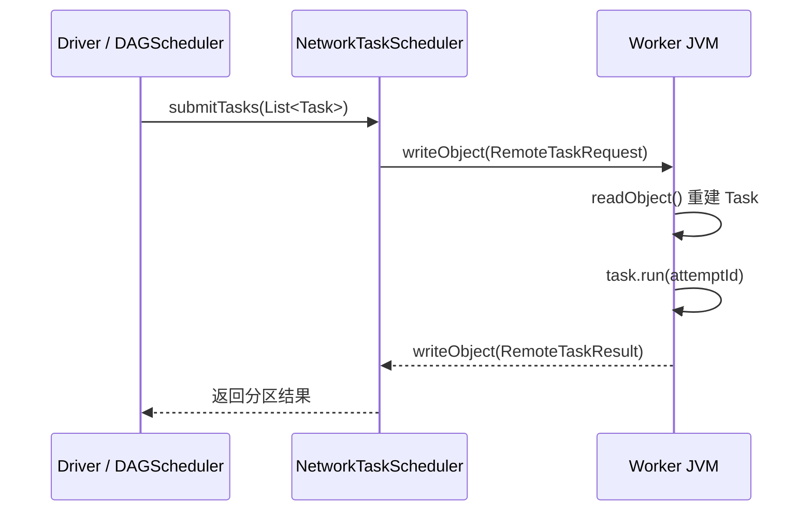
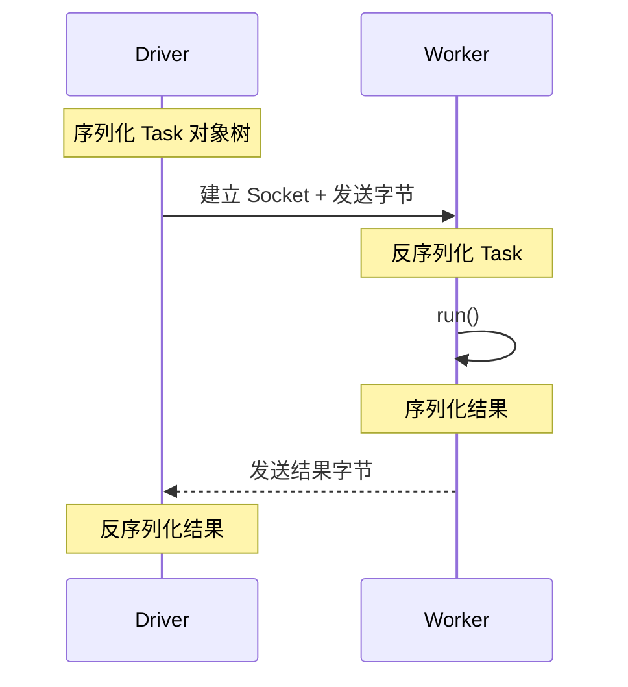
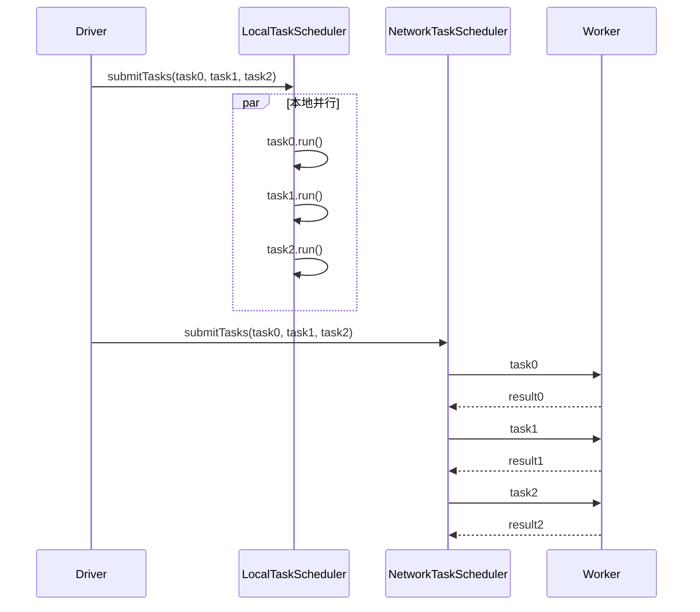
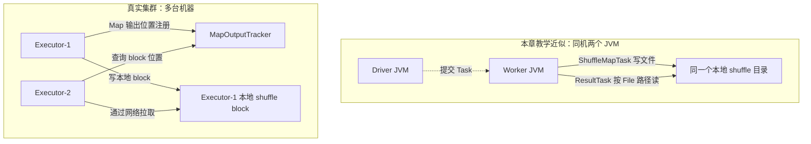

# 第 9 章 · 从线程池到真正的网络

> 💻 本章完整代码：[GitHub 查看](https://github.com/rchaocai/mini-spark/tree/main/ch09-network-rpc)
>
> 构建运行：`mvn -pl ch09-network-rpc package`
>
> 先启动 Worker：`java -Dfile.encoding=UTF-8 -cp ch09-network-rpc/target/classes com.sparklearn.Worker 9091`
>
> 再启动 Driver：`java -Dfile.encoding=UTF-8 -cp ch09-network-rpc/target/classes com.sparklearn.Main network localhost:9091`

第 8 章已经能在 Task 失败后重试，也能在 shuffle 文件丢失后重算对应的 Map 分区。

但它始终有一个前提：Driver、TaskScheduler、Task、RDD、shuffle 文件，都在同一个 JVM 里。

第 5 章我们说“把 Task 交给线程池”。这句话在代码里就是：

```java
executor.submit(task);
```

这行代码看起来很像分布式调度。Task 被放进队列，由另一个工作线程执行，结果通过 `Future` 回来。

但线程池不是分布式。

线程之间共享同一块堆内存。`submit(task)` 交出去的不是一份 Task，而是一个对象引用。工作线程拿到这个引用，就能继续访问 Task 里的 `rdd`、`partition`、用户函数、依赖链。所有东西本来就在同一个 JVM 里。

现在把 Worker 换成另一个 JVM。引用就没用了。一个内存地址在 Driver 进程里有意义，到了 Worker 进程里只是一个数字。

所以第 9 章只做一件事：



这一步很小，但它会逼出分布式计算最硬的边界：**你想发到远端的东西，必须能变成字节。**

## 9.1 先把调度器接口切出来

第 8 章的 `DAGScheduler` 直接依赖 `TaskScheduler`：

```text
DAGScheduler
  -> 创建 ShuffleMapTask / ResultTask
  -> 交给 TaskScheduler
  -> TaskScheduler 放进线程池
```

如果第 9 章直接把 `DAGScheduler` 改成网络版本，它就会同时知道 Stage 怎么切、Task 怎么建、Socket 怎么连。抽象会一下子变厚。

本章把第 8 章的线程池类拆成一个接口和两个实现。接口仍然叫 `TaskScheduler`，这个名字故意对齐 Spark 源码里的 `TaskScheduler`：

```java
public interface TaskScheduler extends AutoCloseable {

    <T> List<T> submitTasks(List<? extends Task<T>> tasks);

    @Override
    void close();
}
```

第 8 章的线程池版变成：

```java
public final class LocalTaskScheduler implements TaskScheduler {
    ...
}
```

第 9 章新增网络版：

```java
public final class NetworkTaskScheduler implements TaskScheduler {
    ...
}
```

`DAGScheduler` 只面向 `TaskScheduler`。它仍然沿 RDD 血缘切 Stage，仍然创建 `ShuffleMapTask` 和 `ResultTask`，仍然按 Stage 顺序提交任务。

改变的是任务提交方式。

```text
第 8 章：
TaskScheduler 实现 = LocalTaskScheduler

第 9 章：
TaskScheduler 实现 = NetworkTaskScheduler
```

这个接口不是为了“设计模式”而设计。它对应真实 Spark 里的分工：DAGScheduler 负责把作业切成 Stage 和 Task，底层调度器负责把 Task 送到具体执行端。

真实 Spark 里也有 `Task.scala`、`ResultTask.scala`、`ShuffleMapTask.scala`、`TaskScheduler.scala` 这些文件。为了让后面读源码时少一层翻译，本章也按这个形状组织：`ResultTask` / `ShuffleMapTask` 继承同一个 `Task`，`LocalTaskScheduler` 和 `NetworkTaskScheduler` 都实现 `TaskScheduler`。

## 9.2 Task 不是引用了，是字节流

网络版调度器的核心逻辑很短：

```java
try (Socket socket = new Socket(host, port);
     ObjectOutputStream out = new ObjectOutputStream(
             new BufferedOutputStream(socket.getOutputStream()))) {
    out.flush();
    ObjectInputStream in = new ObjectInputStream(
            new BufferedInputStream(socket.getInputStream()));

    out.writeObject(new RemoteTaskRequest<>(task, attemptId));
    out.flush();

    RemoteTaskResult<T> response =
            (RemoteTaskResult<T>) in.readObject();
    return response.value();
}
```

对照线程池版看，它只是在做同一件事：

```text
线程池版：把 task 引用放进 BlockingQueue
网络版：  把 task 序列化后写进 Socket
```

差别就在“引用”和“字节流”之间。

引用只在同一个 JVM 里有意义。字节流可以穿过 Socket，到另一个 JVM 里重新变成对象。

所以本章先抽出一个可序列化的 `Task`，再让 `ResultTask` 和 `ShuffleMapTask` 继承它：

```java
public abstract class Task<T> implements Serializable {

    public final T run(int attemptId) {
        return runTask(new TaskContext(stageId, partition, attemptId));
    }

    protected abstract T runTask(TaskContext context);
}

public final class ResultTask<T, U> extends Task<U> {
    ...
}
```

`TaskContext` 也是刻意对齐 Spark 的小对象。它记录当前 Task 属于哪个 Stage、哪个分区、这是第几次尝试。第 8 章重试时只知道“再跑一次”；第 9 章开始，重试有了显式的 `attemptId`。

但只让 Task 可序列化还不够。

`ResultTask` 里面有 `RDD<T> rdd`，所以 RDD 也必须可序列化。RDD 里有父 RDD 和 `Dependency`，所以依赖也必须可序列化。`MapPartitionsRDD` 里有用户传进来的 `map` 函数，所以用户函数也必须可序列化。

Task 抓住的不是一个对象，而是一整棵对象树。

```text
ResultTask
  -> final RDD
    -> parent RDD
      -> parent RDD
        -> ListRDD
    -> Dependency
    -> 用户函数
  -> Partition
  -> action 的分区函数
```

Java 序列化会从 `task` 这个根对象出发，把所有可达对象都走一遍。中间任何一个对象不能序列化，整个 Task 就发不出去。

这就是本章新增 `SerializableFunction`、`SerializablePredicate`、`SerializableBinaryOperator` 的原因：

```java
@FunctionalInterface
public interface SerializableFunction<T, R>
        extends Function<T, R>, Serializable {
}
```

第 8 章的 `map(Function<T, U>)` 到第 9 章变成：

```java
public <U> MapPartitionsRDD<T, U> map(
        SerializableFunction<T, U> elementFunction) {
    ...
}
```

这不是 Java 语法上的小改动，而是模型契约的升级：

```text
第 8 章：这个函数能在另一个线程里调用
第 9 章：这个函数能被复制到另一个 JVM 里调用
```

## 9.3 一个 lambda，能不能过网络

这一步最容易让人困惑。

下面这段代码在第 8 章没问题：

```java
rdd.map(Function.identity())
```

到第 9 章会编译失败。

原因不是 `identity()` 做不了恒等映射，而是它返回的是普通 `Function`。普通 `Function` 没有承诺自己可序列化。

所以第 9 章的代码改成：

```java
rdd.map(value -> value)
```

此时 `map` 方法的参数类型是 `SerializableFunction`，编译器就会把这个 lambda 编译成一个可序列化的函数对象。

`reduceByKey` 也一样。本章不用 `Integer::sum`，而写成：

```java
reduceByKey((left, right) -> left + right, 2)
```

看起来啰嗦一点，但目标类型很清楚：这是一个 `SerializableBinaryOperator<Integer>`。

这里有一个 Java 初学者很容易跳过的点：lambda 能不能序列化，不只看 lambda 里面写了什么，还看它被赋给了什么类型。同样的 `(x -> x)`，赋给 `Function` 就只是普通函数，赋给 `SerializableFunction` 才是可序列化函数。

分布式计算里很多“奇怪的 API 约束”，背后都是这个原因。你以为只是写一个函数，系统看到的是：这个函数要不要被打包，能不能过网络，到了远端 JVM 还能不能重新加载。

还要再补一刀：lambda 自己可序列化，不代表它捕获的东西也可序列化。

```java
Object notSerializable = new Object();
rdd.map(value -> value + notSerializable.toString());
```

这段代码的目标类型仍然是 `SerializableFunction`，但 lambda 抓住了一个普通 `Object`。发送 Task 时，Java 序列化会沿着引用继续走，最后仍然可能抛 `NotSerializableException`。如果捕获的是 `FileInputStream`、数据库连接、某个没有实现 `Serializable` 的 service，也一样。

跨 JVM 后还有一个更隐蔽的变化：闭包状态会变成**副本**。第 8 章的 `FaultyRDD` 用 `AtomicInteger` 共享剩余失败次数，在线程池里没问题，因为所有线程看到的是同一个对象；网络版发送 Task 时，Worker 改的是反序列化后的副本，Driver 侧原对象不会跟着变。也就是说，本章保留第 8 章容错代码作为基线，但不要用 `FaultyRDD` 去演示网络重试。跨 JVM 的故障计数要放进 `attemptId`、Driver 事件或外部状态里，而不是放进会被复制的闭包对象里。

## 9.4 Worker：另一个 JVM 里的 run()

Worker 的代码故意写得很朴素：

```java
try (ServerSocket socket = new ServerSocket(port)) {
    while (running) {
        handle(socket.accept());
    }
}
```

`accept()` 会阻塞等待 Driver 连接。连接来了，Worker 读取一个对象：

```java
RemoteTaskRequest<?> request = (RemoteTaskRequest<?>) in.readObject();
```

然后执行：

```java
Object value = request.task().run(request.attemptId());
out.writeObject(RemoteTaskResult.success(value));
```

注意这一点：Worker 的协议入口没有认识 `RDD`，也没有认识 `DAGScheduler`。它只认识 `Task`。但 Task 内部仍然携带 RDD 血缘，真正执行 `run()` 时，还是会调用 `rdd.iterator(partition)`。

因为 Stage 切分、Task 创建已经在 Driver 里完成了。Worker 要做的事很少：

```text
读 Task
执行 run()
写结果
```

这就是本章想让你亲手摸到的“RPC”本质。RPC 框架可以更复杂，可以复用连接，可以异步，可以压缩，可以做心跳和失败探测。但最小闭环就是这三步。

真实 Spark 不会用 Java 原生序列化加一个 `ServerSocket` 写生产级 RPC。早期 Spark 代码里已经有远程 actor 和 `MapOutputTracker`，现代 Spark 用更完整的 RPC 和网络传输层。那些工程能力很重要，但它们包住的核心动作没有变：Driver 把任务描述发给 Executor，Executor 执行后把状态和结果报回来。

> [!INFO] 本章先只跨 JVM 发送 Task
> 本章先实现“Task 怎么过网络”。`reduceByKey` 的 shuffle 文件仍沿用第 8 章的本地文件模型。真正跨机器时，Reduce 端不能靠同一个 `File` 路径读取 Map 端输出，必须引入 `MapOutputTracker` / BlockManager 这类组件。这个边界会在 9.8 展开。

## 9.5 为什么 RDD 里的 SparkContext 要 transient

本章的 `RDD` 是这样声明的：

```java
public abstract class RDD<T> implements Serializable {

    private final transient SparkContext sparkContext;
    ...
}
```

`transient` 的意思是：序列化时跳过这个字段。

为什么要跳过 `SparkContext`？

因为 `SparkContext` 是 Driver 侧入口，里面有调度器。把 RDD 发给 Worker，是为了让 Worker 计算这个分区，不是为了把 Driver 的调度器、线程池、网络调度器也复制一份过去。

真实 Spark 的 `RDD` 也是这个思路：RDD 本身可序列化，但 `SparkContext` 是 transient。

这又是一个“分布式边界”的例子。单机时对象之间互相引用没什么问题；跨进程后，你必须非常清楚哪些东西是计算描述的一部分，哪些东西只属于 Driver。

RDD 血缘、分区、依赖、用户闭包，属于计算描述，要发。

SparkContext、调度器、线程池，属于 Driver 控制面，不发。

## 9.6 preferredLocations：把 Task 发到数据那里

第 4 章讲 RDD 五个属性时，`preferredLocations` 先按下不表。第 5 章也埋过一个点：Task 无状态以后，调度器就可以决定把它派到哪里。

到这一章，它终于有意义了。

本章给 RDD 增加默认方法：

```java
public List<String> preferredLocations(Partition partition) {
    return List.of();
}
```

`ListRDD` 可以为每个分区提供位置偏好。`MapPartitionsRDD`、`FaultyRDD` 这类窄依赖 RDD，会把父分区的位置偏好继续传下来：

```java
@Override
public List<String> preferredLocations(Partition partition) {
    return parent.preferredLocations(partition);
}
```

网络调度器选择 Worker 时，先看 Task 有没有位置偏好：

```java
for (String location : task.preferredLocations()) {
    if (workerAddresses.contains(location)) {
        return location;
    }
}
return workerAddresses.get(taskIndex % workerAddresses.size());
```

这段逻辑很短，但它正是“把代码发给数据”的调度含义。

如果数据在 Worker-1，把 Task 发给 Worker-1，网络上传的是 Task：闭包、RDD 血缘、分区号。通常是几 KB 到几 MB。

如果把 Task 发给 Worker-2，而数据在 Worker-1，就要先把数据从 Worker-1 搬到 Worker-2。一个分区可能是几十 MB、几百 MB，甚至更大。

所以分布式计算的经验法则不是“找一台空闲机器就跑”，而是：

```text
能移动计算，就不要移动数据。
```

Task 是说明书，数据是货物。能寄说明书，就不要搬货物。

真实 Spark 的 `DAGScheduler` 会沿窄依赖向上找位置偏好：当前 RDD 没有，就看父 RDD；父 RDD 也没有，再继续往上。本章的实现只做了最直观的一层委托，但方向是一样的。

不过这里必须把教学边界说清楚：本章的 `ListRDD` 是内存演示 RDD，它把完整 `List` 保存在对象字段里。网络发送 `Task` 时，`ResultTask -> RDD -> ListRDD -> data` 这条引用链会被一起序列化，所以 demo 里确实会把内存数据也发给 Worker。

这和真实 Spark 的“数据本地性”还差一层。真实 Spark 面对的常常是 HDFS block、本地文件分片、缓存 block：Task 里带的是“这个分区怎么读”的描述，不是把几百 MB 数据塞进 Task 对象。`preferredLocations` 的意义，就是让调度器把这份读取描述发到数据块所在的机器。

所以本章先兑现调度接口和位置偏好的形状；真正“不搬数据，只发计算”的前提，是源头 RDD 不能把大数据本体直接放进要序列化的对象树里。这一点到真实 Spark 源码里看 `HadoopRDD` 会更明显。

## 9.7 网络到底贵在哪里

线程池版提交一个 Task，主要成本是：

```text
把引用放进队列
工作线程取出引用
调用 run()
```

网络版提交一个 Task，成本变成：



真正的计算只在中间那一步。其余都是为了跨进程付出的过路费。

还有一个本章刻意保留的简化：`NetworkTaskScheduler` 是同步 RPC。它会发送一个 Task，等结果回来，再发送下一个 Task。第 8 章的 `LocalTaskScheduler` 会先把一批 Task 都提交到线程池，因此保留了分区并行；第 9 章先牺牲这点并行度，换来最短的网络闭环。



生产系统当然不会这样串行跑远端分区。真实 Spark 会把一批 Task 分发给多个 Executor，并异步接收完成事件。但如果一上来就实现异步事件循环、连接池和多 Worker 并发，读者会先被工程细节淹没。本章先把“对象怎样过网络”讲清楚。

即使 Worker 跑在 `localhost`，这笔账也不会消失。数据仍然要经过 Socket、TCP 协议栈、内核缓冲区和用户态 / 内核态切换。`localhost` 只是没有经过物理网卡，不等于免费。

所以本章的 `Main` 保留了两个入口。

直接运行：

```bash
java -Dfile.encoding=UTF-8 \
  -cp ch09-network-rpc/target/classes \
  com.sparklearn.Main
```

走本地线程池。

先启动 Worker：

```bash
java -Dfile.encoding=UTF-8 \
  -cp ch09-network-rpc/target/classes \
  com.sparklearn.Worker 9091
```

再启动 Driver：

```bash
java -Dfile.encoding=UTF-8 \
  -cp ch09-network-rpc/target/classes \
  com.sparklearn.Main network localhost:9091
```

走 Socket Worker。

你会看到两边结果一致，但网络版会多出发送、接收、序列化和反序列化的开销。数据量越小，这些固定开销越显眼；数据量越大，位置选择和数据搬运成本越关键。

这也是为什么 Cache 会在下一章出现。网络这么贵，如果一个中间结果下次还要用，能不能别再跨网络重算？能不能把它留在某台 Worker 上，下次把 Task 派过去？

这就是 Cache 和数据本地性接上的地方。

## 9.8 一个必须说清的教学近似

本章代码保留了第 8 章的 Stage 和 shuffle 文件模型，因此 `reduceByKey` 在网络版 demo 中能在本机 Worker 上跑通。

但这还不是完整的集群 shuffle。

原因很简单：第 8 章的 shuffle 输出是本地文件。Map Task 写出：

```text
map_0_reduce_0
map_0_reduce_1
...
```

Reduce Task 再按路径读取这些文件。

如果 Driver 和 Worker 只是同一台机器上的两个 JVM，它们可以看到同一个临时目录，教学 demo 可以闭环。

如果真的换成两台机器，这个路径就不成立了。Worker-1 写出的本地文件，Worker-2 不能靠同一个 `File` 路径读到。真实 Spark 需要 `MapOutputTracker` 记录每个 Map 输出在哪台 Executor 上，再让 Reduce 端通过网络去拉对应的数据。



早期 Spark 源码里就有 `MapOutputTracker`：Map 端注册输出位置，Reduce 端查询这些位置。它解决的是“shuffle 文件在哪台机器上”这个问题。

本章没有实现它，因为这会把主题从“Task 怎样跨进程发送”推进到“shuffle block 怎样跨节点拉取”。那是另一层网络系统。

所以本章网络实现的定位要清楚：

```text
已实现：
Task / RDD 血缘 / 用户闭包跨 JVM 序列化
Socket Worker 执行 Task，包括 ShuffleMapTask 和 ResultTask
调度器按 preferredLocations 选择 Worker

教学近似：
shuffle 文件仍沿用第 8 章的本地文件模型
完整跨机器 shuffle 需要 MapOutputTracker / BlockManager
```

把边界说清楚，反而更接近真实工程。你知道现在写到哪一层，也知道下一层复杂度从哪里长出来。

> [!INFO] 后面读 Spark 源码时怎么对
> 本章新增类名时，刻意贴近 Spark 源码，而不是另起一套“教学命名”。第 11 章会正式展开源码对照；这里先留一个路标：
>
> ```text
> 本章 Task
>   -> Spark 0.5: core/src/main/scala/spark/Task.scala
>   -> Spark 3.x: core/src/main/scala/org/apache/spark/scheduler/Task.scala
>
> 本章 ResultTask / ShuffleMapTask
>   -> Spark 0.5: ResultTask.scala / ShuffleMapTask.scala
>   -> Spark 3.x: scheduler/ResultTask.scala / scheduler/ShuffleMapTask.scala
>
> 本章 TaskScheduler 接口
>   -> Spark 0.5: DAGScheduler.scala 里的 submitTasks 抽象
>   -> Spark 3.x: scheduler/TaskScheduler.scala
>
> 本章 preferredLocations
>   -> Spark 0.5: RDD.scala + DAGScheduler.getPreferredLocs
>   -> Spark 3.x: RDD.preferredLocations + DAGScheduler.getPreferredLocsInternal
>
> 本章没有实现的完整跨机器 shuffle
>   -> Spark 0.5: MapOutputTracker.scala
>   -> Spark 3.x: MapOutputTracker / BlockManager / shuffle fetch
> ```

## 9.9 本章小结

第 9 章没有推翻前面的实现。它只是把第 8 章的“提交 Task”这一步换了一个出口。

但这一换，整个模型的物理含义变了：

```text
线程池：Task 是同 JVM 里的对象引用
网络：  Task 是跨 Socket 传输的字节流
```

为了让这件事成立，Task、RDD、Dependency、Partition、Stage、用户闭包、action 分区函数，都必须能序列化。

你也第一次真正兑现了“把代码发给数据”。这句话不再是比喻。用户函数、RDD 血缘和分区任务真的被打包成字节，发到 Worker JVM，在那里重新变成对象，再调用同一个 `run()`。

网络让分布式变成事实，也让代价变成事实。序列化、连接、传输、反序列化，全都要花时间。于是数据本地性不再是锦上添花，而是调度器必须考虑的基本问题。

下一章要接着回答一个自然问题：既然跨网络这么贵，算过一次的分区结果，能不能留在内存里，下一次直接复用？

这就是 Cache。
