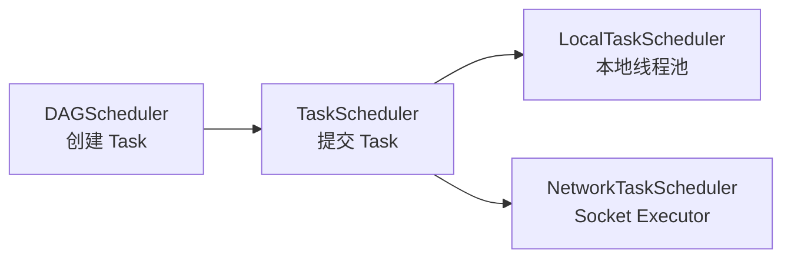
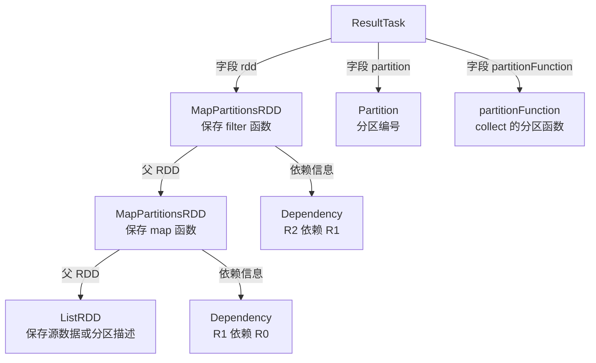
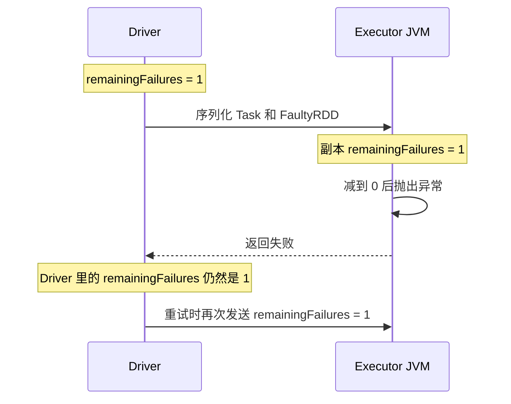
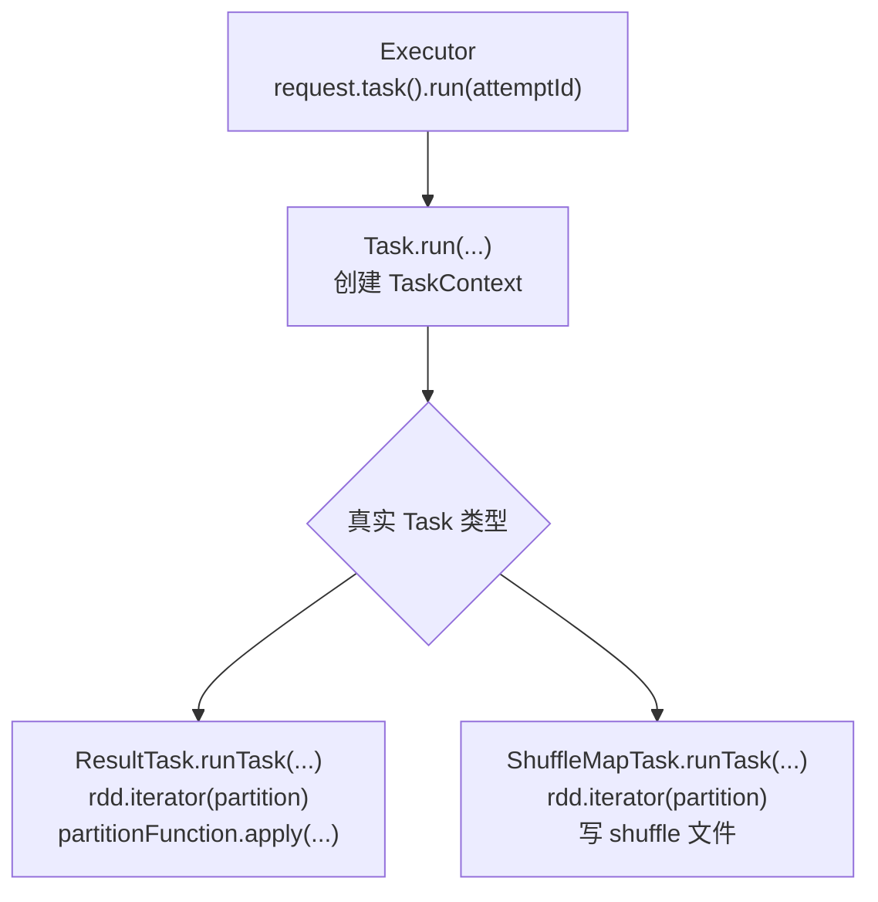
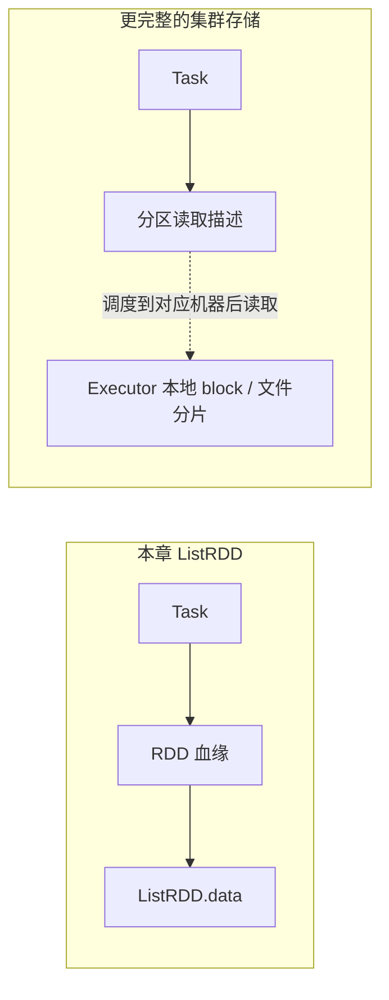
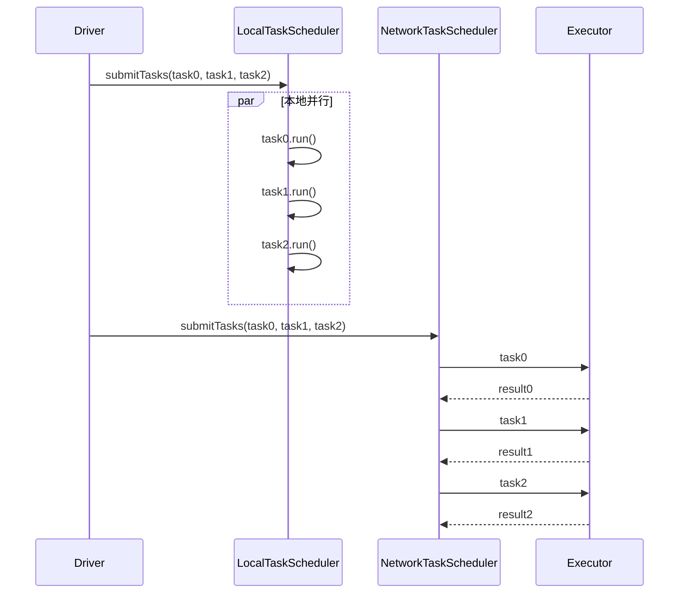
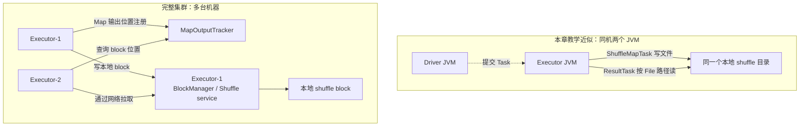

# 第 9 章 · 从单机到分布式执行

> 💻 本章完整代码：[GitHub 查看](https://github.com/rchaocai/mini-spark/tree/main/ch09-network-rpc)
>
> 构建运行：`mvn -pl ch09-network-rpc package`
>
> 先启动 Executor：`java -Dfile.encoding=UTF-8 -cp ch09-network-rpc/target/classes com.sparklearn.Executor 9091`
>
> 再启动 Driver：`java -Dfile.encoding=UTF-8 -cp ch09-network-rpc/target/classes com.sparklearn.Main network localhost:9091`

第 8 章已经能在 Task 失败后重试，也能在 shuffle 文件丢失后重算对应的 Map 分区。

但它始终有一个前提：Driver、TaskScheduler、Task、RDD、shuffle 文件，都在同一个 JVM 里。

第 5 章我们说“把 Task 交给线程池”。这句话在代码里就是：

```java
executor.submit(task);
```

这行代码看起来很像分布式调度。Task 被放进队列，由另一个工作线程执行，结果通过 `Future` 回来。

但线程池不是分布式。

线程之间共享同一块堆内存。`submit(task)` 交出去的不是一份 Task，而是一个对象引用。工作线程拿到这个引用，就能继续访问 Task 里的 `rdd`、`partition`、用户函数、依赖链。所有东西本来就在同一个 JVM 里。

现在把执行端换成另一个 JVM。引用就没用了。一个内存地址在 Driver 进程里有意义，到了 Executor 进程里只是一个数字。

所以第 9 章只做一件事：


到了这里，Task 就不能再只是内存里的一个对象了。Driver 必须先把它写成字节，Executor 才能收到；Executor 再把这些字节还原成 Task，继续执行。第 9 章后面的所有变化，都从这里开始。

## 9.1 DAGScheduler 需要知道网络吗？

先回忆第 8 章的分工。

`DAGScheduler` 沿着 RDD 血缘划分 Stage，创建 `ShuffleMapTask` 和 `ResultTask`。Task 创建好以后，再交给 `TaskScheduler` 放进线程池。

现在只是把“在线程池里执行”换成“发给 Executor 执行”。那么，应该修改谁？

最直接的做法，是在 `DAGScheduler` 里连接 Socket、发送 Task、等待结果。但仔细想一想，`DAGScheduler` 的工作其实没有变：

```text
划分 Stage
  -> 创建一批 Task
  -> 提交 Task
  -> 等待结果
```

至于 Task 是进入本地线程池，还是穿过 Socket 到另一个 JVM，并不是 `DAGScheduler` 需要关心的事。

因此，本章让 `DAGScheduler` 只依赖 `TaskScheduler` 这一个入口：

```java
public interface TaskScheduler extends AutoCloseable {

    <T> List<T> submitTasks(List<? extends Task<T>> tasks);

    @Override
    void close();
}
```

这个接口只表达一件事：给我一批 Task，我负责执行，再把结果交回来。

第 8 章的线程池实现改名为 `LocalTaskScheduler`：

```java
public final class LocalTaskScheduler implements TaskScheduler {
    ...
}
```

第 9 章再增加 `NetworkTaskScheduler`：

```java
public final class NetworkTaskScheduler implements TaskScheduler {
    ...
}
```



这样一来，`DAGScheduler` 的代码几乎不用变化。变化被留在了 Task 的执行方式里。

这一节只做了两个整理：把“要执行的东西”统一叫 `Task`，把“怎么执行 Task”交给 `TaskScheduler`。前者让 `ResultTask` 和 `ShuffleMapTask` 有同一个入口，后者让本地线程池和 Socket Executor 可以替换。

## 9.2 Task 不是引用了，是字节流

上一节把入口统一成了 `TaskScheduler.submitTasks(...)`。现在看同一个入口在两个实现里分别做了什么。

在线程池版 `LocalTaskScheduler` 里，提交 Task 的关键代码是：

```java
private <T> Future<T> submitTask(Task<T> task, int attemptId) {
    return executor.submit(() -> task.run(attemptId));
}
```

`executor.submit(...)` 做的是同 JVM 内的对象传递。`task` 这个变量里保存的是一个引用，线程池把这个引用交给工作线程。工作线程拿到引用后，直接调用 `task.run(attemptId)`。

到了网络版，`submitTasks(...)` 会走到 `NetworkTaskScheduler.sendTask(...)`。这里不再有共享堆内存，Executor 拿不到 Driver 里的对象引用，所以发送端必须把 Task 写进 Socket：

```java
try (Socket socket = new Socket(host, port);
     ObjectOutputStream out = new ObjectOutputStream(
             new BufferedOutputStream(socket.getOutputStream()))) {
    out.flush();
    ObjectInputStream in = new ObjectInputStream(
            new BufferedInputStream(socket.getInputStream()));

    out.writeObject(new RemoteTaskRequest<>(task, attemptId));
    out.flush();

    RemoteTaskResult<T> response =
            (RemoteTaskResult<T>) in.readObject();
    return response.value();
}
```

这段代码在做两件事。

第一，发送请求：

```java
out.writeObject(new RemoteTaskRequest<>(task, attemptId));
out.flush();
```

`RemoteTaskRequest` 里装着 Task 和本次尝试编号。`writeObject(...)` 会从这个请求对象开始，把它引用到的对象一起序列化。

第二，等待结果：

```java
RemoteTaskResult<T> response =
        (RemoteTaskResult<T>) in.readObject();
return response.value();
```

Executor 执行完 Task 后，把结果也序列化回来。Driver 再用 `readObject()` 把结果还原。

所以，任务入口没有变，传递方式变了：

```text
线程池版：把 task 引用放进 BlockingQueue
网络版：  把 task 序列化后写进 Socket
```

差别就在“引用”和“字节流”之间。

引用只在同一个 JVM 里有意义。字节流可以穿过 Socket，到另一个 JVM 里重新变成对象。

> [!INFO] 序列化发送的是对象状态，不是 class 文件
> `writeObject(...)` 会把对象字段里的状态写出去，比如 `ResultTask` 里的 `rdd`、`partition`、用户函数。
>
> 它不会把 `ResultTask.class`、`ListRDD.class` 这些类定义一起发过去。Executor JVM 必须已经在 classpath 里加载得到同一套代码；否则 `readObject()` 找不到类，Task 还没开始运行就会失败。

所以本章先抽出一个可序列化的 `Task`，再让 `ResultTask` 和 `ShuffleMapTask` 继承它。但真正被发送的不是这个外壳本身，而是具体的子类对象。以 `ResultTask` 为例：

```java
public abstract class Task<T> implements Serializable {
    public final T run(int attemptId) {
        return runTask(new TaskContext(stageId, partition, attemptId));
    }
    protected abstract T runTask(TaskContext context);
}

public final class ResultTask<T, U> extends Task<U> {
    private final RDD<T> rdd;
    private final Partition partition;
    private final SerializableFunction<Iterator<T>, U> partitionFunction;

    @Override
    protected U runTask(TaskContext context) {
        return partitionFunction.apply(rdd.iterator(partition));
    }
}
```

`TaskContext` 不参与 `WordCount` 的计算结果。它记录的是这次运行的身份，供日志和错误处理使用。

比如同一个结果分区第一次运行失败，调度器会再发起一次运行。第 8 章只是再次调用同一个 `call()`，Task 内部看不出“这是重试”。现在 `run(attemptId)` 会把尝试编号带进去，Task 打日志或上报错误时，就能说清楚自己是哪一次运行：

```text
ResultTask(stage=1, partition=0, attempt=0) 失败
ResultTask(stage=1, partition=0, attempt=1) 重试成功
```

现在再回到 `writeObject(new RemoteTaskRequest<>(task, attemptId))`。这里的 `task` 如果是一个 `ResultTask`，Java 序列化不会只写 `ResultTask` 自己。它会沿着 `ResultTask` 的字段引用继续展开。

先看 `ResultTask` 自己的三个关键字段：

```java
private final RDD<T> rdd;
private final Partition partition;
private final SerializableFunction<Iterator<T>, U> partitionFunction;
```

所以，发送一个 `ResultTask` 时，至少要一起发送三类东西：

1. `rdd`：这个分区从哪条 RDD 血缘算出来。
2. `partition`：这次要算哪个分区。
3. `partitionFunction`：算完这个分区后，action 要怎样把迭代器变成结果。

难点在 `rdd`。它通常不是一个孤立对象，而是一串 RDD 血缘。比如：

```java
sc.parallelize(words, 3)
        .map(...)
        .filter(...)
        .collect();
```

这个 `collect()` 生成的 `ResultTask`，会指向最后一个 RDD；最后一个 RDD 又会指向它的父 RDD，父 RDD 再指向更早的父 RDD。每个变换 RDD 还会保存自己的用户函数。



这张图里，从 `ResultTask` 出发，沿字段引用能到达的所有对象，合起来就叫**对象图**。它不一定是严格的树形结构；只要某个对象能被这些引用一路找到，序列化就会把它纳入检查范围。

Java 序列化会从 `task` 这个根对象出发，沿对象图把可达对象都检查一遍。中间任何一个对象不能序列化，整个 Task 就发不出去。

这里就出现了一个很具体的问题：用户传进来的函数怎么办？

第 8 章还在同一个 JVM 里运行。`map` 只需要一个普通 `Function`：

```java
Function<T, U> elementFunction
```

这句话的意思很简单：给我一个 `T`，我能算出一个 `U`。至于这个函数能不能写进 Socket，第 8 章不关心。

到了第 9 章，函数会被放进 `MapPartitionsRDD`，再跟着 `ResultTask` 一起发到 Executor。于是接口只说“我能计算”就不够了，还要多说一句“我能序列化”。

普通 `Function` 的承诺只有一个：

```text
Function
  -> 能 apply(...)
```

本章需要的是两个承诺叠在一起：

```text
SerializableFunction
  -> 能 apply(...)
  -> 能 Serializable
```

所以我们新增了 `SerializableFunction`：

```java
@FunctionalInterface
public interface SerializableFunction<T, R>
        extends Function<T, R>, Serializable {
}
```

它没有发明新的计算能力，只是把“这个函数可以被写成字节”放进类型里。这样 `map` 的签名就从第 8 章的：

```java
public <U> MapPartitionsRDD<T, U> map(
        Function<T, U> elementFunction) {
    ...
}
```

变成第 9 章的：

```java
public <U> MapPartitionsRDD<T, U> map(
        SerializableFunction<T, U> elementFunction) {
    ...
}
```

这不是 Java 语法上的小改动，而是模型契约的升级：

```text
第 8 章：这个函数能在另一个线程里调用
第 9 章：这个函数能被复制到另一个 JVM 里调用
```

`filter` 和 `reduceByKey` 也是同一个道理。它们在本地线程池里只需要“能判断”“能合并”；跨 JVM 后，还要能跟着 Task 过网络。所以本章同样补了 `SerializablePredicate` 和 `SerializableBinaryOperator`。

## 9.3 一个 lambda，能不能过网络

先看一个容易踩坑的例子。

下面这段代码在第 8 章没问题：

```java
rdd.map(Function.identity())
```

到第 9 章会编译失败。

原因不是 `identity()` 做不了恒等映射，而是它返回的是普通 `Function`。普通 `Function` 没有承诺自己可序列化。

所以第 9 章的代码改成：

```java
rdd.map(value -> value)
```

此时 `map` 方法的参数类型是 `SerializableFunction`，编译器就会把这个 lambda 编译成一个可序列化的函数对象。

`reduceByKey` 也一样。本章不用 `Integer::sum`，而写成：

```java
reduceByKey((left, right) -> left + right, 2)
```

看起来啰嗦一点，但目标类型很清楚：这是一个 `SerializableBinaryOperator<Integer>`。

这里有一个 Java 初学者很容易跳过的点：lambda 能不能序列化，不只看 lambda 里面写了什么，还看它被赋给了什么类型。同样的 `(x -> x)`，赋给 `Function` 就只是普通函数，赋给 `SerializableFunction` 才是可序列化函数。

分布式计算里很多“奇怪的 API 约束”，背后都是这个原因。你以为只是写一个函数，系统看到的是：这个函数要不要被打包，能不能过网络，到了远端 JVM 还能不能重新加载。

还要再补一刀：lambda 自己可序列化，不代表它捕获的东西也可序列化。

```java
Object notSerializable = new Object();
rdd.map(value -> value + notSerializable.toString());
```

这段代码的目标类型仍然是 `SerializableFunction`，所以 lambda 本身愿意被序列化。但它里面用到了外面的 `notSerializable`，这个对象也会被放进刚才那张对象图。

问题在这里：`new Object()` 只是一个普通 Java 对象，它没有实现 `Serializable`。Java 序列化走到它时，就不知道该怎样把它写成字节，于是抛 `NotSerializableException`。

如果确实要把某个小配置带到 Executor，就让这个配置对象自己可序列化：

```java
record Prefix(String value) implements Serializable {
}

Prefix prefix = new Prefix("word=");
rdd.map(value -> prefix.value() + value);
```

这种对象只有普通字段，写成字节、传到 Executor、再还原回来，都说得通。

但有些东西不应该放进闭包里，比如 `FileInputStream`、数据库连接、线程池。它们代表的是 Driver 进程里的某个运行时资源，不是一份稳定的数据。即使强行让类型实现了 `Serializable`，传到另一个 JVM 后通常也没有原来的含义。更稳妥的做法，是在 Executor 侧按需创建这些资源，或者只把连接参数、文件路径这类小配置传过去。

> [!INFO] 真实 Spark 怎么处理闭包
> 真实 Spark 也要处理同一个问题。用户写的 `map`、`filter`、`foreach` 这类函数，会和 Task 一起形成闭包。提交 Task 前，Spark 会分析这个闭包，把 Executor 运行时真正需要的变量整理出来，再交给后面的序列化层发送到 Executor。
>
> Spark 里有 `ClosureCleaner` / `SparkClosureCleaner` 这类组件做这件事。比如一个 lambda 只用到了外部对象里的一个普通字符串，但编译后的闭包可能顺手带上了整个外部对象。Cleaner 会尽量剪掉这些没用到的引用，避免一个本来只需要带字符串的 Task，因为多带了外部对象而序列化失败。
>
> 但它不是魔法。如果你的函数明确引用了一个不能序列化的对象，比如打开的文件流、数据库连接，Spark 仍然可能报 `Task not serializable`。所以真实 Spark 的规则和本章一样：闭包里真正要带到 Executor 的东西，必须能被序列化；运行时资源不要直接捕获。

跨 JVM 后还有一个更隐蔽的变化：闭包状态会变成**副本**。第 8 章的 `FaultyRDD` 用 `AtomicInteger` 共享剩余失败次数，在线程池里没问题，因为所有线程看到的是同一个对象；网络版发送 Task 时，Executor 改的是反序列化后的副本，Driver 侧原对象不会跟着变。



也就是说，本章保留第 8 章容错代码作为基线，但不要用 `FaultyRDD` 去演示网络重试。跨 JVM 的故障计数要放进 `attemptId`、Driver 事件或外部状态里，而不是放进会被复制的闭包对象里。

## 9.4 Executor：另一个 JVM 里的 run()

Executor 这边要做的事，可以先看成一个完整的请求处理函数：

```java
private void handle(Socket client) throws IOException {
    try (Socket socket = client;
         ObjectOutputStream out = new ObjectOutputStream(
                 new BufferedOutputStream(socket.getOutputStream()))) {
        out.flush();
        ObjectInputStream in = new ObjectInputStream(
                new BufferedInputStream(socket.getInputStream()));

        RemoteTaskRequest<?> request =
                (RemoteTaskRequest<?>) in.readObject();

        try {
            Object value = request.task().run(request.attemptId());
            out.writeObject(RemoteTaskResult.success(value));
        } catch (Throwable e) {
            out.writeObject(RemoteTaskResult.failure(e));
        }
        out.flush();
    } catch (ClassNotFoundException e) {
        throw new IOException("Task 反序列化失败", e);
    }
}
```

外层的服务器循环只负责接连接：

```java
try (ServerSocket socket = new ServerSocket(port)) {
    while (running) {
        handle(socket.accept());
    }
}
```

`accept()` 会阻塞等待 Driver 连接。连接来了，就交给 `handle(...)`。这段 `handle(...)` 只做四步：

```text
读 RemoteTaskRequest
执行 request.task().run(...)
成功时写 RemoteTaskResult.success(...)
失败时写 RemoteTaskResult.failure(...)
```

这里的重点不是 `ObjectInputStream` 这几个类名，而是职责边界：Executor 不是在“理解 RDD”。它只是在反序列化一个请求，执行请求里的 Task，再把响应写回去。

最关键的是第二步：

```java
Object value = request.task().run(request.attemptId());
```

这里没有反射，也没有“根据字符串方法名去找代码”。`readObject()` 之后，`request.task()` 已经是一个正常的 Java 对象了。它的真实类型可能是 `ResultTask`，也可能是 `ShuffleMapTask`。

`Task.run(...)` 本身是父类里的固定入口：

```java
public final T run(int attemptId) {
    return runTask(new TaskContext(stageId, partition, attemptId));
}
```

真正不同的地方在 `runTask(...)`。如果反序列化出来的是 `ResultTask`，Java 的普通虚方法分派会调用 `ResultTask.runTask(...)`；如果是 `ShuffleMapTask`，就调用 `ShuffleMapTask.runTask(...)`。



所以，远程执行并不是 Executor 临时“拼出一段代码”再运行。代码的 class 必须已经在 Executor 的 classpath 里；网络上传过来的是对象状态。对象还原以后，Executor 像本地线程池一样调用 `run()`，只是这个对象来自 Socket。

如果 `run()` 抛出异常，Executor 不会让连接直接断掉，而是把失败也包装成 `RemoteTaskResult.failure(e)`。Driver 读到响应后再判断：

```java
if (!response.success()) {
    throw new IllegalStateException(..., response.error());
}
```

这样，远端 Task 失败会重新变成 Driver 侧能处理的异常。第 8 章的 `FetchFailedException` 也因此可以从 Executor 回到 Driver，再触发对应的 shuffle map 重算。

这里同样有序列化边界：`RemoteTaskResult.failure(e)` 会把异常对象写回 Driver。异常类和异常里携带的字段也要能被 Driver 反序列化。完整系统通常会把远端失败整理成更稳定的错误信息，而不是直接传任意 `Throwable`。

注意这一点：Executor 的协议入口没有认识 `RDD`，也没有认识 `DAGScheduler`。它只认识 `Task`。但 Task 内部仍然携带 RDD 血缘，真正执行 `run()` 时，还是会调用 `rdd.iterator(partition)`。

因为 Stage 切分、Task 创建已经在 Driver 里完成了。Executor 只负责执行收到的请求。

这就是本章想让你亲手摸到的“RPC”本质。RPC 框架可以更复杂，可以复用连接，可以异步，可以压缩，可以做心跳和失败探测。但在这些能力出现之前，先要有这条请求和响应路径。

> [!INFO] 真实 Spark 的序列化和 RPC
> 本章用 `ObjectOutputStream` 把对象写进 `Socket`，是为了让你看见最小的一条链路。
>
> 真实 Spark 把这件事拆成两层。第一层是序列化：`JavaSerializer` 使用 Java 自带对象序列化，`KryoSerializer` 使用开源库 Kryo。Kryo 通常比 Java 序列化更快、结果也更紧凑，但为了更好性能，常常需要提前注册自定义类。
>
> 第二层是网络通信：RPC 由 `NettyRpcEnv` 这类组件承接，底层基于开源网络框架 Netty。
>
> 换句话说，Kryo 负责把对象变成更紧凑的字节，Netty 负责把这些字节高效地送过网络。本章把这两层都压缩成了 `ObjectOutputStream + Socket`，是为了先看清最小闭环。
>
> 名字变复杂了，本质没有变：Driver 先把“要做什么”变成字节，发给远端；Executor 反序列化、执行，再把结果或失败写回 Driver。
>
> 但本章只实现“Task 怎么过网络”。`reduceByKey` 的 shuffle 文件仍沿用第 8 章的本地文件模型。真正跨机器时，Reduce 端不能靠同一个 `File` 路径读取 Map 端输出，必须引入 `MapOutputTracker` / BlockManager 这类组件。这个边界会在 9.8 展开。

## 9.5 为什么 RDD 里的 SparkContext 要 transient

本章的 `RDD` 是这样声明的：

```java
public abstract class RDD<T> implements Serializable {

    private final transient SparkContext sparkContext;
    ...
}
```

`transient` 的意思是：序列化时跳过这个字段。

为什么要跳过 `SparkContext`？

因为 `SparkContext` 是 Driver 侧入口，里面有调度器。把 RDD 发给 Executor，是为了让 Executor 计算这个分区，不是为了把 Driver 的调度器、线程池、网络调度器也复制一份过去。

本章沿用这个边界：RDD 本身可序列化，但 `SparkContext` 是 transient。

这又是一个“分布式边界”的例子。单机时对象之间互相引用没什么问题；跨进程后，你必须非常清楚哪些东西是计算描述的一部分，哪些东西只属于 Driver。

RDD 血缘、分区、依赖、用户闭包，属于计算描述，要发。

SparkContext、调度器、线程池，属于 Driver 控制面，不发。

## 9.6 preferredLocations：把 Task 发到数据那里

第 4 章讲 RDD 五个属性时，`preferredLocations` 先按下不表。第 5 章也埋过一个点：Task 无状态以后，调度器就可以决定把它派到哪里。

到这一章，它终于有意义了。

先把边界说在前面：本章的 `ListRDD` 还是内存演示 RDD。它把完整 `List` 保存在对象字段里。网络发送 `Task` 时，`ResultTask -> RDD -> ListRDD -> data` 这条引用链会被一起序列化，所以 demo 里确实会把内存数据也发给 Executor。



也就是说，本章先把“调度器能看见位置偏好”这件事做出来。真正的大数据系统里，Task 里通常带的是“这个分区怎么读”的描述，不是把几百 MB 数据塞进 Task 对象。

本章给 RDD 增加默认方法：

```java
public List<String> preferredLocations(Partition partition) {
    return List.of();
}
```

`ListRDD` 可以为每个分区提供位置偏好。`MapPartitionsRDD`、`FaultyRDD` 这类窄依赖 RDD，会把父分区的位置偏好继续传下来：

```java
@Override
public List<String> preferredLocations(Partition partition) {
    return parent.preferredLocations(partition);
}
```

网络调度器选择 Executor 时，先看 Task 有没有位置偏好：

```java
for (String location : task.preferredLocations()) {
    if (executorAddresses.contains(location)) {
        return location;
    }
}
return executorAddresses.get(taskIndex % executorAddresses.size());
```

这段代码表达的是一个具体选择：先看数据位置，能命中就把 Task 发过去；没有命中，再退回轮询。

如果数据在 Executor-1，把 Task 发给 Executor-1，网络上传的是 Task：闭包、RDD 血缘、分区号。通常是几 KB 到几 MB。

如果把 Task 发给 Executor-2，而数据在 Executor-1，就要先把数据从 Executor-1 搬到 Executor-2。一个分区可能是几十 MB、几百 MB，甚至更大。

所以分布式计算的经验法则不是“找一台空闲机器就跑”，而是：

```text
能移动计算，就不要移动数据。
```

Task 是说明书，数据是货物。能寄说明书，就不要搬货物。

更完整的调度器会沿窄依赖向上找位置偏好：当前 RDD 没有，就看父 RDD；父 RDD 也没有，再继续往上。本章的实现只做了最直观的一层委托。

所以本章先兑现调度接口和位置偏好的形状；真正“不搬数据，只发计算”的前提，是源头 RDD 不能把大数据本体直接放进要序列化的对象图里。

## 9.7 网络到底贵在哪里

线程池版提交一个 Task，主要成本是：

```text
把引用放进队列
工作线程取出引用
调用 run()
```

网络版提交一个 Task，成本变成：


真正的计算只在中间那一步。其余都是为了跨进程付出的过路费。

还有一个本章刻意保留的简化：`NetworkTaskScheduler` 是同步 RPC。它会发送一个 Task，等结果回来，再发送下一个 Task。第 8 章的 `LocalTaskScheduler` 会先把一批 Task 都提交到线程池，因此保留了分区并行；第 9 章先牺牲这点并行度，把注意力放在 Task 怎样变成字节、怎样在 Executor 里重新运行。



生产系统当然不会这样串行跑远端分区。它会把一批 Task 分发给多个 Executor，并异步接收完成事件。但如果一上来就实现异步事件循环、连接池和多 Executor 并发，读者会先被工程细节淹没。本章先把“对象怎样过网络”讲清楚。

即使 Executor 跑在 `localhost`，这笔账也不会消失。数据仍然要经过 Socket、TCP 协议栈、内核缓冲区和用户态 / 内核态切换。`localhost` 只是没有经过物理网卡，不等于免费。

所以本章的 `Main` 保留了两个入口。

直接运行：

```bash
java -Dfile.encoding=UTF-8 \
  -cp ch09-network-rpc/target/classes \
  com.sparklearn.Main
```

走本地线程池。

先启动 Executor：

```bash
java -Dfile.encoding=UTF-8 \
  -cp ch09-network-rpc/target/classes \
  com.sparklearn.Executor 9091
```

再启动 Driver：

```bash
java -Dfile.encoding=UTF-8 \
  -cp ch09-network-rpc/target/classes \
  com.sparklearn.Main network localhost:9091
```

走 Socket Executor。

这次 `Main` 里的 WordCount 用 3 个输入分区、2 个 reduce 分区。网络版运行时，Driver 会按 Stage 依次发出这些 Task：

| 次序 | Task 类型 | 分区 | Executor 做什么 | 文件动作 |
| --- | --- | --- | --- | --- |
| 1 | `ShuffleMapTask` | map 0 | 读取输入分区 0，按 key 分到 2 个桶 | 写 `map_0_reduce_0`、`map_0_reduce_1` |
| 2 | `ShuffleMapTask` | map 1 | 读取输入分区 1，按 key 分到 2 个桶 | 写 `map_1_reduce_0`、`map_1_reduce_1` |
| 3 | `ShuffleMapTask` | map 2 | 读取输入分区 2，按 key 分到 2 个桶 | 写 `map_2_reduce_0`、`map_2_reduce_1` |
| 4 | `ResultTask` | reduce 0 | 读取所有 map 输出里属于 reduce 0 的文件，合并结果 | 读 `map_*_reduce_0` |
| 5 | `ResultTask` | reduce 1 | 读取所有 map 输出里属于 reduce 1 的文件，合并结果 | 读 `map_*_reduce_1` |

这张表也解释了为什么本章还能用第 8 章的 shuffle 文件模型跑通：Map 和 Reduce 都在同一台机器的 Executor JVM 上执行，它们看到的是同一个本地 shuffle 目录。

你会看到两边结果一致，但网络版会多出发送、接收、序列化和反序列化的开销。数据量越小，这些固定开销越显眼；数据量越大，位置选择和数据搬运成本越关键。

这也是为什么 Cache 会在下一章出现。网络这么贵，如果一个中间结果下次还要用，能不能别再跨网络重算？能不能把它留在某台 Executor 上，下次把 Task 派过去？

这就是 Cache 和数据本地性接上的地方。

## 9.8 一个必须说清的教学近似

本章代码保留了第 8 章的 Stage 和 shuffle 文件模型，因此 `reduceByKey` 在网络版 demo 中能在本机 Executor 上跑通。

但这还不是完整的集群 shuffle。

关键原因在文件位置：第 8 章的 shuffle 输出是本地文件。Map Task 写出：

```text
map_0_reduce_0
map_0_reduce_1
...
```

Reduce Task 再按路径读取这些文件。

如果 Driver 和 Executor 只是同一台机器上的两个 JVM，它们可以看到同一个临时目录，教学 demo 可以闭环。

如果真的换成两台机器，这个路径就不成立了。Executor-1 写出的本地文件，Executor-2 不能靠同一个 `File` 路径读到。完整系统需要 `MapOutputTracker` 记录每个 Map 输出在哪台 Executor 上，再让 Reduce 端通过网络去拉对应的数据。



`MapOutputTracker` 解决的正是这个问题：Map 端注册输出位置，Reduce 端查询这些位置。换句话说，它回答“shuffle 文件在哪台机器上”。

本章没有实现它，因为这会把主题从“Task 怎样跨进程发送”推进到“shuffle block 怎样跨节点拉取”。那是另一层网络系统。

所以本章网络实现的定位要清楚：

```text
已实现：
Task / RDD 血缘 / 用户闭包跨 JVM 序列化
Socket Executor 执行 Task，包括 ShuffleMapTask 和 ResultTask
调度器按 preferredLocations 选择 Executor

教学近似：
shuffle 文件仍沿用第 8 章的本地文件模型
完整跨机器 shuffle 需要 MapOutputTracker / BlockManager
```

把边界说清楚，反而更接近真实工程。你知道现在写到哪一层，也知道下一层复杂度从哪里长出来。

> [!INFO] 后面读 Spark 源码时怎么对
> 本章新增类名时，刻意贴近 Spark 源码，而不是另起一套“教学命名”。第 11 章会正式展开源码对照；这里先留一个路标：
>
> ```text
> 本章 Task
>   -> Spark 0.5: core/src/main/scala/spark/Task.scala
>   -> Spark 3.x: core/src/main/scala/org/apache/spark/scheduler/Task.scala
>
> 本章 ResultTask / ShuffleMapTask
>   -> Spark 0.5: ResultTask.scala / ShuffleMapTask.scala
>   -> Spark 3.x: scheduler/ResultTask.scala / scheduler/ShuffleMapTask.scala
>
> 本章 TaskScheduler 接口
>   -> Spark 0.5: DAGScheduler.scala 里的 submitTasks 抽象
>   -> Spark 3.x: scheduler/TaskScheduler.scala
>
> 本章 preferredLocations
>   -> Spark 0.5: RDD.scala + DAGScheduler.getPreferredLocs
>   -> Spark 3.x: RDD.preferredLocations + DAGScheduler.getPreferredLocsInternal
>
> 本章没有实现的完整跨机器 shuffle
>   -> Spark 0.5: MapOutputTracker.scala
>   -> Spark 3.x: MapOutputTracker / BlockManager / shuffle fetch
> ```

## 9.9 本章小结

第 9 章没有推翻前面的实现。它把第 8 章的“提交 Task”这一步接到了另一个出口。

但这一换，整个模型的物理含义变了：

```text
线程池：Task 是同 JVM 里的对象引用
网络：  Task 是跨 Socket 传输的字节流
```

为了让这件事成立，Task、RDD、Dependency、Partition、用户闭包、action 分区函数，都必须能序列化。

你也第一次真正兑现了“把代码发给数据”。这句话不再是比喻。用户函数、RDD 血缘和分区任务真的被打包成字节，发到 Executor JVM，在那里重新变成对象，再调用同一个 `run()`。

网络让分布式变成事实，也让代价变成事实。序列化、连接、传输、反序列化，全都要花时间。于是数据本地性不再是锦上添花，而是调度器必须考虑的基本问题。

下一章要接着回答一个自然问题：既然跨网络这么贵，算过一次的分区结果，能不能留在内存里，下一次直接复用？

这就是 Cache。
