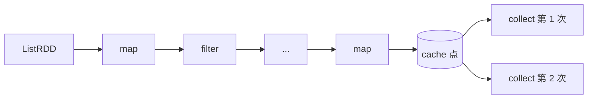
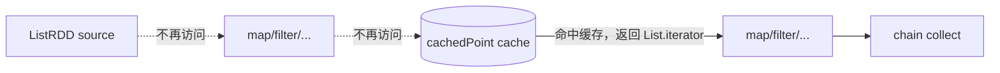
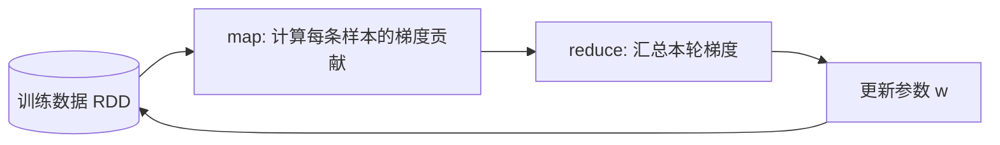

# 第 10 章 · Cache 与 Checkpoint

> 💻 本章完整代码：[GitHub 查看](https://github.com/rchaocai/mini-spark/tree/main/ch10-cache-checkpoint)
>
> 构建运行：`mvn -pl ch10-cache-checkpoint package`
>
> 运行示例：`java -Dfile.encoding=UTF-8 -cp ch10-cache-checkpoint/target/classes com.sparklearn.Main`

先抓住上一章留下的判断：血缘能重算，但重算不一定便宜。

当一个 Task 失败时，调度器会重新提交它。Task 再沿着 RDD 血缘，从父 RDD 一层层算回来。只要源数据还在、函数还在、依赖还在，这个分区就能被重算出来。

这句话是对的，但它还不完整。它只回答了“能不能重算”，没有回答“重算要花多少钱”。

前一章已经把执行搬到另一个 JVM。到了那里，Task、RDD 血缘和用户函数都要先序列化，再穿过 Socket，再在 Executor 里反序列化。一次普通计算已经多了一层网络和序列化成本。

本章代码继续使用本地调度器路径，把重点放回 `RDD.iterator(partition)` 这个读取入口。这样可以先看清 cache 和 checkpoint 插入到哪里；Executor 侧的分布式缓存放在后面的 Info 注释里对照现代 Spark 说明。

这一章先看一个最容易暴露问题的场景：一条很长的血缘。

这条链横向展开后，cache 命中的位置会更清楚：



第 1.5 节里说的逻辑回归和 PageRank，本质上也是同一批数据要反复读。把问题收缩成一条 RDD 链之后，可以先看清一个核心动作：只要 cache 点命中，后面的 action 就不必再向前追。

如果没有任何缓存，每一次 `collect()` 都会从 `ListRDD` 开始，把这么多步重新跑一遍。

如果中间某个分区失败，也要从能找到的最早父分区重新跑一遍。

血缘是容错的保险绳。但绳子越长，重新爬一遍就越累。

本章加两个工具：

```text
cache      把算过的分区留在内存里，下次直接读
checkpoint 把分区写到磁盘，并切断它之前的血缘
```

它们都在控制重算成本，但控制的方式不一样。

cache 更像“抄近路”。路还在，只是命中缓存时不用走。

checkpoint 更像“重新设一个起点”。结果已经写到磁盘，从这里往前的父依赖可以不再追。

> [!INFO]
> **“抄近路”和“新起点”有什么区别？**
>
> 假设一条血缘是 `A -> B -> C -> D`，现在在 `C` 上做 cache。
> 第一次算 `D` 时，还是要从 `A` 一路算到 `C`，再算到 `D`。第二次算 `D` 时，如果 `C` 的缓存还在，就可以从 `C` 的缓存直接往后算到 `D`。
>
> 但这条旧路没有消失。如果缓存丢了，`A -> B -> C` 仍然可以沿血缘重算。
>
> checkpoint 不一样。如果在 `C` 上 checkpoint 成功，`C` 的分区结果已经写到文件里，调度器也会把 `C` 看成没有父依赖的 RDD。后面再算 `D`，最多追到 `C` 的 checkpoint 文件，不再继续追 `A` 和 `B`。

## 10.1 长血缘的问题藏在 iterator 里

要理解 cache 和 checkpoint，先看第 3 章留下来的这个统一入口：

```java
public final Iterator<T> iterator(Partition partition) {
    Objects.requireNonNull(partition, "partition");
    return compute(partition);
}
```

前面几章里，`iterator()` 几乎只是 `compute()` 的外壳。

它重要，是因为所有 RDD 读取分区数据时，都要经过这里。比如 `MapPartitionsRDD.compute(...)`：

```java
public Iterator<U> compute(Partition partition) {
    Iterator<T> parentIterator = parent.iterator(partition);
    return iteratorTransform.apply(parentIterator);
}
```

当前 RDD 要算一个分区，先问父 RDD 要同号分区。父 RDD 又问自己的父 RDD。这样一层层往上，就形成了血缘回溯。

所以，重算不是一个抽象概念。它在代码里就是：

```text
child.compute(partition)
  -> parent.iterator(partition)
      -> parent.compute(partition)
          -> grandParent.iterator(partition)
              -> grandParent.compute(partition)
```

只要没有人拦住这条调用链，它就会一直追到源头。

第 10 章的关键点不是“多了两个新接口”，而是入口没有变：所有分区读取仍然经过 `iterator()`。

在本章这个 mini-Spark 项目里，cache 只要插在这里，就能让后续读取自动命中同一份缓存。

checkpoint 也会先借这个入口改掉“从哪里读数据”。同时，它还要让调度器看到“这个 RDD 已经没有父依赖了”。依赖边界放到 10.6 再拆。

真实 Spark 的早期源码也是这个设计。`RDD.cache()` 只是设置一个 `shouldCache` 标记；真正读取分区时，`RDD.iterator(split)` 再决定是走缓存，还是调用 `compute(split)`。缓存的复杂实现放在 `CacheTracker.getOrCompute(...)` 后面，但插入点仍然是 `iterator()`。

mini-Spark 也沿用这个位置，把 CacheTracker 的职责收束到一个内存 Map 上。

## 10.2 cache：第一次算，第二次读

cache 的基本流程是：

```text
第一次有人要这个分区：
  compute(partition)
  把结果存进内存
  返回结果

第二次有人要这个分区：
  从内存里取
  不再调用 compute(partition)
```

先只看 cache 需要的状态，`RDD` 里有三个相关字段：

```java
private boolean shouldCache;
private final Map<Integer, List<T>> cache = new ConcurrentHashMap<>();
private final AtomicInteger computeCount = new AtomicInteger();
```

`shouldCache` 表示这个 RDD 想缓存。

`cache` 用分区编号做 key，保存这个分区已经算出来的元素列表。

`computeCount` 不是 Spark 的生产功能，只是本章 demo 用来观察“真正调用了几次 compute”。
它统计的是 `compute()` 被调用的次数，不是元素处理次数，也不是 action 次数。

同一个 `RDD` 类里还有 checkpoint 需要的 `checkpointRequested`、`checkpointed`、`checkpointDir` 和 `checkpointedPartitions`。这一节主要介绍 cache，checkpoint 会在 10.5 节单独展开。

> [!INFO]
> **cache 保存在哪里？会不会丢？**
>
> 在本章代码里，cache 是 `RDD` 对象里的一个内存 `Map`。它只保存已经算出来的分区结果，不会把数据写到 checkpoint 文件，也不会切断血缘。
>
> 现代 Spark 里，同样的职责由 Executor 侧的 `BlockManager` 承担。`persist()` 默认先把分区结果放进内存块；如果缓存块丢失，下一次 action 仍会沿血缘重算，再把结果重新放回缓存。
>
> 这意味着缓存块属于具体 Executor。如果某个 Executor 被销毁，或者内存压力导致缓存块被清掉，那些分区的缓存就没了。下一次再需要这些分区时，Spark 不会报错，而是沿着 `A -> B -> C` 这样的血缘重新计算，再把新结果放回缓存。
>
> 所以 cache 是“加速用的捷径”，不是新的数据源。需要更强的保留策略时，Spark 还可以选择 `MEMORY_AND_DISK`、`MEMORY_ONLY_2` 这类 storage level，但它们解决的是缓存保存策略，不改变 cache 不切断血缘这一点。

`cache()` 只记录缓存意图，不负责计算分区：

```java
public final RDD<T> cache() {
    shouldCache = true;
    return this;
}
```

调用 `rdd.cache()` 时，框架只是记下“以后如果真的算到这个 RDD，就把结果留下来”。这一步不会读取父 RDD，也不会生成任何分区结果。

真正填充缓存的时机，是 action 触发 `iterator(partition)` 之后。外层 `iterator()` 先处理 checkpoint，再把普通读取交给 `iteratorWithoutCheckpoint(...)`：

```java
public final Iterator<T> iterator(Partition partition) {
    Objects.requireNonNull(partition, "partition");
    if (checkpointed) {
        return readCheckpointFile(partition);
    }
    if (checkpointRequested) {
        return checkpointPartition(partition);
    }
    return iteratorWithoutCheckpoint(partition);
}
```

cache 分支在 `iteratorWithoutCheckpoint(...)` 里：

```java
private Iterator<T> iteratorWithoutCheckpoint(Partition partition) {
    if (!shouldCache) {
        return computeTracked(partition);
    }

    List<T> cached = cache.get(partition.index());
    if (cached != null) {
        return new ArrayList<>(cached).iterator();
    }

    List<T> computed = materialize(computeTracked(partition));
    cache.put(partition.index(), computed);
    return new ArrayList<>(computed).iterator();
}
```

这个顺序决定了读取优先级。一个 RDD 如果已经 checkpoint，就说明它的数据已经物化到文件里，读取时直接读文件。如果只是请求了 checkpoint，当前分区会先完成 checkpoint 物化。只有没有 checkpoint 介入时，才进入 cache 分支。

这一节先看 cache 分支。没有开 cache 时，和前几章一样，回到原来的 `compute(partition)` 路径。

代码里多包了一层 `computeTracked(...)`，用于给本章示例统计 compute 次数：

```java
private Iterator<T> computeTracked(Partition partition) {
    computeCount.incrementAndGet();
    return compute(partition);
}
```

开了 cache 时，先用分区编号查 `cache`。命中了，就从内存里的列表返回迭代器。

没有命中，才回到 `compute(partition)` 路径。算完以后把迭代器里的元素收集成 `List`，放进缓存，再返回。

这里的 `materialize(...)` 就是做这件事的：

```java
private static <T> List<T> materialize(Iterator<T> iterator) {
    List<T> values = new ArrayList<>();
    iterator.forEachRemaining(values::add);
    return values;
}
```

它把一次性的迭代器完整消费掉，留下一个可以反复读取的 `List`。缓存不能保存“只能走一遍”的迭代器，所以必须先把结果物化出来，再放进 `cache`。

## 10.3 缓存命中时，短路的是整条上游链

示例里先构造一条长血缘。`buildLongLineage(source)` 不做计算，只连续挂上几层 transformation：

```java
private static RDD<Integer> buildLongLineage(RDD<Integer> source) {
    return source
            .map(value -> value * 2)
            .filter(value -> value > 5)
            .map(value -> value + 10)
            .filter(value -> value < 30)
            .map(value -> value * 3)
            .filter(value -> value > 30)
            .map(value -> value - 5)
            .map(value -> value + 1);
}
```

接着选一个中间点作为缓存点。`traceUp(chain, 3)` 从末端 `chain` 沿着父依赖往上走 3 层，拿到链路中间的那个 RDD。

```java
private static RDD<Integer> traceUp(RDD<?> rdd, int steps) {
    RDD<?> current = rdd;
    for (int index = 0; index < steps; index++) {
        current = current.dependencies().get(0).rdd();
    }
    @SuppressWarnings("unchecked")
    RDD<Integer> result = (RDD<Integer>) current;
    return result;
}
```

于是，示例里会观察三个位置：

```java
RDD<Integer> source = sc.parallelize(input, 3);
RDD<Integer> chain = buildLongLineage(source);
RDD<Integer> cachedPoint = traceUp(chain, 3);
```

`source` 是源头 RDD，`chain` 是整条长血缘的末端，`cachedPoint` 是中间缓存点。输入被切成 3 个分区，所以一个 RDD 如果被完整计算一次，`compute` 次数通常就是 3。

先看不加 cache 的版本。两次 `collect()` 都要从 `source` 往后跑完整条链：

```java
List<Integer> first = chain.collect();
List<Integer> second = chain.collect();
```

| 场景 | 第一次 collect 时 | 第二次 collect 时 |
| --- | --- | --- |
| 不加 cache，源头 `source` | 3 | 3 |
| 不加 cache，中间点 `cachedPoint` | 3 | 3 |

两次都是 3，说明每一次 `collect()` 都会重新访问 3 个分区。没有 cache 时，第二次 action 不会复用第一次 action 的分区结果。

加上 cache 后，唯一的代码变化是在中间点 `cachedPoint` 上调用 `cache()`。

```java
cachedPoint.cache();

List<Integer> first = chain.collect();
List<Integer> second = chain.collect();
```

第一次 `collect()` 仍然要从源头算，因为缓存还没有内容；但这次算到 `cachedPoint` 时，会把 3 个分区结果放进缓存。第二次 `collect()` 再经过 `cachedPoint`，就会直接命中缓存：

| 场景 | 第一次 collect 后 | 第二次 collect 时 |
| --- | --- | --- |
| cache 中间点，源头 `source` | 3 | 0 |
| cache 中间点，中间点 `cachedPoint` | 3 | 0 |
| cache 中间点，末端 `chain` | 3 | 3 |

末端 `chain` 仍然要算 3 次，因为缓存点之后的下游链路还要继续执行。真正被短路的是缓存点之前的上游链路。

第二次 `collect()` 经过缓存点时，调用链在这里断开：



cache 命中时，`cachedPoint.iterator(partition)` 直接返回缓存里的 `List.iterator()`。它不会调用 `cachedPoint.compute(partition)`，也就不会继续调用父 RDD 的 `iterator(partition)`。

cache 在长血缘里省下的成本，不是某一个 `map` 或 `filter`，而是缓存点之前的整段血缘。

## 10.4 cache 放在哪里

cache 不是越早越好，也不是越晚越好。

先看一个更准确的说法：cache 应该放在会被复用的位置上，通常是几条下游链路的共同上游。

```text
如果一个 RDD 只会被一个下游 action 用一次：
  cache 它通常不值

如果一个 RDD 会被多个下游 action 复用：
  cache 它能让这些 action 共享同一份结果

如果同一条长链会被反复 action 访问：
  cache 它能让后续 action 直接复用结果
```

更准确地说，要看三个因素：

```text
这个 RDD 被复用几次
算到这个 RDD 要花多少钱
这个 RDD 的分区结果占多少内存
```

如果一个 RDD 只会被用一次，cache 没意义。保存它还会额外占用内存。

如果一个 RDD 会被反复使用，而且算它要读文件、走网络、跑很长血缘，cache 的收益就很明显。

迭代式机器学习就是这种复用模式的典型场景。

第 1.5 节里的逻辑回归，就是这种模式最典型的缩影。训练过程可以收缩成一维梯度下降：



每一轮都要从同一份训练数据里重新算梯度，所以 cache 的效果会体现在源 RDD 的计算次数上：不缓存时，源 RDD 每一轮都要重新算；缓存以后，第一轮把数据读进内存，后面的轮次直接复用。

本章 `Main` 里就有这个小例子。用当前已经实现的 `map` 和 `reduce` 跑三轮训练，观察源 RDD 的 `compute` 次数：

```text
不缓存训练数据: source.compute = 3, 3, 3
cache 训练数据: source.compute = 3, 0, 0
```

两边的参数更新过程一样，差别只在训练数据是否被重复读取。

逻辑回归的训练通常是一轮一轮更新参数。每一轮都要读同一份训练数据。如果没有 cache，10 轮训练就读 10 次数据。数据在 HDFS 上时，这意味着每轮都有磁盘 I/O 和网络 I/O。

把训练数据 RDD 缓存起来以后，第一轮把数据读进内存，后面的轮次直接读内存。

对迭代式算法来说，cache 直接减少的是每一轮训练或迭代里重复读取同一批数据的成本。轮数越多、数据越大，这个差距越明显。

## 10.5 checkpoint：把血缘切断

cache 解决的是“反复读同一批数据太贵”的问题，但它不改变数据的来源。缓存命中时，计算可以绕开上游；缓存一旦丢了，Spark 仍然可以沿着原来的血缘重新算回来。也就是说，cache 更像一条近路，路还在，只是平时不用每次都走。

checkpoint 处理的是另一类问题：血缘太长时，重算的代价会一路累积，最后大到难以接受。拿 PageRank 来说，`links` 是固定的网页链接图，适合反复缓存；`ranks` 则会在每一轮迭代里由上一轮的 `ranks` 生成新的 `ranks`。如果第 20 轮某个分区丢了，还要从第 1 轮一路重算到第 20 轮，成本就太高了。

所以 checkpoint 要做两件事：

1. 把当前 RDD 的每个分区写到一个可重新读取的位置
2. 让这个 RDD 不再向前暴露父依赖

当前例子仍然沿用前面的长血缘。`checkpointPoint` 不是 `RDD` 的字段，而是 `Main.runWithCheckpoint(...)` 里的一个局部变量：它表示从长血缘中间取出的那个 RDD。

```java
RDD<Integer> source = sc.parallelize(input, 3);
RDD<Integer> chain = buildLongLineage(source);
RDD<Integer> checkpointPoint = traceUp(chain, 3);

checkpointPoint.checkpoint();
```

这段代码只是登记 checkpoint 请求。真正触发计算的 action，是后面那次 `collect()`。

`checkpoint()` 只记录意图：

```java
public final void checkpoint() {
    checkpointRequested = true;
}
```

checkpoint 相关状态集中在 `RDD` 父类里：

```java
private boolean checkpointRequested;
private boolean checkpointed;
private File checkpointDir;
private final Set<Integer> checkpointedPartitions =
        ConcurrentHashMap.newKeySet();
```

`checkpointRequested` 表示已经登记 checkpoint 请求。`checkpointedPartitions` 记录哪些分区已经写入文件。只有所有分区都写完，`checkpointed` 才会变成 true。

此时 `checkpointPoint` 还没有数据文件，`dependencies()` 也仍然能看到父 RDD。下一次 action 经过这个 RDD 时，`iterator(partition)` 才会起作用：

```java
public final Iterator<T> iterator(Partition partition) {
    Objects.requireNonNull(partition, "partition");
    if (checkpointed) {
        return readCheckpointFile(partition);
    }
    if (checkpointRequested) {
        return checkpointPartition(partition);
    }
    return iteratorWithoutCheckpoint(partition);
}
```

如果 checkpoint 已经完成，就直接读文件。如果只是请求了 checkpoint，还没有物化，就进入 `checkpointPartition(partition)`：

```java
private Iterator<T> checkpointPartition(Partition partition) {
    File dir = ensureCheckpointDir();
    File file = checkpointFile(dir, partition);
    if (file.exists()) {
        return readCheckpointFile(partition);
    }
    List<T> values = materialize(iteratorWithoutCheckpoint(partition));
    writeCheckpointFile(dir, partition, values);
    markCheckpointPartitionComplete(partition);
    return new ArrayList<>(values).iterator();
}
```

这一段就是 checkpoint 的物化过程：当前分区先按原来的读取路径拿到数据，再写入 checkpoint 文件。这个读取路径可能沿血缘计算，也可能命中已有 cache。`collect()` 会访问所有分区，所以它结束后，所有分区都已经写好。

等最后一个分区写完，`markCheckpointPartitionComplete(partition)` 会把这个 RDD 标记为 checkpointed。此后它发生两个变化：

1. `iterator(partition)` 不再沿父血缘往上算，而是直接读 checkpoint 文件。
2. `dependencies()` 返回空列表，调度器再往上找时，会把这里当成血缘终点。

真实 Spark 也是这个时间线：`rdd.checkpoint()` 先记录请求，后续 action 第一次把这个 RDD 算出来时，再把结果写到可靠存储。mini-Spark 使用本地临时目录作为 checkpoint 位置，但保留同一个核心流程：先在 action 中物化分区结果，再切断血缘。

## 10.6 dependencies 为什么变成 final

checkpoint 不只是“下次从文件读”。

它还要让调度器看见：这个 RDD 已经没有父依赖了。

可以把两层职责分开记：

```text
iterator()      决定分区数据从哪儿读
dependencies()  决定调度器还能不能继续向上找
```

第 7 章的 `DAGScheduler` 会沿着 `rdd.dependencies()` 回溯，遇到窄依赖继续走，遇到 shuffle 依赖切 Stage。

如果 checkpoint 物化后 `dependencies()` 仍然返回父 RDD，调度器还是会继续向上追。那就没有真正切断血缘。

所以本章把 `dependencies()` 放到父类 `RDD` 里，并且设为 `final`：

```java
public final List<Dependency<?>> dependencies() {
    if (checkpointed) {
        return List.of();
    }
    return getDependenciesInternal();
}
```

子类不再重写 `dependencies()`，而是改写：

```java
protected abstract List<Dependency<?>> getDependenciesInternal();
```

`MapPartitionsRDD` 仍然有一个父 RDD：

```java
protected List<Dependency<?>> getDependenciesInternal() {
    return dependencies;
}
```

`ListRDD` 仍然没有父 RDD：

```java
protected List<Dependency<?>> getDependenciesInternal() {
    return List.of();
}
```

但 checkpoint 物化之后，父类会统一返回空列表。

这样可以把“checkpoint 物化后没有父依赖”这条规则收口到父类里，避免每个子类都重复判断一次。

## 10.7 跑一遍 checkpoint

示例 Part C 会在同一个中间 RDD 上调用 `checkpoint()`，再用一次 `collect()` 触发物化：

```text
Part C: checkpoint 中间 RDD，切断它的父依赖
checkpoint 前依赖数: 1
checkpoint 请求后依赖数: 1
isCheckpointed: false
触发 checkpoint 的 collect: [48, 54, 60, 66, 72, 78, 84]
checkpoint 物化后依赖数: 0
isCheckpointed: true
```

先看前两个数字：调用 `checkpoint()` 以后，依赖数仍然是 1，`isCheckpointed` 仍然是 false。因为这时只是记录了 checkpoint 请求，还没有 action 真正把分区算出来。

`collect()` 触发计算以后，checkpoint 文件才写出来。等所有分区都写完，依赖数变成 0。这意味着 `DAGScheduler` 再从这个 RDD 往上找父 Stage 时，到这里就停了。

随后示例从 checkpoint RDD 继续往下建一条链：

```java
RDD<Integer> downstream = checkpointPoint
        .map(value -> value * 10)
        .filter(value -> value > 200);
```

再执行 `collect()`：

```text
checkpoint 后继续往下计算: [480, 540, 600, 660, 720, 780, 840]
源头 compute 次数: 0
checkpoint 点 compute 次数: 0
```

源头是 0，说明没有回溯到 `ListRDD`。

checkpoint 点也是 0，说明没有调用这个 RDD 原来的 `compute()`，而是直接从 checkpoint 文件读。

checkpoint 和 cache 的区别就落在这里。

cache 命中时不走血缘；缓存没命中时，血缘还在。

checkpoint 完成后，血缘被切断。下游再重算，最多追到 checkpoint 文件。

## 10.8 本章小结

第 8 章说：血缘让失败的分区可以重算。

本章补上后半句：血缘太长时，重算成本会变高。

cache 和 checkpoint 都是在控制这个成本。

cache 把分区结果留在内存里。它快，适合反复使用的数据，比如逻辑回归每轮都要读的训练数据。但它不切断血缘。缓存丢了，还能从父 RDD 重算。

checkpoint 把分区结果写到磁盘，并让 `dependencies()` 返回空列表。它慢一些，但给容错重算设了上限。PageRank 里不断变长的 `ranks` 就是典型对象。

本章的关键改动集中在一个方法上：

```java
RDD.iterator(partition)
```

前几章里，所有父子 RDD 都通过它读取分区。到了第 10 章，这个统一入口接住了两种短路：

```text
checkpoint 命中 -> 读磁盘文件
cache 命中      -> 读内存列表
都没命中        -> compute(partition)
```

到这里，`iterator()` 仍然是分区读取入口。cache 和 checkpoint 只是让这个入口在合适的时候提前返回：命中缓存时从内存返回，checkpoint 完成后从文件返回，否则继续沿血缘调用 `compute(partition)`。
