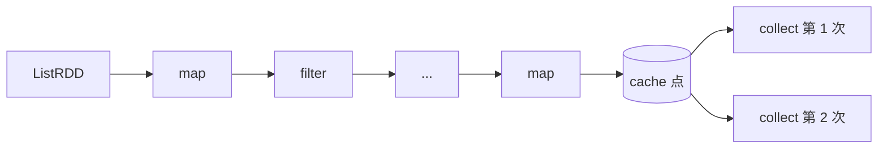
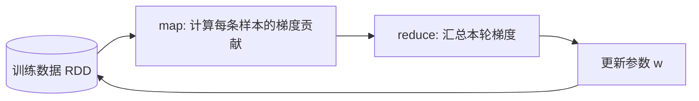

# 第 10 章 · Cache 与 Checkpoint

> 💻 本章完整代码：[GitHub 查看](https://github.com/rchaocai/mini-spark/tree/main/ch10-cache-checkpoint)
>
> 构建运行：`mvn -pl ch10-cache-checkpoint package`
>
> 运行示例：`java -Dfile.encoding=UTF-8 -cp ch10-cache-checkpoint/target/classes com.sparklearn.Main`

先抓住上一章留下的判断：血缘能重算，但重算不一定便宜。

当一个 Task 失败时，调度器会重新提交它。Task 再沿着 RDD 血缘，从父 RDD 一层层算回来。只要源数据还在、函数还在、依赖还在，这个分区就能被重算出来。

这句话是对的，但它还不完整。它只回答了“能不能重算”，没有回答“重算要花多少钱”。

前一章已经把执行搬到另一个 JVM。到了那里，Task、RDD 血缘和用户函数都要先序列化，再穿过 Socket，再在 Executor 里反序列化。一次普通计算已经多了一层网络和序列化成本。

这一章先看一个最容易暴露问题的场景：一条很长的血缘。

把它横着画出来，会更容易看清 cache 命中的位置：



第 1.5 节里说的逻辑回归和 PageRank，本质上也是同一批数据要反复读。这里把它缩成一条 RDD 链，就能更直接地看到：只要 cache 点命中，后面的 action 就不必再向前追。

如果没有任何缓存，每一次 `collect()` 都会从 `ListRDD` 开始，把这么多步重新跑一遍。

如果中间某个分区失败，也要从能找到的最早父分区重新跑一遍。

血缘是容错的保险绳。但绳子越长，重新爬一遍就越累。

本章加两个工具：

```text
cache      把算过的分区留在内存里，下次直接读
checkpoint 把分区写到磁盘，并切断它之前的血缘
```

它们都在控制重算成本，但控制的方式不一样。

cache 更像“抄近路”。路还在，只是命中缓存时不用走。

checkpoint 更像“重新设一个起点”。结果已经写到磁盘，从这里往前的父依赖可以不再追。

> [!INFO]
> **“抄近路”和“新起点”有什么区别？**
>
> 假设一条血缘是 `A -> B -> C -> D`，现在在 `C` 上做 cache。
> 第一次算 `D` 时，还是要从 `A` 一路算到 `C`，再算到 `D`。第二次算 `D` 时，如果 `C` 的缓存还在，就可以从 `C` 的缓存直接往后算到 `D`。
>
> 但这条旧路没有消失。如果缓存丢了，`A -> B -> C` 仍然可以沿血缘重算。
>
> checkpoint 不一样。如果在 `C` 上 checkpoint 成功，`C` 的分区结果已经写到文件里，调度器也会把 `C` 看成没有父依赖的 RDD。后面再算 `D`，最多追到 `C` 的 checkpoint 文件，不再继续追 `A` 和 `B`。

## 10.1 长血缘的问题藏在 iterator 里

要理解 cache 和 checkpoint，先看第 3 章留下来的这个统一入口：

```java
public final Iterator<T> iterator(Partition partition) {
    Objects.requireNonNull(partition, "partition");
    return compute(partition);
}
```

前面几章里，`iterator()` 几乎只是 `compute()` 的外壳。

但它很重要。

所有 RDD 读取分区数据时，都要经过这里。比如 `MapPartitionsRDD.compute(...)`：

```java
public Iterator<U> compute(Partition partition) {
    Iterator<T> parentIterator = parent.iterator(partition);
    return iteratorTransform.apply(parentIterator);
}
```

当前 RDD 要算一个分区，先问父 RDD 要同号分区。父 RDD 又问自己的父 RDD。这样一层层往上，就形成了血缘回溯。

所以，重算不是一个抽象概念。它在代码里就是：

```text
child.compute(partition)
  -> parent.iterator(partition)
      -> parent.compute(partition)
          -> grandParent.iterator(partition)
              -> grandParent.compute(partition)
```

只要没有人拦住这条调用链，它就会一直追到源头。

第 10 章真正要抓住的，不是“多了两个新接口”，而是入口没有变：还是 `iterator()`。

因为所有分区读取都经过这里。

在本章这个 mini-Spark 项目里，cache 只要插在这里，就能让后续读取自动命中同一份缓存。

checkpoint 也会先借这个入口改掉“从哪里读数据”。不过它还多一件事：它要让调度器看到“这个 RDD 已经没有父依赖了”。这个依赖边界，我们放到后面的 10.6 再拆。

真实 Spark 的早期源码也是这个设计。`RDD.cache()` 只是设置一个 `shouldCache` 标记；真正读取分区时，`RDD.iterator(split)` 再决定是走缓存，还是调用 `compute(split)`。缓存的复杂实现放在 `CacheTracker.getOrCompute(...)` 后面，但插入点仍然是 `iterator()`。

mini-Spark 也沿用这个位置，把 CacheTracker 的职责收束到一个内存 Map 上。

## 10.2 cache：第一次算，第二次读

cache 的直觉很简单：

```text
第一次有人要这个分区：
  compute(partition)
  把结果存进内存
  返回结果

第二次有人要这个分区：
  从内存里取
  不再调用 compute(partition)
```

先只看 cache 需要的状态，`RDD` 多了三个字段：

```java
private boolean shouldCache;
private final Map<Integer, List<T>> cache = new ConcurrentHashMap<>();
private final AtomicInteger computeCount = new AtomicInteger();
```

`shouldCache` 表示这个 RDD 想缓存。

`cache` 用分区编号做 key，保存这个分区已经算出来的元素列表。

`computeCount` 不是 Spark 的生产功能，只是本章 demo 用来观察“真正调用了几次 compute”。
它统计的是 `compute()` 被调用的次数，不是元素处理次数，也不是 action 次数。

同一个 `RDD` 类里还有 checkpoint 需要的 `checkpointed` 和 `checkpointDir`。它们暂时先放在一边；这一节只看 cache。等看到完整的 `iterator()` 时，你会发现 checkpoint 的优先级排在 cache 前面。

`cache()` 本身很短：

```java
public final RDD<T> cache() {
    shouldCache = true;
    return this;
}
```

注意，它没有计算任何分区。

这就是惰性。

调用 `rdd.cache()` 的时候，你只是告诉框架：“以后如果真的算到了这个 RDD，请把结果留下来。”

什么时候真正填缓存？

等 action 触发 `iterator(partition)`。

```java
public final Iterator<T> iterator(Partition partition) {
    Objects.requireNonNull(partition, "partition");
    if (checkpointed) {
        return readCheckpointFile(partition);
    }
    if (!shouldCache) {
        return computeTracked(partition);
    }

    List<T> cached = cache.get(partition.index());
    if (cached != null) {
        return new ArrayList<>(cached).iterator();
    }

    List<T> computed = materialize(computeTracked(partition));
    cache.put(partition.index(), computed);
    return new ArrayList<>(computed).iterator();
}
```

这段代码的顺序很重要。

第一层先看 checkpoint。一个 RDD 如果已经 checkpoint，就说明它的数据已经物化到文件里，读取时应该直接读文件，而不是再去考虑内存 cache。

第二层才看 cache。没有开 cache 时，和前几章一样，直接 `computeTracked(partition)`。

开了 cache 时，先用分区编号查 `cache`。命中了，就从内存里的列表返回迭代器。

没有命中，才真的调用 `computeTracked(partition)`。算完以后把迭代器里的元素收集成 `List`，放进缓存，再返回。

为什么要把迭代器收集成 `List`？

因为迭代器只能往前走一次。缓存不能保存“已经被消费过的迭代器”，它必须保存一份可以反复读取的数据。

## 10.3 缓存命中时，短路的是整条上游链

运行第 10 章示例，Part A 先不加 cache：

```text
Part A: 没有 cache，两次 action 都会重算上游
第一次 collect: [44, 50, 56, 62, 68, 74, 80]
compute 次数: 源头=3，中间点=3，末端=3
第二次 collect: [44, 50, 56, 62, 68, 74, 80]
compute 次数: 源头=6，中间点=6，末端=3
```

这里有 3 个分区。

第一次 `collect()` 后，源头 `ListRDD` 的 `compute` 调了 3 次。第二次又调了 3 次，所以累计变成 6 次。

这里故意只重置了末端 RDD 的计数，所以 `source` 和中间点显示的是累计值，末端显示的是第二次 action 的次数。

没有 cache 时，每个 action 都重新走一遍上游。

Part B 在中间 RDD 上调用 `cache()`：

```java
RDD<Integer> source = sc.parallelize(input, 3);
RDD<Integer> chain = buildLongLineage(source);
RDD<Integer> cachedPoint = traceUp(chain, 3);
cachedPoint.cache();
```

第一次 `collect()` 还是要从源头算，因为缓存还没内容：

```text
第一次 collect，填充缓存: [44, 50, 56, 62, 68, 74, 80]
compute 次数: 源头=3，中间点=3，末端=3
```

第二次 `collect()` 就不一样了：

```text
第二次 collect，命中缓存: [44, 50, 56, 62, 68, 74, 80]
compute 次数: 源头=0，中间点=0，末端=3
```

源头是 0。

中间点也是 0。

这说明缓存命中以后，不只是“少算了中间这一层”。它连中间点之前的所有父 RDD 都不再访问。

原因就在 `iterator()`：

```text
cachedPoint.iterator(partition)
  -> cache 命中
  -> 直接返回 List.iterator()
  -> 不调用 cachedPoint.compute(partition)
  -> 不调用 parent.iterator(partition)
  -> 更上游全部安静
```

一步命中，整条上游链都被短路。

这就是 cache 在长血缘里真正省下来的成本。

## 10.4 cache 放在哪里

cache 不是越早越好，也不是越晚越好。

先看一个更准确的说法：cache 应该放在会被复用的位置上，通常是几条下游链路的共同上游。

```text
如果一个 RDD 只会被一个下游 action 用一次：
  cache 它通常不值

如果一个 RDD 会被多个下游 action 复用：
  cache 它能让这些 action 共享同一份结果

如果同一条长链会被反复 action 访问：
  cache 它能让后续 action 直接复用结果
```

更准确地说，要看三个因素：

```text
这个 RDD 被复用几次
算到这个 RDD 要花多少钱
这个 RDD 的分区结果占多少内存
```

如果一个 RDD 只会被用一次，cache 没意义。你为了存它，还多占了内存。

如果一个 RDD 会被反复使用，而且算它要读文件、走网络、跑很长血缘，cache 就很值。

这也是为什么 Spark 论文里反复提迭代式机器学习。

第 1.5 节里的逻辑回归，就是这种模式最典型的缩影。为了把它变成一个能直接跑的例子，可以把训练过程缩成一维梯度下降：



每一轮都要从同一份训练数据里重新算梯度，所以 cache 的效果会非常直观：不缓存时，源 RDD 每一轮都要重新算；缓存以后，第一轮把数据读进内存，后面的轮次直接复用。

本章 `Main` 里就有这个小例子。用当前已经实现的 `map` 和 `reduce` 跑三轮训练，观察源 RDD 的 `compute` 次数：

```text
不缓存训练数据: source.compute = 3, 3, 3
cache 训练数据: source.compute = 3, 0, 0
```

两边的参数更新过程一样，差别只在训练数据有没有被重复读取。

逻辑回归的训练通常是一轮一轮更新参数。每一轮都要读同一份训练数据。如果没有 cache，10 轮训练就读 10 次数据。数据在 HDFS 上时，这意味着每轮都有磁盘 I/O 和网络 I/O。

把训练数据 RDD 缓存起来以后，第一轮把数据读进内存，后面的轮次直接读内存。

这不是一点点优化。

对迭代式算法来说，cache 往往是“能不能跑得动”的分界线。

## 10.5 checkpoint：把血缘切断

cache 很快，但它有一个弱点：缓存只是捷径，不是新的源头。

缓存没了，Spark 仍然可以沿血缘重算。

这对性能不一定好，但对容错是好事。因为只要血缘还在，缓存丢了也能恢复。

checkpoint 解决的是另一个问题：血缘太长时，容错重算没有上限。

例如 PageRank。

`links` 表示网页之间的链接关系。它每轮都会被读，适合 cache。

`ranks` 表示当前每个网页的排名。每一轮都会从上一轮的 `ranks` 变换出新的 `ranks`。如果做 20 轮，最后的 `ranks` 背后就有 20 轮血缘。

如果第 20 轮某个分区丢了，从第 1 轮重新算到第 20 轮，代价就太高了。

这时 checkpoint 要做两件事：

```text
1. 把当前 RDD 的每个分区写到一个可重新读取的位置
2. 让这个 RDD 不再向前暴露父依赖
```

真实 Spark 通常会把 checkpoint 写到 HDFS 这类可靠存储。mini-Spark 使用本地临时目录作为 checkpoint 位置。
这里的 checkpoint 是立即执行的 driver 端操作，不经过调度器，也不覆盖完整分布式 checkpoint 语义。
但它足够让我们看清 checkpoint 的两个动作：先物化分区，再切断血缘。

```java
public final void checkpoint() {
    try {
        File dir = Files.createTempDirectory("spark-checkpoint-").toFile();
        for (Partition partition : partitions()) {
            List<T> values = materialize(iterator(partition));
            writeCheckpointFile(dir, partition, values);
        }
        checkpointDir = dir;
        checkpointed = true;
    } catch (IOException e) {
        throw new UncheckedIOException(e);
    }
}
```

注意顺序。

先物化所有分区。

全部写成功以后，才把 `checkpointed` 设成 true。

如果反过来，先切断血缘再写文件，一旦写到一半失败，这个 RDD 既没有完整 checkpoint，也不能回到父 RDD 重算。

`iterator()` 里也把 checkpoint 放在最高优先级：

```java
if (checkpointed) {
    return readCheckpointFile(partition);
}
```

一旦 checkpoint 完成，读取这个 RDD 分区时，直接从文件读，不再调用 `compute(partition)`。

## 10.6 dependencies 为什么变成 final

checkpoint 不只是“下次从文件读”。

它还要让调度器看见：这个 RDD 已经没有父依赖了。

可以把两层职责分开记：

```text
iterator()      决定分区数据从哪儿读
dependencies()  决定调度器还能不能继续向上找
```

第 7 章的 `DAGScheduler` 会沿着 `rdd.dependencies()` 回溯，遇到窄依赖继续走，遇到 shuffle 依赖切 Stage。

如果 checkpoint 后 `dependencies()` 仍然返回父 RDD，调度器还是会继续向上追。那就没有真正切断血缘。

所以本章把 `dependencies()` 放到父类 `RDD` 里，并且设为 `final`：

```java
public final List<Dependency<?>> dependencies() {
    if (checkpointed) {
        return List.of();
    }
    return getDependenciesInternal();
}
```

子类不再重写 `dependencies()`，而是改写：

```java
protected abstract List<Dependency<?>> getDependenciesInternal();
```

`MapPartitionsRDD` 仍然有一个父 RDD：

```java
protected List<Dependency<?>> getDependenciesInternal() {
    return dependencies;
}
```

`ListRDD` 仍然没有父 RDD：

```java
protected List<Dependency<?>> getDependenciesInternal() {
    return List.of();
}
```

但 checkpoint 之后，父类会统一返回空列表。

这样写是为了把“checkpoint 后没有父依赖”这条规则收口到父类里，避免每个子类都重复判断一次。

## 10.7 跑一遍 checkpoint

示例 Part C 会在同一个中间 RDD 上调用 `checkpoint()`：

```text
Part C: checkpoint 中间 RDD，切断它的父依赖
checkpoint 前依赖数: 1
checkpoint 后依赖数: 0
isCheckpointed: true
```

依赖数从 1 变成 0。

这不是为了好看。

这意味着 `DAGScheduler` 再从这个 RDD 往上找父 Stage 时，到这里就停了。

随后示例从 checkpoint RDD 继续往下建一条链：

```java
RDD<Integer> downstream = checkpointPoint
        .map(value -> value * 10)
        .filter(value -> value > 200);
```

再执行 `collect()`：

```text
checkpoint 后继续往下计算: [480, 540, 600, 660, 720, 780, 840]
源头 compute 次数: 0
checkpoint 点 compute 次数: 0
```

源头是 0，说明没有回溯到 `ListRDD`。

checkpoint 点也是 0，说明没有调用这个 RDD 原来的 `compute()`，而是直接从 checkpoint 文件读。

这就是 checkpoint 和 cache 的区别。

cache 命中时不走血缘；但缓存没命中时，血缘还在。

checkpoint 完成后，血缘被切断。下游再重算，最多追到 checkpoint 文件。

## 10.8 本章小结

第 8 章说：血缘让失败的分区可以重算。

本章补上后半句：血缘太长时，重算成本会变高。

cache 和 checkpoint 都是在控制这个成本。

cache 把分区结果留在内存里。它快，适合反复使用的数据，比如逻辑回归每轮都要读的训练数据。但它不切断血缘。缓存丢了，还能从父 RDD 重算。

checkpoint 把分区结果写到磁盘，并让 `dependencies()` 返回空列表。它慢一些，但给容错重算设了上限。PageRank 里不断变长的 `ranks` 就是典型对象。

最后，再回头看代码。

本章真正改动的中心只有一个方法：

```java
RDD.iterator(partition)
```

前几章我们一直让所有父子 RDD 通过它读取分区。到了第 10 章，这个统一入口终于把两种短路都接住了：

```text
checkpoint 命中 -> 读磁盘文件
cache 命中      -> 读内存列表
都没命中        -> compute(partition)
```

前面章节不是在堆功能，而是在一步一步给后面的机制留位置。

下一章我们不再继续往 mini-Spark 里加功能，而是打开真实 Spark 源码，把 `RDD`、`Dependency`、`DAGScheduler`、`Task` 和本书实现并排看一遍。

到那时你会发现：工业系统当然复杂得多，但核心骨架已经在你手里了。
