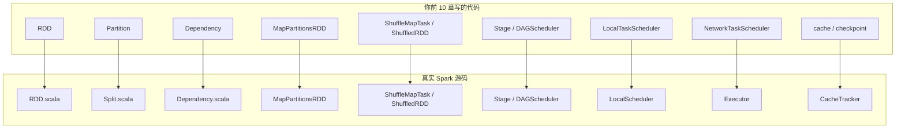
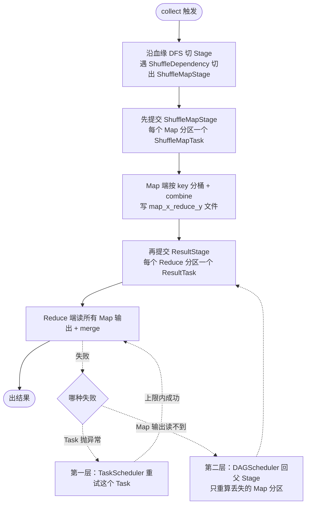
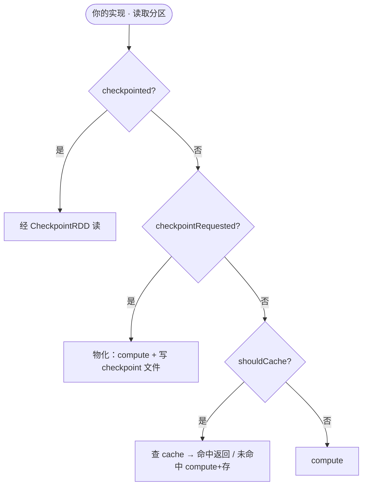
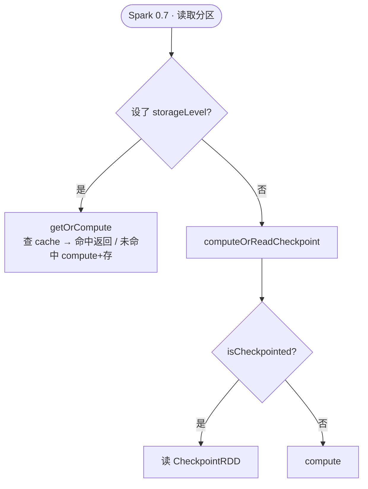

# 第 11 章 · 致敬工业级 Spark

> 💻 本章完整代码：[GitHub 查看](https://github.com/rchaocai/mini-spark/tree/main/ch11-real-spark)
>
> 构建运行：`mvn -pl ch11-real-spark package`
>
> 运行示例：`java -Dfile.encoding=UTF-8 -cp ch11-real-spark/target/classes com.sparklearn.Main`

前 10 章，你一行一行写过这些东西：

```text
RDD / Partition / Dependency
MapPartitionsRDD / ShuffledRDD
Task / Stage / DAGScheduler
LocalTaskScheduler / NetworkTaskScheduler
cache / checkpoint
```

每一块都是你敲出来的。

这一章把它们和真实 Apache Spark 的源码并排放在一起。对照的是 Apache Spark 0.5（[apache/spark](https://github.com/apache/spark) 的 [`branch-0.5`](https://github.com/apache/spark/tree/branch-0.5) 分支，约 `v0.5.2`）——RDD 时代、Scala/SBT、还没有 Spark SQL 的早期版本，结构最纯粹。相关文件大多在 [`core/src/main/scala/spark/`](https://github.com/apache/spark/tree/branch-0.5/core/src/main/scala/spark) 下，读者可以打开它和本章代码并排阅读。

对照有两种比法：

```text
比签名：贴出两边的类名、方法签名，一一指认
比运行：让两边各跑一次同一个 job，看运行时的步骤对不对得上
```

比签名，让你认得零件——「这个我写过」。比运行，让你看到它跑起来的样子——「和我写的一模一样」。这一章两种都比，但着重点在比运行：签名对得上只是形似，一条 job 从提交到出结果、shuffle 怎么交接、失败了怎么恢复——这些运行步骤两边一致，才是「核心一模一样」的真正证据。

## 11.1 先认几个 Scala 词

真实 Spark 是用 Scala 写的。Scala 跑在 JVM 上，编译成 `.class` 文件，和 Java 可以互相调用。

对 Java 程序员来说，读 Scala 最大的障碍通常不是语义，而是几个陌生关键字。

下面这张表，够你读懂 90% 的 `RDD` / `DAGScheduler` / `Shuffle` 源码。其余高级特性（隐式参数、上下文界定、高阶类型）本章一律不碰。

| Scala | Java 等价 | 出现在哪 |
|---|---|---|
| `class Foo(x: Int)` | 类 + 构造参数 `Foo(int x)` | 到处都是 |
| `case class Foo(x: Int)` | `record Foo(int x)` | `CompletionEvent` 一类值对象 |
| `trait Foo` | `interface Foo`（可有默认方法） | `DAGScheduler`、`Logging` |
| `sealed trait Foo` | `sealed interface Foo` | `Dependency`（只允许 `NarrowDependency` / `ShuffleDependency`） |
| `object Foo` | 单例 / 静态工具类 | `SparkEnv`、`Accumulators` |
| `def f(x: Int): Int = ...` | 方法 `int f(int x) { ... }` | 到处都是 |
| `val x = ...` | `final` 引用 | 到处都是 |

再补三个小细节：

```text
x: Int            类型写在冒号后面，和 Java 的 int x 反过来
Option[T]         ≈ Optional<T>
Seq[String]       ≈ List<String>
Array[T]          ≈ T[]
```

还有一点你会很快注意到：Spark 源码几乎每一行都是 `val`。它就是不可变引用——赋值后不能再改，读源码时当 Java 的 `final` 就行。至于为什么这么执着于不可变，第 8 章那条「不可变 → 重算幂等 → 容错安全」已经讲透，这里不重复。

认完这些词，接下来就开始对照。

## 11.2 本章看什么

代码上，这一章和前 10 章几乎一样：把整套可运行系统——`RDD`、`Dependency`、`DAGScheduler`、`ShuffledRDD`、`TaskScheduler`、cache / checkpoint——搬到了 `ch11-real-spark/`，再补一个 `SparkSourceMapDemo` 打印静态对照表。打开本章目录，你看到的就是前 10 章的完整快照。

但看的角度变了。

```text
前 10 章：新概念 → 新代码 → 新 demo
本章：   让整机跑起来 → 对照运行行为
```

本章用三条运行时线索做对照：

```text
一条 job 怎么跑完     Stage 怎么切、按什么顺序提交
shuffle 数据怎么交接   Map 写盘 → Reduce 读盘
失败时怎么恢复         两层：Task 重试、Map 输出重算
```

每条都让两边各跑一次，看步骤对不对得上。先把整机跑起来：

```bash
mvn -pl ch11-real-spark package
java -Dfile.encoding=UTF-8 -cp ch11-real-spark/target/classes com.sparklearn.Main
```

你会先看到一张静态对照地图，再看到一段 `map → reduceByKey → collect` 的 pipeline，最后看到失败与恢复的运行时。接下来三节，就是把这些运行时拆开，和真实 Spark 并排对照。

> [!INFO]
> **为什么对照要看运行行为？**
>
> 贴两段代码比签名，只能说明形似：类名对得上、方法名对得上。
>
> 但一条 job 真正跑起来要经过很多步：切 Stage、决定先跑谁、shuffle 写盘再读盘、某个任务失败后怎么办。这些步骤的顺序和处理方式，才决定一台计算引擎长什么样。
>
> 所以本章的重心不在「这个类叫什么」，而在「跑起来，它先后做了什么」——并看真实 Spark 是不是按同样的步骤走。

## 11.3 两张地图

对照可以从两个角度看，对应两张地图。

### 结构图：零件对零件

`SparkSourceMapDemo` 打印的 16 行，可以先理解成下面这张总图——每个你写过的类，对应真实 Spark 哪个文件：



更完整的路径表在仓库的 [`reference-notes/spark-source-map.md`](https://github.com/rchaocai/mini-spark/blob/main/reference-notes/spark-source-map.md)。

这个版本没有 Spark SQL，没有 Catalyst，没有 DataFrame API——正因为纯粹，它和你前 10 章写的代码对应关系才最清晰。

现代 Spark 2.x / 3.x 在这个内核之上加了很多层，但底座没有换。你读懂了这一层，就读懂了后面所有版本的根。

### 行为图：一条 job 怎么走

结构图是静态的「谁对应谁」。但一条 job 跑起来是一条动线。下图是 `collect()` 触发后，两边都会走的运行时路径——实线是正常流程，虚线是失败时岔出去的两层恢复：



这张图就是本章第 11.4 节的目录：4.1 讲主流程（建 Stage 到出结果），4.2 讲 shuffle 数据交接，4.3 讲虚线那两层恢复，4.4 讲 cache / checkpoint 在哪一步短路。

## 11.4 运行行为对照

### 11.4.1 一条 action 怎么跑完

把 Part B 那段 `map → reduceByKey → collect` 跑起来，DAGScheduler 会先把 Stage 划分结果打印出来，再按顺序提交：

```text
Stage 划分结果:
ResultStage 1 (rdd=ShuffledRDD, parents=[0])
  ShuffleMapStage 0 (rdd=MapPartitionsRDD, parents=[])
提交 ShuffleMapStage 0 (rdd=MapPartitionsRDD, parents=[])
  shuffle map 输出已写入磁盘
提交 ResultStage 1 (rdd=ShuffledRDD, parents=[0])
  提交 ResultStage 的分区任务
  [pool-1-thread-2] 开始计算结果分区 0
  [pool-1-thread-1] 开始计算结果分区 1
  [pool-1-thread-1] 结果分区 1 完成
  [pool-1-thread-2] 结果分区 0 完成
```

读这段轨迹，运行行为很清楚：

```text
1. 先把 RDD 血缘切成 Stage（一条 ResultStage + 它依赖的 ShuffleMapStage）
2. 先提交 ShuffleMapStage：Map 端写盘
3. 等它写完，再提交 ResultStage：Reduce 端读盘
```

关键是第 2、3 步的**顺序**：父 Stage 必须先写完 shuffle 文件，子 Stage 才能读。这个顺序不是手写死的，是从依赖关系里推出来的。

**顺序是怎么推出来的**（`DAGScheduler.java`）：

```java
private List<Stage> getParentStages(RDD<?> rdd) {
    Set<Stage> parents = new LinkedHashSet<>();
    Set<RDD<?>> visited = new HashSet<>();
    visit(rdd, parents, visited);
    return List.copyOf(parents);
}

private void visit(RDD<?> rdd, Set<Stage> parents, Set<RDD<?>> visited) {
    if (!visited.add(rdd)) {
        return;
    }

    for (Dependency<?> dependency : rdd.dependencies()) {
        if (dependency instanceof ShuffleDependency<?, ?> shuffleDependency) {
            parents.add(newShuffleMapStage(shuffleDependency));
        } else {
            visit(dependency.rdd(), parents, visited);
        }
    }
}
```

**真实 Spark**（`DAGScheduler.scala`）走的是同一个算法：

```scala
def getParentStages(rdd: RDD[_]): List[Stage] = {
  val parents = new HashSet[Stage]
  val visited = new HashSet[RDD[_]]
  def visit(r: RDD[_]) {
    if (!visited(r)) {
      visited += r
      for (dep <- r.dependencies) {
        dep match {
          case shufDep: ShuffleDependency[_,_,_] =>
            parents += getShuffleMapStage(shufDep)
          case _ =>
            visit(dep.rdd)
        }
      }
    }
  }
  visit(rdd)
  parents.toList
}
```

同一个 DFS：

```text
1. 从目标 RDD 出发，沿 dependencies 往回走
2. 遇到 ShuffleDependency → 切出父 Stage
3. 遇到窄依赖 → 继续往上游走
```

Java 用 `instanceof`，Scala 用 `match case`。语法不同，语义完全一样。

划分完，你的 `submitStage()` 从 ResultStage 出发，沿父链递归提交所有 ShuffleMapStage，再提交 ResultStage 本身——这就是轨迹里「先 ShuffleMapStage，后 ResultStage」的由来。真实 Spark 用事件驱动的状态机做同一件事，拓扑序不变：

```text
父 Stage 全部完成
  → 再提交子 Stage
```

那么 `Stage` 本身长什么样？两边对照一下。

你的 `Stage`：

```java
public record Stage(
        int id,
        RDD<?> rdd,
        boolean shuffleMap,
        List<Stage> parents,
        Optional<ShuffleDependency<?, ?>> shuffleDependency)
```

真实 Spark：

```scala
class Stage(
    val id: Int,
    val rdd: RDD[_],
    val shuffleDep: Option[ShuffleDependency[_,_,_]],
    val parents: List[Stage]) {
  val isShuffleMap = shuffleDep != None
}
```

编码方式不同：你用一个 `boolean shuffleMap` 字段存死，真实 Spark 用 `shuffleDep != None` 现算。真实 Spark 的好处是单一数据源（`shuffleDep` 既是依赖也是类型标记）；你的好处是 `record` 字段更直白。信息相同，行为一致。

### 11.4.2 Shuffle 的运行时：Map 写盘 → Reduce 读盘

上一节轨迹里的这两行，就是 shuffle 数据交接的全部：

```text
提交 ShuffleMapStage 0 (rdd=MapPartitionsRDD, parents=[])
  shuffle map 输出已写入磁盘
```

「写入磁盘」具体写的是什么？看 `ShuffleMapTask.runTask()`：

```java
// buckets: numReducePartitions 个空 HashMap（初始化省略）
Iterator<KeyValuePair<K, V>> iterator = rdd.iterator(partition);
while (iterator.hasNext()) {
    KeyValuePair<K, V> kv = iterator.next();
    int bucketId = dependency.partition(kv.key());
    buckets.get(bucketId).merge(kv.key(), kv.value(), dependency.reduceFunc());
}

for (int reduceId = 0; reduceId < dependency.numReducePartitions(); reduceId++) {
    writeMapOutput(partition.index(), reduceId, buckets.get(reduceId));
}
```

**真实 Spark**（`ShuffleMapTask.run()`）是同一幅画面：

```scala
val buckets = Array.tabulate(numOutputSplits)(_ => new JHashMap[Any, Any])
for (elem <- rdd.iterator(split)) {
  val (k, v) = elem.asInstanceOf[(Any, Any)]
  val bucketId = partitioner.getPartition(k)
  val bucket = buckets(bucketId)
  val existing = bucket.get(k)
  if (existing == null) {
    bucket.put(k, aggregator.createCombiner(v))
  } else {
    bucket.put(k, aggregator.mergeValue(existing, v))
  }
}
for (i <- 0 until numOutputSplits) {
  // 每个桶写一个 shuffle 文件
}
```

两边的运行时步骤一模一样：

```text
读一个 Map 分区
  → 按 key 哈希分桶
  → 桶内 combine
  → 每个桶写一个 map_x_reduce_y 文件
```

Reduce 端反过来。轨迹里 `开始计算结果分区` 之后，`ShuffledRDD.compute()` 会读属于当前分区的所有 Map 输出文件，再 `HashMap.merge(...)`。真实 Spark 的 `ShuffledRDD.compute()` 通过 `ShuffleFetcher` 拉数据，再 `mergeCombiners`——拿数据的渠道不同（本地文件 vs 网络），但「Reduce 读所有 Map 输出再合并」这一步一样。

差别只在「文件从哪里来」：

```text
你的实现：读本地临时目录
真实 Spark：可能通过 HTTP 从别的节点拉取
```

但零件你都有了：

```text
第 6 章：Map 写文件 / Reduce 读文件
第 9 章：Task 可以序列化，跨 Socket 发到 Executor
```

> [!INFO]
> **`Aggregator` 是什么？**
>
> 你的 `reduceByKey` 直接吃一个合并函数，逻辑写在 `HashMap.merge(...)` 里。
>
> 真实 Spark 把「怎么合并」抽成一个 `Aggregator` 对象，描述三件事：
>
> ```text
> createCombiner  第一次碰到这个 key 怎么初始化
> mergeValue      同一个 Map 分区内怎么合并
> mergeCombiners  不同 Map 分区的结果怎么再合并
> ```
>
> 为什么要抽出来？因为 `groupByKey`、`combineByKey` 和 `reduceByKey` 共享同一套 Shuffle 骨架，只是合并策略不同。把可变的行为做成参数，不变的流程写死——这是把一套 shuffle 服务多种算子的做法，和你把 `dependencies()` 锁进父类是同一种思路。

### 11.4.3 失败时的运行时：两层恢复

这是运行行为对照里最值得看的一段，也是前几章机制讲解的「现场回放」。第 8 章讲过为什么要把失败分成两层处理；这里看它跑起来的样子，并和真实 Spark 对照。

Main 的 Part C 注入了两种失败，分别触发两层恢复。

**第一层：Task 抛异常，TaskScheduler 只重试这一个 Task**

让 map 分区 0 在第一次计算时抛一次异常，再跑同一个 `reduceByKey`：

```text
提交 ShuffleMapStage 0 (rdd=FaultyRDD, parents=[])
  [重试] ShuffleMapTask(0, 0) 失败: FaultyIterator 在第 2 次 next() 时模拟失败，开始第 1 次重试
  shuffle map 输出已写入磁盘
提交 ResultStage 1 (rdd=ShuffledRDD, parents=[0])
  ...
```

注意第二行：`ShuffleMapTask(0, 0)` 失败了，调度器没有惊动 DAGScheduler，也没有重提整个 Stage——它只是把**这一个 Task** 重新提交了一次。重试时 `run()` 会再次调用 `rdd.iterator(partition)`，沿血缘为这个分区重建一条迭代器链，所以重算结果和第一次一样。

这正是第 8 章那条线的运行时体现：

```text
哪个 Task 失败，就只重试哪个 Task
```

`LocalTaskScheduler.awaitWithRetry()` 里只有一句关键判断——普通异常进重试循环：

```java
catch (ExecutionException e) {
    if (e.getCause() instanceof FetchFailedException fetchFailure) {
        throw fetchFailure;   // 这种失败不在这里重试，见第二层
    }
    if (retries >= maxTaskRetries) {
        throw new IllegalStateException(..., e.getCause());
    }
    retries++;
    future = submitTask(task, retries);
}
```

**第二层：Map 输出文件丢失，DAGScheduler 回父 Stage 重算**

第一层能解决「Task 跑挂了」。但有一种失败重试同一个 Task 也救不了：**Map 已经成功写盘，文件却丢了**（节点宕机、磁盘清理）。这时 Reduce 再去读，读到的还是空——重试 Reduce Task 没用，因为它读的那个文件本就不存在。

跑一下：在 Reduce 分区 0 第一次计算前，删掉 map 分区 1 的输出文件，看系统怎么办：

```text
提交 ResultStage 1 (rdd=MissingMapOutputRDD, parents=[0])
  提交 ResultStage 的分区任务
  [pool-3-thread-2] 开始计算结果分区 1
  [pool-3-thread-1] 开始计算结果分区 0
  [pool-3-thread-2] 结果分区 1 完成
  [Fetch 失败] Reduce 分区 0 无法读取 Map 分区 1 的输出
  重新提交 ShuffleMapStage 0 的 Map 分区 1
  Map 输出已恢复，重新提交 ResultStage 1 (rdd=MissingMapOutputRDD, parents=[0])
  提交 ResultStage 的分区任务
  ...
```

读这段轨迹，第二层的行为和第一层完全不同：

```text
Reduce 读 Map 输出失败
  → 不是重试这个 Reduce Task
  → DAGScheduler 定位丢失输出来自哪个 ShuffleDependency、哪个 Map 分区
  → 只重算对应的那个 Map 分区（重新提交 ShuffleMapStage 0 的 Map 分区 1）
  → 文件恢复了，再重新提交整个 ResultStage
```

两件事让这套行为成立：

一是 **`FetchFailedException` 携带坐标**。`ShuffledRDD.readMapOutput()` 读不到文件时，抛的不是普通异常，而是一个结构化异常，指明丢失的输出来自哪条 `ShuffleDependency`、哪个 `mapId`、哪个 `reduceId`：

```java
throw new FetchFailedException(
        shuffleDependency,
        mapId,
        reduceId,
        file,
        e);
```

普通异常只说「我失败了」；`FetchFailedException` 还说「我失败在 map 1 / reduce 0」。调度器因而知道该回哪里去补救。

二是 **`TaskScheduler` 不盲目重试 Fetch 失败**（上面代码里的 `throw fetchFailure`）。它把 `FetchFailedException` 原样向上抛，交给 `DAGScheduler`：

```java
private <T, U> List<U> submitResultStageWithRecovery(...) {
    int fetchFailures = 0;
    while (true) {
        try {
            return submitMissingTasks(stage, taskScheduler, partitionFunction);
        } catch (FetchFailedException e) {
            fetchFailures++;
            if (fetchFailures > MAX_FETCH_FAILURE_RECOVERIES) {
                throw new IllegalStateException("fetch failure recovery exceeded limit", e);
            }
            recoverMapOutput(stage, taskScheduler, e);   // 回父 Stage，只重算丢失的 Map 分区
        }
    }
}
```

把两层并排放，运行行为的分工一目了然：

```text
TaskScheduler：  当前 Task 的普通异常      → 重试当前 Task
DAGScheduler：   下游读不到父 Stage 输出   → 重算来源 Map 分区，再重提当前 Stage
```

真实 Spark 在这一层的行为完全对应：Reduce 端通过 `MapOutputTracker` 找 Map 输出，找不到时同样抛 `FetchFailedException` 回到 Driver，由 `DAGScheduler` 重新调度对应 Map 分区。差别在真实 Spark 要在一个真集群里定位「哪个 Executor 上还有这份输出」「那个 Executor 是不是真死了」，所以组件更多（`MapOutputTracker`、`BlockManager`、心跳与超时）；但「读不到 → 回父 Stage 重算那一个 Map 分区」这条行为主线，两边一致。

> [!INFO]
> **为什么必须是两层？**
>
> 如果只有一层（所有失败都重试当前 Task）：Task 跑挂能救，但 Map 输出丢失时，重试 Reduce Task 只会再读一次空文件，永远失败。
>
> 如果只有一层（所有失败都回父 Stage 重算）：一个 Task 偶发抛异常，也要把整个上游 Stage 重算一遍，代价过大。
>
> 所以按「失败能不能通过重试当前 Task 解决」分两层：能解决的留在 TaskScheduler，解决不了的带上坐标交给 DAGScheduler。这是第 8 章的设计推理，这里看到它跑起来的样子。

### 11.4.4 cache / checkpoint 的运行时：短路

前面几节，`iterator(partition)` 一直是分区读取的入口。cache 和 checkpoint 不新增入口，只是让这个入口在合适的时候**提前返回**。

你的 `RDD.iterator()`：

```java
public final Iterator<T> iterator(Partition partition) {
    if (checkpointed) {
        return checkpointRDD.iterator(partition);
    }
    if (checkpointRequested) {
        return checkpointPartition(partition);
    }
    return iteratorWithoutCheckpoint(partition);
}
```

没命中 checkpoint 时，再走 cache：

```java
private Iterator<T> iteratorWithoutCheckpoint(Partition partition) {
    if (!shouldCache) {
        return computeTracked(partition);
    }
    List<T> cached = cache.get(partition.index());
    if (cached != null) {
        return new ArrayList<>(cached).iterator();
    }
    List<T> computed = materialize(computeTracked(partition));
    cache.put(partition.index(), computed);
    return new ArrayList<>(computed).iterator();
}
```

checkpoint 是 Spark 0.7 才有的（0.5 还没有），所以 cache 和 checkpoint 的放置直接看 0.7——它两者都有，正好瞧它怎么放进 `iterator`。它的入口长这样：

```scala
final def iterator(split, context): Iterator[T] = {
  if (storageLevel != StorageLevel.NONE)
    cacheManager.getOrCompute(this, split, context, storageLevel)   // cache 路径
  else
    computeOrReadCheckpoint(split, context)                         // checkpoint 或 compute
}

private[spark] def computeOrReadCheckpoint(split, context): Iterator[T] =
  if (isCheckpointed) firstParent[T].iterator(split, context)       // 读 CheckpointRDD
  else compute(split, context)
```

0.7 用 `storageLevel` 把 cache 和 checkpoint 分成两条路：设了缓存级别就走 cache（`getOrCompute` 内部查 cache、没命中就 compute 再存回去），没设才进 `computeOrReadCheckpoint`——已 checkpoint 就读 `CheckpointRDD`，否则 compute。

代码里的 `firstParent` 是 `dependencies.head.rdd`：checkpoint 后依赖已经指向 `CheckpointRDD`，所以 `firstParent` 取到的就是它，调 `iterator` 等于读 checkpoint 文件。把两边的决策流程画出来对比。先看你的实现：



再看 Spark 0.7：



两边都把 cache 和 checkpoint 收进 `iterator`，命中就提前返回，谁都没另开入口。放置方式有个差异：

```text
你的实现：checkpoint 优先——先看 checkpointed，再看 cache
         优先级 checkpoint > cache > compute
Spark 0.7：用 storageLevel 分流——设了缓存级别走 cache，没设才看 checkpoint
         cache 和 checkpoint 是两条互斥分支
```

共同点不变：cache 命中直接返回内存；checkpoint 完成后读 `CheckpointRDD`，不再沿旧血缘 compute。

checkpoint 的另一半在 `dependencies()`：物化后，0.7 让依赖指向 `CheckpointRDD`，你也一样——`dependencies()` 返回一个 `OneToOneDependency(checkpointRDD)`，调度器追到 `CheckpointRDD`（叶子，无父依赖）就停，原血缘被切断。

> [!INFO]
> **写入（物化）的时机，两边不一样**
>
> 上面只对照了读取。两边把分区写进 checkpoint 文件的时机不同：
>
> ```text
> 你的实现：物化搭下一次读取的便车——iterator 的 checkpointRequested 分支，
>          下一个 action 读到分区时边算边写，不另起一趟计算
> Spark 0.7：物化是独立一步——DAGScheduler 在用该 RDD 的 job 跑完后，
>          再专门跑一个 job（runJob + CheckpointRDD.writeToFile）把它写进文件
> ```
>
> 所以 0.7 的 `computeOrReadCheckpoint` 只管读：写入不在 iterator 里，而在 `RDDCheckpointData.doCheckpoint`，由 DAGScheduler 在 job 结束后单独触发——这也解释了为什么 0.7 要多一个 `RDDCheckpointData` 组件来管这件事。
>
> 为什么 Spark 宁可多一轮 job 也要这么做？主要是**完整性**和**时机**：搭便车要求下游 action 把这个 RDD 的每个分区都读一遍才能物化完整，只读一部分就永远写不全；独立 job 强制遍历所有分区，保证写全。而且它在「用该 RDD 的 job 刚跑完」那一刻立刻触发，数据多半还在 cache，物化能直接复用、不必重算。再加上状态机管着进度，物化过程可见、可独立重试——这些在生产集群里是必须的。我们搭便车省了那一轮 job，代价是默认「总会完整读取」：教学场景够用，生产场景不够稳。

> [!INFO]
> **`CacheTracker` 和你的 `Map` 有什么差别？**
>
> 你的 cache 是 RDD 实例上的：
>
> ```text
> Map<Integer, List<T>>
> ```
>
> 真实 Spark 用 `CacheTracker` + `BoundedMemoryCache`，带 LRU 一类驱逐策略，并且是多 Task 共享的全局组件。
>
> 为什么需要共享和有界驱逐？因为内存有限，而多个 Task 会重复访问同一批分区——单 RDD 内的 `Map` 没法跨 Task 复用。共享让缓存对所有人可见，有界驱逐让缓存不会无节制吃光内存。模式没变：
>
> ```text
> getOrCompute =
>   先查缓存
>   没命中就 compute
>   再把结果存回去
> ```

## 11.5 结构速查：类与签名

前面四节对照的是运行行为。这一节给结构对照留一张速查表——当你翻真实 Spark 源码时，能快速对上「这个类是我第几章写过的」。它不是主线，是工具。

**RDD 五接口**（`RDD.java` ↔ `RDD.scala`）：

```text
splits               ↔ partitions()
compute              ↔ compute()
dependencies         ↔ dependencies()
iterator             ↔ iterator()
preferredLocations   ↔ preferredLocations()
```

第 4 章讲过：一个 RDD 只需要回答几个问题。

```text
有哪些分区？
每个分区怎么算？
依赖谁？
优先在哪算？
怎么读一个分区？
```

> [!INFO]
> **真实 Spark 用的 API 很老**
>
> 上面右边的 `splits` / `Split` / `ClassManifest`，是 Spark 早期版本的叫法。后来的版本里，`splits` 改名 `partitions`、`Split` 改名 `Partition`、`ClassManifest` 换成 `ClassTag`。本书对照的是 RDD 时代的早期版本，所以名字和你翻最新 Spark 3.x 源码会不一样——底座没换。

你多做的一点，是第 10 章把 `dependencies()` 收成了 `final`：

```java
public final List<Dependency<?>> dependencies() {
    if (checkpointed) {
        return List.of();
    }
    return getDependenciesInternal();
}
```

对照要看版本：0.5 的 `dependencies` 是个 `@transient val`（算好一次、序列化时不写出，纯粹是序列化优化，没有 checkpoint）；从 0.7 起，真实 Spark 才把它改成 `final def`，并在里面加了 checkpoint 分支——checkpoint 后让依赖指向 `CheckpointRDD`，不再沿旧父血缘往上追。你这里的 `final` + `if (checkpointed) return List.of(new OneToOneDependency<>(checkpointRDD))`，和 0.7 几乎逐行一致（checkpoint 切断血缘的运行时对照见 11.4.4）。

**分区**（`Partition` ↔ `Split`）：

```text
record Partition(int index)   ≈   trait Split { val index: Int }
```

核心都是一个整数编号。分区对象不存数据，只回答「这是第几块」——数据找 `compute(partition)` 要。这是第 2 章的理念：存访问方式，不存数据副本。

**Dependency：窄依赖 / 宽依赖**：

```text
你的 sealed Dependency permits NarrowDependency, ShuffleDependency
≈
真实 Dependency + isShuffle 布尔区分两类
```

两边都是闭合二分。`getParents(outputPartition)` 的签名几乎一字不差：它回答「子分区 0 的数据来自父分区哪几个」。

差异在 `ShuffleDependency` 的参数包装：

```text
你的版本：    rdd + numReducePartitions + shuffleDir + reduceFunc
真实 Spark：  shuffleId + rdd + aggregator + partitioner
```

真实 Spark 多出来的 `Aggregator`，就是 11.4.2 INFO 里讲的「把合并策略抽成对象」。

## 11.6 那工业级到底多了什么

如果运行行为一模一样，那「工业级」三个字贵在哪？

跑完上面的对照你会发现：每一步运行时轨迹，右边都有你左边的影子。但真实 Spark 的代码量远大于你前 10 章写的代码。多出来的部分，大致落在这些层：

**1. 集群调度层**

你的路径是：

```text
TaskScheduler
  → LocalTaskScheduler
  → NetworkTaskScheduler
```

真实 Spark 在这一层有 `LocalScheduler`、`MesosScheduler`，后来还有 YARN / Kubernetes。资源分配、节点心跳、故障检测、机架感知，都在这里。

但 `DAGScheduler` 的 Stage 划分与恢复，并不依赖这些。

**2. 闭包清洁与序列化**

第 9 章你要求用户函数实现 `Serializable`。真实 Spark 用 `ClosureCleaner` 扫描闭包外部引用，尽量自动处理序列化问题。

目标完全一样：

```text
保证闭包能跨 JVM 传输
```

只是真实世界要把各种边角情况盖住。

**3. 数据源适配**

你的数据源主要是 `ListRDD`。真实 Spark 还要读 HDFS、HBase、S3……于是有 `HadoopRDD`、`NewHadoopRDD`。

它们重写的仍然是 `compute(split)`。重写完以后，照样接 `map` / `filter` / `reduceByKey`。

**4. 更强的 Shuffle 实现**

你的 HashMap 分桶在教学上足够清楚。数据大到内存装不下时，真实 Spark 会走到 SortShuffle、堆外内存、更紧凑的二进制格式。

算法更复杂，概念模型没变：

```text
Map 写 bucket
Reduce 读 bucket
```

**5. 监控、日志、度量**

SparkUI、HistoryServer、MetricsSystem……这些让你看得见集群在干什么。它们很重要，但不是计算内核本身。

**6. 语言与生态**

你用的是 Java 17。真实 Spark 是 Scala 写的，集合库、模式匹配、高阶函数让很多代码更短。更短，不等于逻辑不同。

把这些外衣剥掉，剩下的核心就是你前 10 章写过的东西。

## 11.7 一套抽象，统一四个系统

「运行行为一样」只是祛魅的一半。

另一半是：这套抽象到底有多强。

先把你已经写过的零件重新认一次：

```text
reduceByKey
  = Map 端按 key 分桶 + combine
  + Reduce 端读文件 + merge
```

这就是 MapReduce 编程模型的核心。

MapReduce 用文件系统在 job 之间传递数据；RDD 用 cache 把反复使用的数据留在内存，用血缘在失败时重算。第 10 章已经见过：cache 之后，重复扫描同一批数据可以差出一个数量级。

再看迭代式图计算。Pregel 的“超步”，在 RDD 视角下就是：

```text
每一轮算完
  → cache 当前顶点状态
  → 下一轮再读
```

Spark 早期自带的 Bagel 示例，就是 Pregel 风格的图计算层，大约两百行。

HaLoop 想解决的，是迭代式 MapReduce 里“同一批数据反复读”的问题。到了 RDD 世界，它常常收缩成一个动作：

```text
.cache()
```

SQL 也一样可以被翻译成 RDD 变换：

```text
WHERE     → filter
GROUP BY  → reduceByKey
JOIN      → ShuffleDependency / 或 co-partition 后的窄依赖
```

所以可以这样看：

```text
MapReduce = RDD + shuffle + 文件传递
Pregel    = RDD + cache + 迭代
HaLoop    = RDD + cache
SQL       = RDD + 声明式前端 / 优化器
```

**MapReduce、Pregel、HaLoop、SQL，这些曾经各自成军的“专门系统”，在 RDD 抽象下，都能还原成上面这几个零件的组合。**

这不是口号。它是 RDD 这套抽象的核心论点：同一套计算，少很多专用代码，也少很多磁盘往返。

你手写的这套东西：

```text
MapPartitionsRDD.compute() 嵌套返回 Iterator
DAGScheduler 遇 ShuffleDependency 切 Stage
cache() / checkpoint() 在 iterator 与 dependencies 上短路
失败时分两层恢复
```

已经具备统一上述系统的抽象能力。

你写的不是“一个只能看的小玩具”。

你写的，是这整套抽象体系的锚点。

## 11.8 本章小结

你从第 1 章一个很短的 WordCount，走到今天。

这一章没有再写新功能，而是让整机跑起来，把运行行为和真实 Spark 并排对照：

```text
结构对照：RDD、Dependency、Stage、DAGScheduler、ShuffleMapTask……
          类名、签名一一对应——你认得这些零件

行为对照：一条 job 怎么切 Stage、按什么顺序提交
          shuffle 数据怎么从 Map 文件交到 Reduce
          失败时分两层恢复——Task 重试、Map 输出重算
          这些运行时步骤，两边走的是同一条路
```

工业级代码不再是一团迷雾。它是你手里那些类的 Scala 版本，再叠上：

```text
集群调度
I/O 适配
序列化优化
监控面板
```

这些外衣每一层都是工程问题，不是魔法。

打开 `reference-notes/spark-source-map.md`，再打开参考工程里的：

```text
core/src/main/scala/spark/RDD.scala
```

读前几行：

```scala
def splits: Array[Split]
def compute(split: Split): Iterator[T]
@transient val dependencies: List[Dependency[_]]
```

你认得这些名字。你知道它们在第 4 章的哪个位置，也知道它们怎样一路长成第 7、8、9、10 章的系统，以及跑起来之后是怎么一步步执行的。

下一步，也是最后一章，我们要问一个更诚实的问题：

```text
RDD 已经这么强了
为什么工业界还要再盖 DataFrame / Catalyst？
```

RDD 是底座。工程师后来发现，“直接写 RDD 代码”仍然有局限：优化器看到的信息不够多，用户要写的代码也偏多。

所以有了 DataFrame。

下一章，你会明白：为什么工业界选择在 RDD 之上再盖一层。
