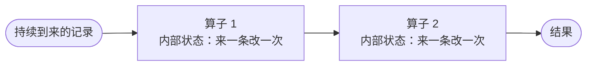
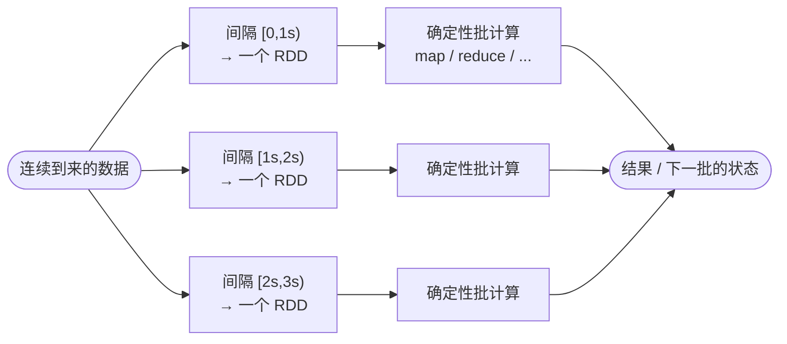
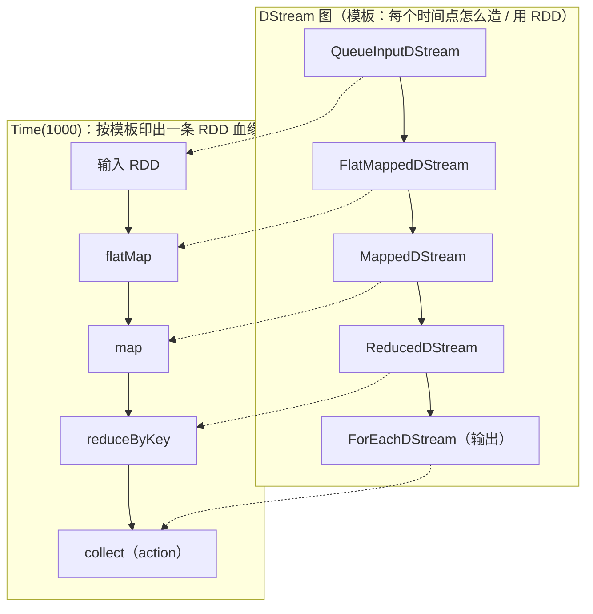
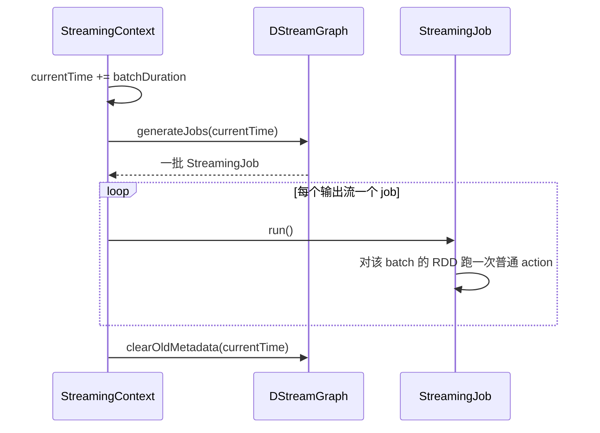
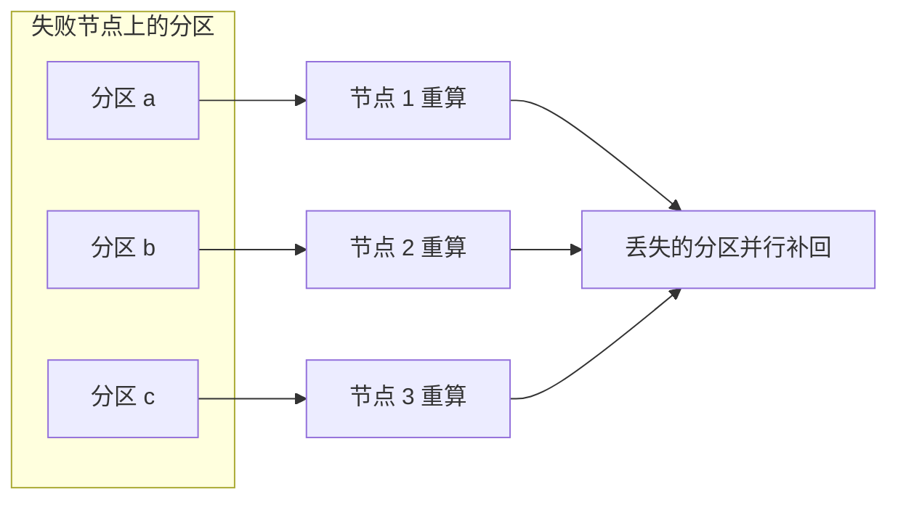

# 第 11 章 · Spark Streaming 与 DStream

> 💻 本章完整代码：[GitHub 查看](https://github.com/rchaocai/mini-spark/tree/main/ch11-streaming)
>
> 构建运行：`mvn -pl ch11-streaming package`
>
> 运行示例：`java -Dfile.encoding=UTF-8 -cp ch11-streaming/target/classes com.sparklearn.streaming.Main`

前 10 章，你已经有一台能跑的 RDD 内核：

```text
分区 / 惰性迭代器 / 血缘 / Stage / DAG
Task / Shuffle / 多线程执行 / 容错重算 / cache / checkpoint
```

这些工具都是为"一批已经到齐的数据"准备的。可现实里有大量数据是**持续到来**的——网站的点击、服务器的日志、传感器的读数。它们最值钱的时候，往往是刚刚到达的那一秒。

于是问题变了：数据不再是一份静止的输入，而是一条不断延伸的河。前 10 章那套内核，能不能也处理这样的数据？

直觉上，流计算像是另一种东西，会想到一个事件循环：来一条，处理一条，更新某个累加器，再等下一条。流计算还有另一条路——它之所以有意思，恰恰因为它把流重新摁回到了你已经写过的 RDD 上。

## 11.1 流处理的难点：状态、故障与掉队者

先把"流计算到底难在哪"想清楚，才能看懂接下来那个看似奇怪的赌注。

流计算要在几百台机器上跑，还得快。在这么大的规模上，两件事几乎必然发生：**有节点会坏（故障），有节点会慢（掉队者，straggler）**。批处理里一个任务慢 30 秒只是晚点收工；流计算里晚 30 秒，可能就错过了一个本该当下做的决定。所以流计算对"恢复得快不快"的要求，比批处理更苛刻。

最直觉的流计算模型长这样：把计算拆成几个常驻的算子，每个算子内部维护一份状态。来一条记录，就更新一次状态，再往下游吐出新的记录。



这个模型很自然，延迟也低。麻烦出在"内部状态是会变的"这件事上。一个节点坏了，它脑子里的那份状态也跟着没了；要恢复，只能想办法把那份状态重建出来。已有的做法大致两条：

- **复制**：每个算子跑两份，输入同时送给两份。但光复制不够——两个副本还得看到一致的输入顺序，于是又得套一套同步协议。代价是几乎翻倍的机器，外加同步的开销。
- **上游备份**：每个算子把自己发出去的消息留着。下游坏了，就开一个新节点，把留着的消息一条条重放给它，让它把状态重新跑出来。机器省了，但恢复很慢：只有这一个新节点在串行地追赶，而新数据还在不停到来。

> [!INFO]
> **还有第三条路：Flink 的分布式快照**
>
> 复制和上游备份是较早的两种做法。后来 Flink 用了**分布式快照（distributed snapshot）**，思路源自 Chandy-Lamport 算法：在数据流里周期性注入一道"栅栏（barrier）"，算子收到栅栏就把自己当前的状态存一份快照，再把栅栏往下游传；栅栏走到末端，就得到了一份跨全链路一致的全局状态。崩溃后从最近一份快照恢复即可——既不用翻倍机器，也比上游备份恢复得快，还能保证"恰好一次"。
>
> 那离散化流为什么没走这条路？因为快照要解决的，恰恰是"常驻算子那份在变的、记在内存里的状态"，它是一种**更好地保存那份状态**的办法。而离散化流押的是另一个方向：干脆不留那份常驻状态，把每个时间点的状态物化成一个不可变的 RDD，丢了沿血缘重算。既然要被快照的那份"在变的状态"从一开始就不存在，快照机制自然也就用不上了。从时间上看，离散化流发表于 2013 年，也早于 Flink 这套流式快照机制成熟。
>
> 换句话说，分布式快照和离散化流不是同一个模型里的两种实现，而是两个不同的出发点：前者让"来一条算一条"的模型也能既快又准地恢复；后者干脆换掉了这个模型本身。

更棘手的是，这两条路都**接不住掉队者**。复制模型里，一个慢节点会拖住需要同步的两个副本；上游备份里，对付慢节点的唯一办法是把它当成坏了，走一遍那条沉重的恢复流程。

把这一节压成一句话：**常驻、有状态、来一条算一条的模型，让容错变得又贵又慢，还怕掉队者。** 正是这个困局，逼出了另一种赌注。

## 11.2 离散化的赌注：把流切成一串 RDD

既然"常驻的有状态算子"是病根，那就别让算子常驻。

换一个做法：把连续到来的数据，按固定的时间间隔切成一小段一小段。每一小段落定之后，就不再改变——它被存成一个**不可变、分了区的数据集**。对这个数据集，跑一次**短小、确定性的批计算**，得到这一段的结果，或者一份交给下一段的状态。

这就是**离散化流（Discretized Stream，D-Stream）**——把一条连续的流，离散成一串离散的数据集。



这个赌注听起来只是换了个切法，但它带来三个根本不同。

首先，**每一步的状态，成了输入数据的确定函数**。同一段输入，无论在哪个节点上算、算几次，结果都一样。这就不再需要那套协调副本顺序的同步协议。

其次，**每个分区的数据，和更早数据之间的依赖，是看得见、而且看得细的**——不是一坨黑箱状态，而是一张明明白白的血缘图。

有了这两点，容错就能借用批处理世界里已经成熟的那套办法：某个分区丢了，不用另写一套流式恢复协议，**沿血缘把它重算出来**就行，和第 8 章一模一样。而且因为依赖是细粒度的，重算还能**并行**：丢一个节点，它的那些分区可以散到集群里很多节点上同时重算，不同时间段的独立步骤也能同时重跑。这是"来一条算一条"的常驻模型做不到的——它默认每个算子得串行地被喂输入，连复制都要费很大劲。

把这个想法压到最简：

```text
DStream = 按时间排列的一串 RDD
一个流式 job = 在某个时间点上，物化这些 RDD 的普通 job
```

流计算没有另起一台引擎。它只是在外面加了一层"时间驱动器"：每隔一个 batch 间隔，把这段时间的数据收成 RDD，再提交一次你已经熟悉的 job。

> [!INFO]
> **"离散化流"这个词从哪来**
>
> "Discretized Streams（D-Streams）"由 Zaharia 等人在 SOSP 2013 的同名论文里提出，并实现成一个叫做 Spark Streaming 的系统。这一章的模型——把流切成一串不可变 RDD、沿血缘恢复、与批处理统一——都源自那篇论文的核心主张。这里不照搬它的工程全貌，只把这层"时间驱动器"在 RDD 内核上长出来，看清它的形状。

## 11.3 先跑起来：队列里的三个 batch

先把东西跑起来，再回头看那些抽象。

```bash
mvn -pl ch11-streaming package
java -Dfile.encoding=UTF-8 -cp ch11-streaming/target/classes com.sparklearn.streaming.Main
```

演示没有接真实的网络端口。它预先往一个队列里塞了三个 RDD，当作"流"的三个批次：

```text
batch1: "hello spark"    "hello stream"
batch2: "spark streaming" "hello spark"
batch3: "mini spark streaming"
```

主程序对这条输入流做的事，和第 1 章的 WordCount 几乎一样，只不过现在挂在"流"上：

```java
DStream<String> input = ssc.queueStream(lines);
DStream<String> words = input.flatMap(line -> List.of(line.split("\\s+")));
DStream<KeyValuePair<String, Integer>> wordCounts = words
        .map(word -> new KeyValuePair<>(word, 1))
        .reduceByKey(Integer::sum, 2);
wordCounts.foreachRDD((rdd, time) -> {
    /* 收集并打印这个 batch 的词频 */
});
```

逐行看返回类型：`queueStream` 给回一个 `DStream<String>`；`flatMap` 拆词，给回新的 `DStream<String>`；`map` 把每个词配成 `(词, 1)`，给回 `DStream<KeyValuePair<String,Integer>>`；`reduceByKey` 按词汇总，又给回一个 `DStream`；最后 `foreachRDD` 登记一段"每个 batch 要执行的打印"。

注意每一行的返回值都是 `DStream`，没有一行是算出来的数据。这些调用只是在搭一条"流上的血缘"——和第 1 章 `rdd.map(...).filter(...)` 只搭血缘不算数据，是同样的惰性。数据要等时间往前走、由输出操作触发才算（11.6 展开）。

跑起来，WordCount 这条流在前两个 batch 的输出长这样（另一条 window 支线的输出，先略过）：

```text
=== batch @Time(1000) jobs=2 ===
-------------------------------------------
Time: Time(1000)
-------------------------------------------
hello -> 2
spark -> 1
stream -> 1

=== batch @Time(2000) jobs=2 ===
-------------------------------------------
Time: Time(2000)
-------------------------------------------
hello -> 1
spark -> 2
streaming -> 1
```

最重要的不是词频，而是那条**时间轴**。每个 batch 都有一个逻辑时间点：`Time(1000)`、`Time(2000)`、`Time(3000)`。时间每往前走一格，就有一个新的 RDD 被收拢出来，对它跑一次熟悉的 job。

注意那行 `jobs=2`：每个 batch 其实提交了**两个** job。一个是这里的 WordCount，另一个是同时挂着的一条 window 支线（最近 2 秒的词频）。它先放一放，11.7 再说。

这里没有任何新的 `collect`，也没有新发明的执行引擎。流计算做的事，只是每隔一个 batch 间隔，把你已经写过的那个 job，在新到的数据上再提交一次。

## 11.4 DStream 与 RDD：时间轴上的一一对应

跑过一遍，现在退一步，把"DStream 到底是什么"一次说清——这决定了后面所有机制能不能看懂。


*图 11-1：DStream 把 RDD 沿时间轴推开——一个 DStream 是按时间排好的一串 RDD，每个时间点上的变换对应同一个 RDD 变换。*

### 11.4.1 一个 DStream 节点，每个时间点交出一个 RDD

`DStream` 自己不存数据，它存的是一条描述：**在任何一个时间点 `Time` 上，怎么得到一个 RDD**。给它一个 `Time`，它按描述交回一个 `RDD`；给下一个 `Time`，再交回另一个。

所以 DStream 与 RDD 的关系，准确说不是"一个 DStream 等于一个 RDD"。一个 DStream 是**一串**按时间排好的 RDD，时间每走一格多一个。"一一对应"指的是两个层面上的对应：

```text
每个时间点上：   一个 DStream 节点  ↔  一个 RDD
每种变换上：     一个 DStream 变换  ↔  同一个 RDD 变换（在每个时间点上各做一次）
```

可以把 DStream 看成把 RDD 推广到了时间轴上：RDD 是一个静止的数据集，DStream 是"同一套数据集、同一个变换结构，只是时间每走一格就重新产出一份"。前面 10 章对 RDD 说过的那些话——惰性、血缘、沿血缘重算——因此能整批搬过来。

### 11.4.2 模板与实例：两张同构的图

这条描述有一个直接后果。演示里 WordCount 这条流搭出五个 DStream 节点，它们之间的连接是**静态的**：不管时间走到哪，节点和连接关系都不变，像一张模板。时间走到 `Time(1000)` 时，按这张模板"印"一遍，每个节点各交出一个 RDD，就得到一条专属于这个 batch 的 RDD 血缘：



图里每个虚线箭头读作"这个 DStream 节点，在这个 batch 里兑现成下面对应的那个 RDD 操作"。`Time(2000)` 再印一遍，又得到一条形状相同、数据不同的 RDD 血缘。**DStream 图是模板，每个 batch 的 RDD 图是它的实例；两者同构。**

### 11.4.3 对应表：每个变换都是同一个 RDD 变换

模板能这么整齐地印出来，是因为每个 DStream 变换，对应的就是同一个 RDD 变换，只是"每个时间点都做一遍"。这张表把一一对应列清楚：

| DStream 节点 | 每个 batch 里对父 RDD 做的事 | RDD 层对应 |
|---|---|---|
| `QueueInputDStream`（输入） | 从队列取这个 batch 的数据，成一个 RDD | 数据源 |
| `FlatMappedDStream` | 对父 batch 的 RDD 调 `flatMap(f)` | `rdd.flatMap` |
| `MappedDStream` | 对父 batch 的 RDD 调 `map(f)` | `rdd.map` |
| `FilteredDStream` | 对父 batch 的 RDD 调 `filter(p)` | `rdd.filter` |
| `ReducedDStream` | 对父 batch 的 RDD 调 `reduceByKey(...)` | `rdd.reduceByKey` |
| `WindowedDStream` | 把父流**多个** batch 的 RDD 并成一个 `UnionRDD` | 多个 RDD `union` |
| `ForEachDStream`（输出） | 对最末端 RDD 跑一次 action | `collect` 等 action |

表里有两处要看清，它们是"对应"的边界，不是反例。其一，前六行每个节点都**造**一个 RDD，唯独输出流 `ForEachDStream` 不造——它的 `compute` 返回空，对应的是一个 **action**，负责把最末端那个 RDD 真正算出来。其二，前几行只吃父流**同一个**时间点的 RDD，`WindowedDStream` 却吃父流**多个**时间点的 RDD（它要跨好几个 batch）。这两处都不改"模板印实例"的整体形状，只说明在输出和窗口这两类节点上，DStream 对应的分别是 action 和跨时间段的 union。

### 11.4.4 这层对应带来的

把 DStream 想成"RDD 的时间副本"，前面 10 章攒下的东西就整批搬过来了：

- **惰性**：DStream 变换只搭模板，不算数据——和 `rdd.map` 一样。
- **血缘**：模板本身就是一张依赖图，丢了某个 batch 的 RDD，沿它重算。
- **容错**：既然每个 batch 的状态就是一个 RDD，第 8 章的重算、第 10 章的 cache/checkpoint，原样可用。

DStream 没有新造一套引擎。它只是把"一个 RDD 变换"封装成"每个时间点都做一次这个变换"，再在外面加一个按时间推进的驱动器去触发。余下几节，就看这个驱动器和这套封装怎么动起来。

## 11.5 三个零件：Time、DStream 的内部、StreamingContext

11.4 讲清了 DStream 是什么。这一节拆开三个具体对象：时间怎么表示、DStream 内部怎么把"造 RDD"做实、谁来按时间驱动。

### 11.5.1 Time 与 Duration：一条逻辑时间轴

`Duration` 是一段时间长度，`Time` 是一个时间点。它们的实现朴素到几乎没有东西：

```java
public final class Time implements Serializable, Comparable<Time> {
    private final long milliseconds;
    // plus / minus / isMultipleOf ...
}

public final class Duration implements Serializable, Comparable<Duration> {
    private final long milliseconds;
    // seconds(1) 就是 1000 毫秒
}
```

演示里设了两个量：batch 间隔 `batchDuration = 1s`，起点 `zeroTime = Time(0)`。于是每个 batch 的逻辑时间点是：

```text
zeroTime       = Time(0)
第 1 个 batch  = Time(1000)
第 2 个 batch  = Time(2000)
第 3 个 batch  = Time(3000)
```

这里有个细节值得停一下：时间**不是用墙钟（真实时钟）推进的**，没有任何后台线程在每秒触发一次。`StreamingContext` 提供的是一个手动拨时间的动作——`advance()` 拨一格，时间往前走一个 `batchDuration`。

为什么要这样？因为"什么时候该往前走一格"和"走到这一格要算什么"，是两件最好分开的事。把它们解耦之后，业务逻辑（算词频）只认逻辑时间点，不认墙钟：想要每秒走一格，就在外面挂一个定时器去调 `advance()`；想要在测试里精确控制，就手动一格一格拨。同一个计算图，两种推进方式都能用。

### 11.5.2 DStream 内部：compute 与 getOrCompute

11.4 说 DStream 存的是"每个时间点怎么造一个 RDD"。落到代码上，这条描述由两个方法承担：`compute` 写"怎么造"，`getOrCompute` 在外面加一层"同一个时间点别造两遍"。

`DStream` 要求子类实现三件事：

```java
public abstract class DStream<T> implements Serializable {
    /** 多久生成一个 RDD（滑动间隔）。 */
    public abstract Duration slideDuration();
    /** 依赖哪些父流。 */
    public abstract List<DStream<?>> dependencies();
    /** 在指定时间点，如何算出这个 RDD；没有数据时返回 empty。 */
    public abstract Optional<RDD<T>> compute(Time validTime);
    // ...
}
```

`slideDuration` 是每隔多久造一个 RDD；`dependencies` 说出父流（11.4.2 模板里的上游节点）；`compute` 就是"怎么造"那条描述本体。看一个最朴素的例子，`MappedDStream` 的 `compute`：

```java
public Optional<RDD<U>> compute(Time validTime) {
    return parent.getOrCompute(validTime)
            .map(rdd -> rdd.map(mapFunc));
}
```

读出来正是 11.4.3 对应表里那行："问父流要这个时间点的 RDD，再对它调一次 `map`。" 其余 `FlatMappedDStream`、`FilteredDStream`、`ReducedDStream` 把 `map` 换成 `flatMap`/`filter`/`reduceByKey`，形状一模一样。输入流 `QueueInputDStream` 没有父流，`compute` 不往上问，自己从队列里取数据。每个变换流，就只是 11.4 说的"同一个 RDD 变换，在这个时间点上做一次"。

`compute` 只是"怎么造"，真正被调用的入口是 `getOrCompute`——它在 `compute` 外面套了一层缓存：

```java
public final Optional<RDD<T>> getOrCompute(Time time) {
    RDD<T> cached = generatedRdds.get(time);
    if (cached != null) {
        return Optional.of(cached);          // 这个时间点已经造过了，直接给
    }
    if (!isTimeValid(time)) {
        return Optional.empty();
    }
    Optional<RDD<T>> computed = compute(time);
    if (computed.isEmpty()) {
        return Optional.empty();
    }
    RDD<T> rdd = computed.get();
    generatedRdds.put(time, rdd);            // 造好的留下来
    return Optional.of(rdd);
}
```

逐段读：

- 先查 `generatedRdds`——这个时间点造过没有？造过就把那个 RDD 直接还回去，不再调 `compute`。
- 没造过，看时间合不合法（`isTimeValid`）；不合法（比如还没到，或不是 batch 边界）就返回空。
- 合法才调 `compute` 真造一个，造完存进 `generatedRdds`，下次同时间点来要就直接给。

这层缓存，正是 11.4.1"一个时间点一个 RDD"在代码里的兑现：同一个 `Time`，`compute` 跑多少遍结果都一样（它只搭惰性血缘），所以敢把第一次造好的存下来复用。后面 window 要回头用旧 batch 的 RDD（11.7），靠的就是这层"造过就留下"。

`map`、`filter`、`flatMap`、`reduceByKey`、`window` 这些方法，返回的都还是 `DStream`——它们各自 `new` 一个上面对应的子类，把自己传进去当父流。这和 `rdd.map` 返回新 `RDD` 而不算数据，完全同构。

### 11.5.3 StreamingContext：那层时间驱动器

`StreamingContext` 站在 `SparkContext` 之上。`SparkContext` 负责跑一个 RDD job；`StreamingContext` 负责按时间反复地提交 job。

它内部有一张 `DStreamGraph`，记着两类流：

```text
inputStreams    数据从哪进（queueStream，以后还可能有 receiver）
outputStreams   最终要执行哪些副作用（foreachRDD 注册的那些）
```

`start()` 把图初始化好；真正干活的是 `advance()`，一个 batch 走这四步：

```java
public int advance() {
    ensureStarted();
    currentTime = currentTime.plus(batchDuration);           // ① 时间往前走一格
    batchesStarted++;
    List<StreamingJob> jobs = graph.generateJobs(currentTime); // ② 给每个输出流生成 job
    for (StreamingJob job : jobs) {
        job.run();                                           // ③ 逐个执行
    }
    for (DStream<?> output : graph.outputStreams()) {
        output.clearOldMetadata(currentTime);                // ④ 丢掉过旧 batch 的元数据
    }
    return jobs.size();
}
```

这四步串起来，就是 11.2 那个"时间驱动器"的全部：拨时间 → 收 job → 跑 job → 清旧账。一次 `advance()` 就是一个 batch 的完整生命周期。



实现上，这些类分成两组包：`com.sparklearn.core` 里是"算一个 RDD"的那套（RDD、Dependency、DAGScheduler、Task、Shuffle、cache……），`com.sparklearn.streaming` 里是"按时间生成一串 RDD"的这层。看到一个类，先判断它属于哪一组，就能定位它的职责。

## 11.6 一条流怎么变成 job

`advance()` 里那句 `generateJobs` 看着轻飘飘。它到底怎么把一条流变成可执行的 job？以 WordCount 为例，这条流的血缘是：


血缘上的五个 DStream 都是惰性的——`flatMap`、`map`、`reduceByKey` 只把变换规则接好，数据一条没算。要有一个节点去推它们。

### 11.6.1 输出流扣扳机：generateJob 拆开读

这个推手是输出流。11.3 里那句 `wordCounts.foreachRDD(...)`，`foreachRDD` 做两件事：把传入的回调包成一个 `ForEachDStream`，再把它登记进 `StreamingContext` 的输出流列表 `outputStreams`。于是血缘最右端的 `ForEachDStream`，是唯一登记成"要执行"的节点。`advance()` 拨到 `Time(1000)` 后，对 `outputStreams` 里每个流调一次 `generateJob(time)`——其余四个变换流不会被直接调用，它们是被 `ForEachDStream` 顺带拉起来的。

`ForEachDStream.generateJob` 全文就一行，但信息很密：

```java
public Optional<StreamingJob> generateJob(Time time) {
    return parent.getOrCompute(time).map(rdd ->
            new StreamingJob(time, () -> foreachFunc.accept(rdd, time)));
}
```

拆成三块读：

- `parent`——这个输出流的父流。WordCount 这条血缘里，`ForEachDStream` 的父流是 `ReducedDStream`。
- `parent.getOrCompute(time)`——11.5.2 见过的"要这个时间点的 RDD，没有就算一个"。这一句是关键：它把父流、父流的父流……一路拉起来，递归地搭出这个 batch 的 RDD。下一小节跟着它走一遍。
- `.map(rdd -> new StreamingJob(...))`——这个 `map` 是 `Optional.map`，不是算数据的 `map`；它只是把父流给回的 RDD（若存在）包进一个 `StreamingJob`。

再看包出来的那个 `StreamingJob`：

```java
new StreamingJob(time, () -> foreachFunc.accept(rdd, time))
```

两个参数：一个 `Time`，一个 `Runnable`。第二个参数 `() -> foreachFunc.accept(rdd, time)` 是 job 的 body，一段"被调到才跑"的回调；`foreachFunc` 正是 11.3 里 `foreachRDD((rdd, time) -> {...})` 传进来的那段——收集并打印词频。

要紧的是这个 `rdd`。它是 `parent.getOrCompute(time)` 拿回来的结果，而 `getOrCompute` 返回它之前已经把整条血缘递归跑完——所以这个 `rdd` 是"对第一个 batch 的数据，套好 flatMap → map → reduceByKey 之后的 RDD 血缘"。注意是血缘，不是算出来的结果：`reduceByKey` 仍是惰性的，数据还没动。

`generateJob` 交回去的，因此是一个装着"未来某刻执行 `foreachFunc`"的 job。真正执行，要等 `advance()` 里那句 `job.run()`。

### 11.6.2 跟着 getOrCompute 递归一遍

`generateJob` 的核心是 `parent.getOrCompute(time)`。沿血缘往上走，看一个 batch 的 RDD 如何一步步搭起来。从 `ForEachDStream` 起步：

**`ForEachDStream.generateJob(1000)`** 调 `parent.getOrCompute(1000)`，`parent` 是 `ReducedDStream`。

**`ReducedDStream`** 发现自己没存过 `Time(1000)` 的 RDD，调 `compute(1000)`：

```java
public Optional<RDD<KeyValuePair<K, V>>> compute(Time validTime) {
    return parent.getOrCompute(validTime)
            .map(rdd -> rdd.reduceByKey(reduceFunc, numberOfReducePartitions));
}
```

`compute` 又是"问父流要 RDD，再套一层"——这里再次出现 `parent.getOrCompute`，递归往上抛一层。`ReducedDStream` 的父流是 `MappedDStream`。

**`MappedDStream`** 照样问父流要 RDD、套 `map`，父流是 `FlatMappedDStream`。**`FlatMappedDStream`** 问父流要 RDD、套 `flatMap`，父流是 `QueueInputDStream`。

**`QueueInputDStream`** 是输入流，`dependencies()` 为空，`compute` 不再往上问，而是自己取数据——从队列里拿出第一个 RDD，即 batch1：`"hello spark"`、`"hello stream"`。

触底。递归一层层往回收：batch1 的 RDD 往上传，`FlatMappedDStream` 套 `flatMap`、`MappedDStream` 套 `map`、`ReducedDStream` 套 `reduceByKey`。每层套上去的都是一条惰性的 RDD 变换，只把血缘接长一段，数据仍未计算。

收回到 `ForEachDStream` 时，`getOrCompute(1000)` 手里攥着的，是一条专属于 `Time(1000)` 的完整 RDD 血缘：`batch1 → flatMap → map → reduceByKey`。它同时被存进沿途各变换流的 `generatedRdds`，同一个时间点再来要，直接给回这条缓存好的血缘。

### 11.6.3 两个阶段：先搭血缘，再执行

把前两节合起来，一个 batch 分两步：

```text
① generateJob：getOrCompute 递归，把这个 batch 的 RDD 血缘搭好（惰性，数据没动）
② job.run()：foreachFunc 执行 → rdd.collect() → 走第 7 章的 DAGScheduler，算出结果
```

这一推一收，就是 11.4.2"模板印实例"的一次具体发生：`ForEachDStream` 扳机一扣，五个 DStream 节点各自把对应的 RDD 操作兑现，串成这条 batch 专属的血缘。

第 ② 步里的 `collect()`，就是第 1 章用过的那个 action：照样经过 `DAGScheduler`、照样切 Stage、照样分发 Task。一个流式 job，骨子里就是一个普通的 Spark job，只不过它被一个按时间推进的循环反复提交。

这一点和 RDD 同构：

```text
RDD:     transform 惰性，action 触发
DStream: transform 惰性，output operation 触发
```

区别只在"触发"的形式：RDD 是程序里显式调一次 action；DStream 是时间每走一格，输出流自动提交一次 job。

> [!INFO]
> **为什么说结果是"恰好一次"的**
>
> 离散化还顺带送了一个干净的性质。因为时间被切成一段段互不重叠的间隔，每个间隔的输出 RDD，反映的是到这个间隔为止的全部输入；不同间隔的数据集又各有各的身份（不同的 `Time`）。所以哪怕各个节点算得有快有慢，最终每个时间点的结果，都等价于所有 batch 排好队、一步不差地锁步跑出来的结果——这就是所谓的"恰好一次（exactly-once）"处理语义。常驻算子模型要做到这一点，反而得专门加同步。

## 11.7 window：跨 batch 复用 RDD

单 batch 的 WordCount 还不太"流"。流计算里更常见的需求：不是只看这一秒，而是看**最近 N 秒**。

### 11.7.1 window 做的事：把最近几个 batch 并起来

`window(windowDuration, slideDuration)` 把父流最近若干个 batch 的 RDD 取出来，并成一个大 RDD，再继续往下算。回到 11.4.3 的对应表，它对应的是"多个 RDD `union`"。

它的 `compute`：

```java
public Optional<RDD<T>> compute(Time validTime) {
    // 窗口右闭：包含 validTime，回溯 windowDuration 宽度。
    Time from = validTime
            .minus(windowDuration)
            .plus(parent.slideDuration());
    List<RDD<T>> rdds = parent.slice(from, validTime);
    if (rdds.isEmpty()) {
        return Optional.empty();
    }
    if (rdds.size() == 1) {
        return Optional.of(rdds.get(0));
    }
    return Optional.of(new UnionRDD<>(context().sparkContext(), rdds));
}
```

逐段读：

- 先算窗口左边界 `from`：从 `validTime` 往回退一个 `windowDuration`，再前进一个滑动步长，得到窗口覆盖的最早那个 batch 的时间点。窗口右闭，含 `validTime` 自己。
- `parent.slice(from, validTime)` 沿时间轴，把这个区间内每个 batch 的 RDD 都要过来——每个都走 11.5.2 的 `getOrCompute`。这正是 11.4.3 指出的那个特殊性：window 不止吃父流同一个时间点的 RDD，而是一口气吃好几个 batch 的。
- 只要到一个，直接还它；要到多个，用 `UnionRDD` 把它们的分区拼成一个 RDD。`UnionRDD` 的做法很直白：把各个 RDD 的分区依次接起来，算的时候各算各的。

后面的 `map`/`reduceByKey` 就在这个并起来的 RDD 上继续算——和单 batch 时一样，只不过数据多了几批。

### 11.7.2 看真实输出

演示设的是 2 秒窗口、1 秒滑动。每个时间点的窗口里，装着最近的两个 batch：

```text
Time(1000): 只有 batch1        （再往前 Time(0) 不是合法 batch）
Time(2000): batch1 + batch2
Time(3000): batch2 + batch3
```

window 这条支线的真实输出（已按词排序）：

```text
[window 2s] @Time(1000)
hello -> 2
spark -> 1
stream -> 1

[window 2s] @Time(2000)
hello -> 3
spark -> 3
stream -> 1
streaming -> 1

[window 2s] @Time(3000)
hello -> 1
mini -> 1
spark -> 3
streaming -> 2
```

`Time(2000)` 的窗口装着 batch1 和 batch2，所以 `hello` 是 2+1=3、`spark` 是 1+2=3，正好是两批各自结果的加总。`Time(3000)` 窗口滑到 batch2+batch3，batch1 滑出去了，`hello` 只剩 batch2 里的 1。

### 11.7.3 复用旧 batch：靠 cache

这里有个问题：窗口要复用过去的 batch，可那些 RDD 算过一次不就该没了吗？这就是 `WindowedDStream` 构造时那句 `parent.cache()` 的用处。它把父流标记成缓存的，于是 `slice` 再次要同一个时间点的 RDD 时，`getOrCompute` 直接返回 11.5.2 存下的那份，不重算。窗口复用历史 RDD，靠的就是那层"造过就留下"。

这种"并起来再整体算"的窗口，每次都要把整个窗口重算一遍，窗口越大重复的功越多。离散化模型在这里还留了一条更省的路：既然每个 batch 的部分结果都是一个不可变的 RDD，滚动窗口时完全可以**只加上新进来那一段的结果，减去滑出去那一段的结果**，不必每次从头加总。这需要一个"可逆"的汇总函数（既能加也能减）。这条增量计算的路线，模型上是通的，留到更大的窗口上体会它的好处。

## 11.8 容错：为什么还是第 8/10 章那套

离散化最有力的回报，不在 API，而在容错。

回到 11.1 那个困局：常驻的有状态算子坏了，重建状态又贵又慢。可在离散化模型里，"某个 batch 的状态"就是一个 RDD。一个 RDD 的分区丢了怎么办？第 8 章早就回答过——**沿血缘重算**。

所以这里不需要另写一套流式恢复协议：

```text
某个 batch 的 RDD 分区丢了
  → 它是历史输入的确定性函数
  → 沿 RDD 血缘，从还在的父分区重算这一个分区
```

短失败，重算当前 batch 的 Task / Stage（第 8 章的两层恢复）；血缘太长了，对中间的 RDD 做 cache / checkpoint 截断（第 10 章）。这两套第 8、10 章已经写好的办法，在流里原样成立。

但这套办法的上限，远不止"单节点重算"。离散化模型还允许一个更狠的用法：既然每个分区都是历史数据的确定性函数，那一个节点坏了，它上面的那些分区，完全可以**散到集群里很多节点上同时重算**——这叫**并行恢复**。而且重算的并行度有两层：既跨一个算子的多个分区，也跨不同的时间段（比如每个 batch 开头那个独立的 `map`，不同时间点的可以同时重跑）。

这一点正是"来一条算一条"的常驻模型做不到的：那种模型默认每个算子得被串行地喂输入，连把状态搬到另一个节点都要费很大劲，更别说把一个节点的活拆给很多人同时干。离散化把"状态"摊成了一堆互相独立的小 RDD，重算才得以并行。



掉队者也同理。因为每个任务都是确定性的，一个任务跑慢了，可以在别处再起一份**推测副本**，谁先算完用谁——这和批处理里的处理方式一致。常驻模型做不到，因为副本得先把那份可变状态重建出来才能接手。

这一章的"集群"只是一个 JVM，所以恢复表现为单节点上的血缘重算，没有多节点的扇出。但机制是同一个：状态摊成 RDD，丢了沿血缘补，能并行的就并行。

> [!INFO]
> **长期运行，还要管两件事**
>
> 流计算要 7×24 小时跑，光重算 Worker 还不够。一是**驱动节点自己也会坏**：恢复时，新驱动读回图的元数据和"算到哪个时间点"，重新接上；因为计算是确定性的，某个 RDD 被算了两遍也无妨，结果一样。二是**血缘会一直长**：每个 batch 都新增一层 RDD，不截断就会无限膨胀。办法和第 10 章一样——定期把状态 RDD checkpoint 到可靠存储，然后**忘掉 checkpoint 之前的血缘**，让它不再增长。这两点都建立在"状态即 RDD、可沿血缘重算"这个前提上。

## 11.9 一处统一：流与批共用同一套 RDD

离散化还有个不那么显眼、但实际里非常值钱的好处。

D-Stream 用的是和批处理**同一套模型、同一套数据结构（RDD）、同一套容错**。这不是巧合，是它的核心主张。结果是，流和批之间那道传统的墙，自然就化了：

- 一条流，可以和一个事先算好的静态 RDD 做 `join`——比如把实时点击流，和一份预先离线算好的垃圾过滤表拼在一起。
- 同一段流式程序，可以换到**批模式**下，对历史数据重跑一遍，得到"如果当时这么算会怎样"的结果。
- 还能对一个正在跑的流的状态，临时发起**即席查询**，因为那些状态本来就是内存里的 RDD。

这些事在过去要分别动用流系统和批系统、各写一套代码，还要费劲让两边算出一致的结果。共用同一套 RDD 之后，它们就是同一件事的不同侧面。

回头看开头那个问题：前 10 章的 RDD 内核，能不能也处理持续到来的数据？答案是——不仅能，而且流计算本来就长在这套内核上：没有新造一台引擎，只是把那层"按时间推进"的驱动器，接了上去。

## 11.10 本章小结

流计算没有另起炉灶。

把连续到来的数据，按时间切成一个个小批次；每个批次收成一个 RDD。`DStream` 是这些 RDD 的时间副本——一个时间点封装出一个 RDD，每一个变换都对应同一个 RDD 变换，于是前 10 章的惰性、血缘、容错整批搬过来。输出操作在每个时间点上，提交一次普通的 Spark job。这就是离散化流的全部形状。

```text
输入按 batch 切开 → 每个 batch 变成一个 RDD
DStream = RDD 的时间副本：一个 Time 一个 RDD，一个变换对应一个 RDD 变换
output operation 在每个 Time 上提交普通 job
```

容错也复用了已经写好的那套：状态就是 RDD，丢了沿血缘重算，规模化之后还能跨分区、跨时间并行恢复，掉队者用推测副本对付。第 8 章的两层恢复、第 10 章的 cache / checkpoint，在这里仍然成立。

这一切的代价，是一个**固定的最低延迟**——至少要等一个 batch 间隔，数据才能被处理。这是一个明明白白的取舍：用一个确定的最小延迟，换来了廉价、快速、可并行的恢复，以及流与批的统一。对绝大多数实时场景（趋势监控、日志告警、在线统计），秒级的延迟完全够用；只有个位数毫秒级的场景，才需要另寻他法。

分包结构也在提醒同一件事：

```text
core       会算一个 RDD
streaming  会按时间反复地算
```

下一章，把前 10 章写过的内核、这一章的 Streaming，和成熟的工业级实现并排放在一起，做一次总对照。
