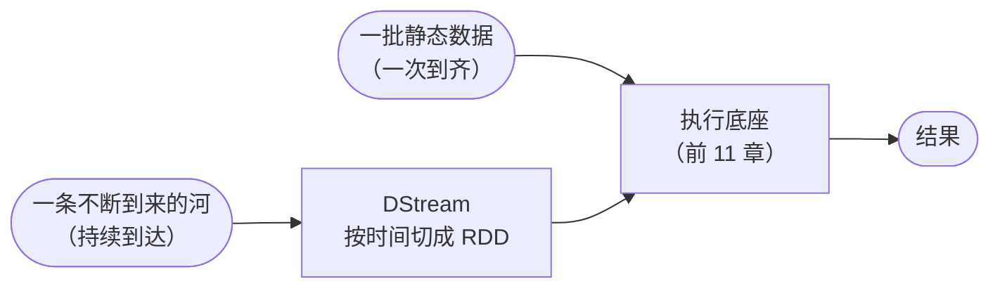
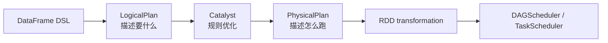
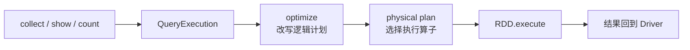
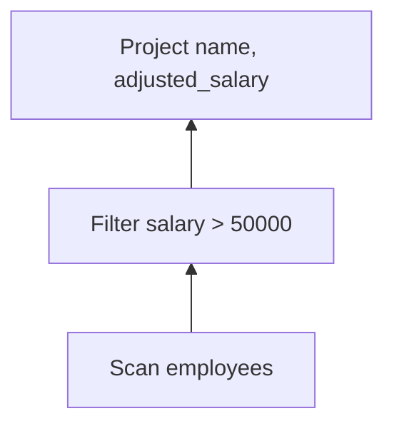
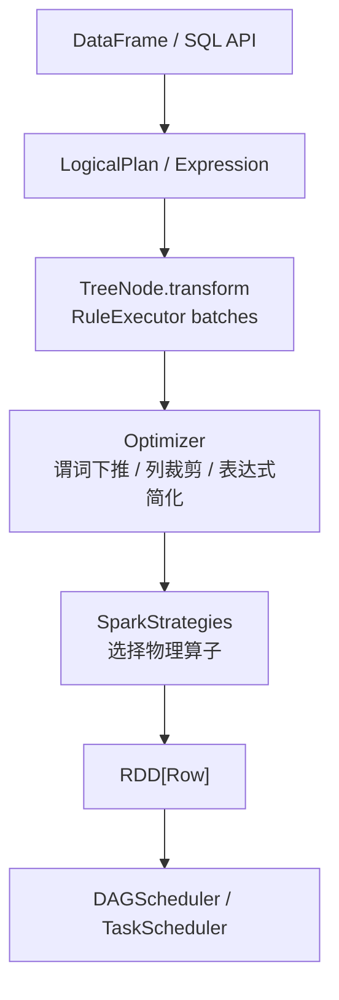
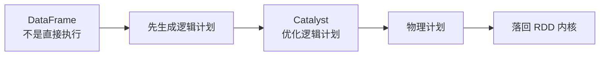
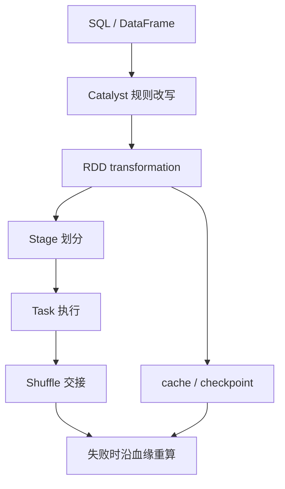

# 第 12 章 · 从 RDD 到 DataFrame

> 💻 本章完整代码：[GitHub 查看](https://github.com/rchaocai/mini-spark/tree/main/ch12-dataframe-future)
>
> 构建运行：`mvn -pl ch12-dataframe-future package`
>
> 运行示例：`java -Dfile.encoding=UTF-8 -cp ch12-dataframe-future/target/classes com.sparklearn.sql.Main`

前 11 章，这台执行底座已经闭环：批和流两条路，最后都汇到同一台机器。



落到这台底座上的数据——不管是一批还是一条河——都走同一套分区、血缘、调度、重算。单看执行底座，这条路已经闭环。

但你去看今天日常业务里的 Spark 代码，最常见的往往不是：

```java
rdd.map(...).filter(...).reduceByKey(...)
```

而是：

```sql
SELECT department, count(*)
FROM employees
WHERE salary > 50000
GROUP BY department
```

或者：

```java
employees
        .where(col("salary").gt(50_000))
        .groupBy("department")
        .count();
```

这很容易让人产生一个疑问：

```text
花这么多章写 RDD
是不是已经过时了？
```

不是。

更上面的一层关系是：**RDD 是执行底座，DataFrame / SQL 是建在底座上的声明式查询层。**

用户不再直接告诉系统“先 map 再 filter 再 shuffle”，而是描述“我要哪些列、过滤哪些行、按什么分组”。系统先把这段描述保存成一棵树，再用优化器改写它，最后把改写后的树翻译回你熟悉的 RDD 变换。

Spark SQL 后来的设计，就是沿着这条路走下去：上面给用户一个能和普通 Spark 程序混在一起写的 DataFrame API，下面用 Catalyst 把查询保存成树、改写成更好的树。

```text
DataFrame API：把关系查询和 Spark 程序紧密接在一起
Catalyst：用可组合规则改写不可变树
```

先不碰完整 SQL 解析器，也不碰复杂的物理计划选择。只走一条最小但完整的路径：



跑通这条路径以后，`spark.sql()` 和 `df.groupBy()` 就不再是黑箱。

## 12.1 为什么 RDD 还不够

先看同一个需求：

```text
查出 salary > 50000 的员工
输出 name 和调整后薪水
```

如果用 RDD 写，大概是：

```java
rdd.filter(row -> row.salary() > 50_000)
   .map(row -> new Row(row.name(), row.salary() * 1.25));
```

这个写法很直接。问题也在“直接”。

RDD 代码告诉系统的是“怎么做”：

```text
先 filter
再 map
```

如果你写反了：

```java
rdd.map(row -> expensiveProject(row))
   .filter(row -> row.salary() > 50_000);
```

Spark 不能随便替你换顺序。因为 `map` 里是任意 Java / Scala / Python 函数，里面可能写日志、改外部变量、发网络请求。优化器不知道它是不是纯函数，也不知道换顺序后外部世界会不会变。

所以 RDD 的力量和限制来自同一个地方：

```text
RDD 很通用：可以塞任意函数
RDD 难优化：系统看不懂任意函数
```

DataFrame 换了一个赌注。

它不让你塞一段黑箱函数，而是让你写结构化表达式：

```text
salary > 50000
name
salary * 1.25
department
count(*)
```

这时候，系统手里多了几张明牌：

```text
它知道 salary 是过滤条件要用的列
它知道 name / salary 是最终输出要用的列
它知道 department 是分组 key
它知道 count(*) 会触发聚合
```

有了这些信息，系统就可以做一些 RDD lambda 做不了的事：先过滤再投影、只读需要的列、把过滤条件尽量推到数据源附近、遇到分组再引入 shuffle。

这些表达式有列名、有类型、没有副作用。系统看得懂，就能改写。

这就是声明式接口的价值：

```text
你说得更少：只说要什么
系统知道得更多：知道列、类型、过滤、投影、聚合
于是系统能替你优化
```

## 12.2 先跑起来：一条 DataFrame 查询

先把代码跑起来：

```bash
mvn -pl ch12-dataframe-future package
java -Dfile.encoding=UTF-8 -cp ch12-dataframe-future/target/classes com.sparklearn.sql.Main
```

第一个查询长这样：

```java
DataFrame adjustedSalary = employees
        .where(col("salary").gt(50_000))
        .select(
                col("name"),
                col("salary").multiply(1.25).as("adjusted_salary"));
```

注意这段代码没有立刻扫描数据。`where()` 和 `select()` 只是返回新的 `DataFrame`，每个 `DataFrame` 里面保存一棵新的逻辑计划树。

示例程序先打印执行计划：

```java
System.out.println(adjustedSalary.explainString());
```

所以你会先看到三棵树。

第一棵是原始逻辑计划：

```text
== Logical Plan ==
Project(name, salary * 1.25 AS adjusted_salary)
  └── Filter(salary > 50000)
      └── Scan(employees, columns=[id, name, department, salary])
```

这棵树从下往上读：

```text
Scan    读 employees
Filter  只保留 salary > 50000
Project 输出 name 和 adjusted_salary
```

第二棵是优化后的逻辑计划：

```text
== Optimized Logical Plan ==
Project(name, salary * 1.25 AS adjusted_salary)
  └── Scan(employees, columns=[name, salary], pushedFilters=[salary > 50000])
```

变化有两个：

```text
谓词下推：这里把 Filter 合进 Scan，扫描时先过滤
列裁剪：Scan 不再读 id / department，只读 name / salary
```

第三棵是物理计划：

```text
== Physical Plan ==
ProjectExec(name, salary * 1.25 AS adjusted_salary)
  └── ScanExec(employees, columns=[name, salary], pushedFilters=[salary > 50000])
```

这里名字多了一个 `Exec`，意思变了：

```text
逻辑计划：描述要什么
物理计划：描述怎么执行
```

然后示例程序调用：

```java
adjustedSalary.show();
```

这一步才真正落回 RDD、提交 job、打印结果：

```text
Stage 划分结果:
ResultStage 0 (rdd=MapPartitionsRDD, parents=[])
提交 ResultStage 0 (rdd=MapPartitionsRDD, parents=[])
  提交 ResultStage 的分区任务
```

这个查询没有 shuffle，所以只有一个 `ResultStage`。你在第 7 章写过的 Stage 划分逻辑，没有变。

## 12.3 DataFrame 到底是什么

`DataFrame` 类很短：

```java
public final class DataFrame {
    private final SQLContext sqlContext;
    private final LogicalPlan logicalPlan;

    public DataFrame where(Expression condition) {
        return new DataFrame(sqlContext, new Filter(condition, logicalPlan));
    }

    public DataFrame select(NamedExpression... expressions) {
        return new DataFrame(sqlContext, new Project(List.of(expressions), logicalPlan));
    }

    public List<Row> collect() {
        return queryExecution().executed().execute().collect();
    }
}
```

它不像 `RDD` 那样自己知道怎么算分区。`DataFrame` 只保存两样东西：

```text
SQLContext   查询入口
LogicalPlan  到目前为止积累出的逻辑计划
```

这句话很重要：

```text
DataFrame = 带 schema 的惰性逻辑计划
```

`where()` 没有过滤数据，只是在树上加一个 `Filter` 节点。

`select()` 没有计算列，只是在树上加一个 `Project` 节点。

`groupBy(...).count()` 这里是聚合 DSL，它没有立刻 shuffle，只是返回一个带 `Aggregate` 节点的新 `DataFrame`。

直接对 `DataFrame` 调 `collect()`、`show()`、`count()` 这类 action，才会触发：



这和 RDD 的惰性很像，但惰性的东西不一样：

```text
RDD 惰性：积累 RDD 血缘
DataFrame 惰性：积累逻辑计划树
```

## 12.4 三个对象：Row、Schema、Expression

RDD 里每个元素可以是任意 Java 对象。DataFrame 不一样，它必须知道“列”。

这里先用三个对象表达这件事。

### 12.4.1 Row：有列名的一行

`Row` 是一行数据：

```java
Row.of("id", 1,
        "name", "Alice",
        "department", "eng",
        "salary", 72_000)
```

它内部是一个保留顺序的 `Map`。这不是高性能设计，只是为了让输出顺序稳定、容易读。

Spark SQL 的内部行格式复杂得多，尤其现代版本会用更紧凑的二进制表示。但现在只要记住：

```text
Row = 一行
Schema = 这一行有哪些列、列是什么类型
```

### 12.4.2 Schema：优化器能看懂列

`Schema` 由一组 `Field` 构成：

```java
public record Field(String name, DataType dataType) implements Serializable {
}
```

有了 schema，系统才知道：

```text
salary 是一列
salary 可以参与数值比较
Project 只需要 name / salary
Filter 只引用 salary
```

这就是 DataFrame 和 RDD 的根本差别。RDD 里一个 lambda 写成这样：

```java
row -> row.salary() > 50_000
```

系统只能看到一段函数。DataFrame 里的条件写成这样：

```java
col("salary").gt(50_000)
```

系统看到的是一棵表达式树：

```text
GreaterThan
  Attribute(salary)
  Literal(50000)
```

树可以分析，函数不行。

### 12.4.3 Expression：不是立刻算，而是先记下来

表达式是一个 sealed interface：

```java
public sealed interface Expression extends Serializable
        permits And, EqualTo, GreaterThan, Literal, Multiply, NamedExpression {

    Object eval(Row row);

    Set<String> references();

    String sql();
}
```

三个方法分别回答：

```text
eval(row)       真执行时，怎么对一行求值
references()   这个表达式引用了哪些列
sql()          怎么打印成可读文本
```

优化器主要用的是 `references()`。

比如：

```java
col("salary").multiply(1.25).as("adjusted_salary")
```

它引用的列只有：

```text
salary
```

所以列裁剪规则知道：为了算 `adjusted_salary`，扫描时不需要读 `id` 和 `department`。

## 12.5 逻辑计划：把每一步关系操作串成树

`Expression` 只描述一行里的小计算：

```text
salary > 50000
salary * 1.25
```

`LogicalPlan` 描述的是“整张表怎么变”：

```text
Scan       从哪里读
Filter     保留哪些行
Project    输出哪些列
Aggregate  按哪些列分组、做什么聚合
```

DataFrame API 每调用一次，就在原来的计划外面包一层。

刚创建表时，只有一个叶子节点：

```text
Scan(employees)
```

调用：

```java
employees.where(col("salary").gt(50_000))
```

计划变成：

```text
Filter(salary > 50000)
  └── Scan(employees)
```

再调用：

```java
.select(col("name"), col("salary").multiply(1.25).as("adjusted_salary"))
```

计划继续长成：

```text
Project(name, salary * 1.25 AS adjusted_salary)
  └── Filter(salary > 50000)
      └── Scan(employees)
```

到这里，仍然没有读一行数据。树只是越来越完整。



这就是逻辑计划的意义：先把“要什么”完整记下来，再交给优化器决定这棵树能不能换个更省事的形状。

## 12.6 Catalyst：规则改写不可变树

Catalyst 最重要的不是某一条具体优化，而是这套处理查询的方式：

```text
TreeNode
Rule
Batch
FixedPoint
```

`TreeNode` 提供递归变换；`RuleExecutor` 把规则分成 batch；每个 batch 可以反复执行，直到树不再变化，也就是 fixed point。

> [!INFO]
> **想打开源码时再看**
>
> Spark 1.3.0 里，Catalyst 这几个对象大致在：
>
> ```text
> sql/catalyst/src/main/scala/org/apache/spark/sql/catalyst/trees/TreeNode.scala
> sql/catalyst/src/main/scala/org/apache/spark/sql/catalyst/rules/RuleExecutor.scala
> sql/catalyst/src/main/scala/org/apache/spark/sql/catalyst/optimizer/Optimizer.scala
> ```

照这个结构，可以写出一个极简版：

```java
public final class RuleExecutor {
    private static final int MAX_ITERATIONS = 20;

    public LogicalPlan execute(LogicalPlan plan) {
        LogicalPlan current = plan;
        for (Batch batch : batches) {
            int iteration = 0;
            boolean changed = true;
            while (changed && iteration < MAX_ITERATIONS) {
                LogicalPlan before = current;
                for (PlanRule rule : batch.rules()) {
                    current = current.transformUp(rule);
                }
                changed = !current.equals(before);
                iteration++;
            }
        }
        return current;
    }
}
```

这里的 fixed point 不是无限等下去。每一轮都比较新旧两棵树；如果树不再变化，就停。如果某些规则来回振荡，也会被 `MAX_ITERATIONS` 截住。优化器需要这种安全边界。

Catalyst 可以挂很多规则。先写三条，就够看清它怎么工作：

```text
CombineFilters       合并相邻 Filter
PushFilterIntoScan   把 Filter 推进 Scan
PruneScanColumns     让 Scan 只读需要的列
```

这三条足够看清 Catalyst 的工作方式。

### 12.6.1 谓词下推

规则代码很短：

```java
public LogicalPlan apply(LogicalPlan plan) {
    if (plan instanceof Filter filter && filter.child() instanceof Scan scan) {
        return scan.withPushedFilter(filter.condition());
    }
    return plan;
}
```

它匹配一棵这样的子树：

```text
Filter(condition)
  Scan(table)
```

然后改成：

```text
Scan(table, pushedFilters=[condition])
```

Spark SQL 的数据源接口也按能力分层。最简单的数据源只能全表读；更强一点的，可以接收“需要哪些列”；再强一点的，还可以接收“哪些过滤条件可以尽量提前做”：

```text
TableScan             只能全表读
PrunedScan            能只读需要的列
PrunedFilteredScan    能只读列，并尝试下推过滤条件
CatalystScan          能接收更完整的 Catalyst 表达式
```

这里的 `Scan` 就扮演一个简化版 `PrunedFilteredScan`：

```text
requiredColumns  要读哪些列
pushedFilters    能推给数据源的过滤条件
```

这里有一个边界要说清楚：为了让计划变化最直观，代码里直接把 `Filter` 节点合进了 `Scan`。Spark 1.3.0 通常更谨慎：它会把可转换的过滤条件传给数据源，但还会在 Spark 侧保留一层 `Filter`。因为数据源下推有时只是“尽量少读”的优化提示，不能总是假设外部系统已经精确完成了全部过滤。

### 12.6.2 列裁剪

列裁剪规则看的是表达式引用：

```java
if (plan instanceof Project project && project.child() instanceof Scan scan) {
    Set<String> columns = new LinkedHashSet<>();
    for (NamedExpression expression : project.projectList()) {
        columns.addAll(expression.references());
    }
    return new Project(project.projectList(), scan.withRequiredColumns(columns.stream().toList()));
}
```

`Project(name, salary * 1.25)` 只引用：

```text
name
salary
```

如果 `Scan` 下面还有被推下去的过滤条件 `salary > 50000`，`Scan` 会把过滤条件引用的列也合进去。最终它读：

```text
name
salary
```

而不是：

```text
id
name
department
salary
```

生产系统里，列裁剪的收益可能非常大。尤其是 Parquet 这类列式存储，少读一列就可能少读一批磁盘块。

这里是内存数据源，看不到 I/O 差距，但执行计划已经长出了 Spark SQL 的形状。

## 12.7 物理计划：落回 RDD

优化后的逻辑计划还不能直接跑。它只说“要什么”，还没有说“怎么用 mini-spark 跑”。

所以要做物理规划。

`PhysicalPlanner` 很直接：

```java
if (logicalPlan instanceof Scan scan) {
    return new ScanExec(...);
}
if (logicalPlan instanceof Project project) {
    return new ProjectExec(project.projectList(), plan(project.child()));
}
if (logicalPlan instanceof Aggregate aggregate) {
    return new HashAggregateExec(...);
}
```

每个 `Exec` 节点都知道怎么生成 RDD。

### 12.7.1 ProjectExec = RDD.map

`ProjectExec` 的核心就是：

```java
return child.execute().map(row -> {
    LinkedHashMap<String, Object> values = new LinkedHashMap<>();
    for (NamedExpression expression : projectList) {
        values.put(expression.name(), expression.eval(row));
    }
    return new Row(values);
});
```

这就是第 3 章的 `MapPartitionsRDD`。

DataFrame 的 `select()` 看起来是新 API，落到底层仍然是 `map`。

### 12.7.2 ScanExec = RDD.filter + RDD.map

`ScanExec` 接收优化器塞进来的两个信息：

```text
requiredColumns
pushedFilters
```

执行时：

```java
RDD<Row> current = rdd;
for (Expression filter : pushedFilters) {
    current = current.filter(row -> Boolean.TRUE.equals(filter.eval(row)));
}
if (!requiredColumns.isEmpty()) {
    current = current.map(row -> row.select(requiredColumns));
}
return current;
```

在 Spark 里，如果底层是 Parquet、JDBC、HBase，这一步可能真的把过滤和列裁剪传给外部系统，让外部系统少读数据。这里是内存表，所以还是转成 RDD 的 `filter` / `map`。接口位置是一样的，但 Spark 通常还会保留 Spark 侧过滤，保证结果语义不依赖外部数据源是否完全过滤干净。

### 12.7.3 HashAggregateExec = RDD.reduceByKey

第二个查询：

```java
DataFrame departmentCounts = employees
        .where(col("salary").gt(50_000))
        .groupBy("department")
        .count();
```

物理计划是：

```text
HashAggregateExec(groupBy=[department], count(*))
  └── ScanExec(employees, columns=[department, salary], pushedFilters=[salary > 50000])
```

`HashAggregateExec` 最终这样执行：

```java
RDD<KeyValuePair<GroupKey, Long>> keyed = child.execute()
        .map(row -> new KeyValuePair<>(GroupKey.from(row, groupingExpressions), 1L));
RDD<KeyValuePair<GroupKey, Long>> counts =
        keyed.reduceByKey(Long::sum, DEFAULT_REDUCE_PARTITIONS);
return counts.map(pair -> pair.key().toRow(pair.value()));
```

这就是第 6 章的 `reduceByKey`。

所以运行时你会看到熟悉的 Stage 划分：

```text
Stage 划分结果:
ResultStage 2 (rdd=MapPartitionsRDD, parents=[1])
  ShuffleMapStage 1 (rdd=MapPartitionsRDD, parents=[])
提交 ShuffleMapStage 1 (rdd=MapPartitionsRDD, parents=[])
  shuffle map 输出已写入磁盘
提交 ResultStage 2 (rdd=MapPartitionsRDD, parents=[1])
```

`groupBy().count()` 先生成一个聚合 DataFrame。

`HashAggregateExec` 是物理计划。

`reduceByKey()` 是 RDD 执行。

`ShuffleDependency` 切出 Stage。

这一串正好把 DataFrame 和前面的执行内核连起来。

## 12.8 源码入口（选读）

RDD 时代的 Spark `branch-0.5` 还没有 SQL。要看 Spark SQL，需要切到更后面的代码。Spark 1.3.0 已经能看到这条链上的几个入口：

> [!INFO]
> **Spark 1.3.0 里的对应入口**
>
> ```text
> sql/core/src/main/scala/org/apache/spark/sql/DataFrame.scala
> sql/core/src/main/scala/org/apache/spark/sql/SQLContext.scala
> sql/catalyst/src/main/scala/org/apache/spark/sql/catalyst/trees/TreeNode.scala
> sql/catalyst/src/main/scala/org/apache/spark/sql/catalyst/rules/RuleExecutor.scala
> sql/catalyst/src/main/scala/org/apache/spark/sql/catalyst/optimizer/Optimizer.scala
> sql/core/src/main/scala/org/apache/spark/sql/execution/SparkStrategies.scala
> sql/core/src/main/scala/org/apache/spark/sql/sources/interfaces.scala
> ```
>
> 这里只留入口，不做逐类对照。逐项源码对照放到最后一章；这里更关心结构化查询链路本身。

先抓住这张图：



源码里还会继续展开几个大块：

```text
Analyzer：解析未绑定的表名、列名、函数名，检查类型
简单统计 / 启发式物理选择：例如按表大小选择 broadcast join
Code Generation：把表达式编译成 JVM 字节码，减少解释执行开销
Data Source API：接 Parquet / JSON / JDBC / Hive 等外部数据源
```

这些先不展开，不是因为它们不重要，而是因为主线已经够清楚：



主线对上以后，再读源码，复杂度就有位置了。

## 12.9 小结

走到这里，并没有推翻 RDD。

RDD 上面多了一层：

```text
DataFrame / SQL
  → LogicalPlan
  → Catalyst Optimizer
  → PhysicalPlan
  → RDD
  → DAGScheduler / TaskScheduler
```

RDD 给 Spark 带来的是通用执行能力：

```text
任意函数
分区计算
宽窄依赖
Stage / Shuffle
cache / checkpoint
失败重算
```

DataFrame 给 Spark 带来的是结构化信息：

```text
列名
类型
表达式树
过滤条件
投影列
聚合键
数据源能力
```

结构化信息越多，优化器能做的事越多。

所以工业界后来更常写 SQL / DataFrame，不是因为 RDD 不重要，而是因为 RDD 已经沉到了执行底座里。你写的 `df.groupBy().count()` 生成的是聚合计划；等它被 `show()` / `collect()` 触发时，底下仍然要变成 RDD 的 shuffle。你写的 `df.cache()`，底下仍然要短路血缘；你写的 `spark.sql()`，最终仍然要提交 Stage 和 Task。

从第 1 章到这里，SQL / DataFrame 到 RDD 内核的链路已经打通：



你现在再看到一行 Spark SQL，不只是会写。

你知道它下面那台机器怎么转。
