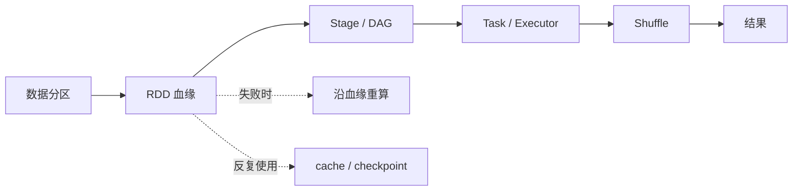
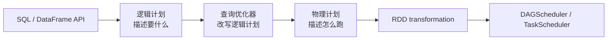
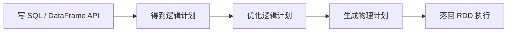
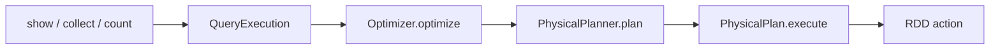
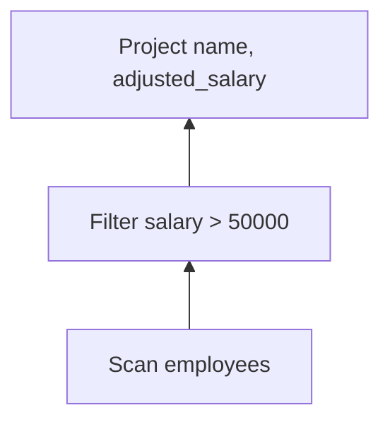
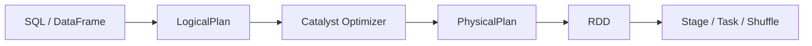
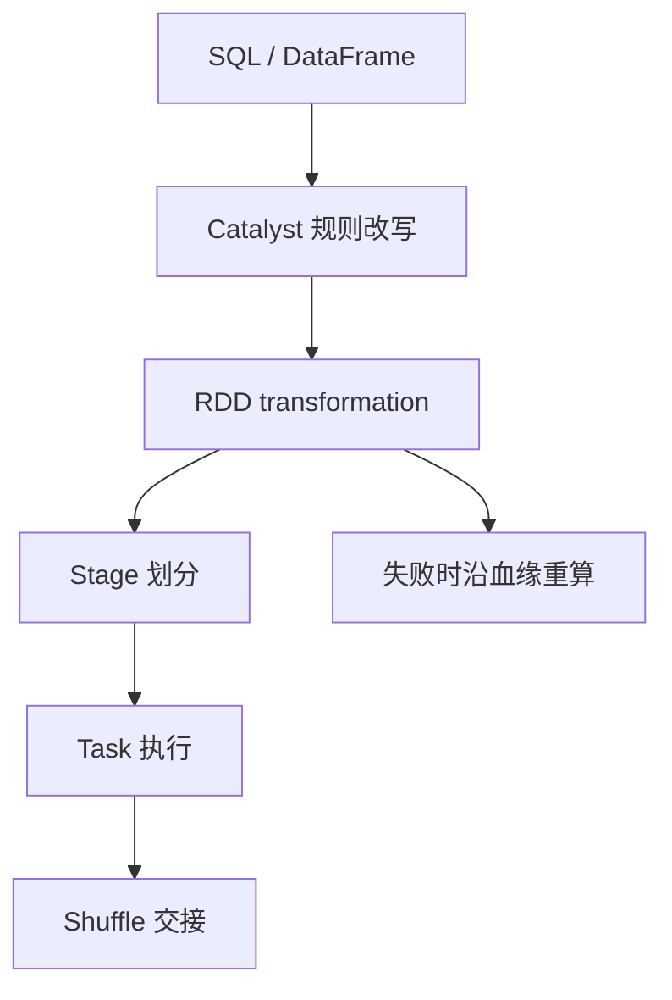

# 第 12 章 · 从 RDD 到 DataFrame

> 💻 本章完整代码：[GitHub 查看](https://github.com/rchaocai/mini-spark/tree/main/ch12-dataframe-future)
>
> 构建运行：`mvn -pl ch12-dataframe-future package`
>
> 运行示例：`java -Dfile.encoding=UTF-8 -cp ch12-dataframe-future/target/classes com.sparklearn.sql.Main`

前 11 章，我们已经把 Spark 的执行底座一层层搭出来了：



如果只看这一层，Spark 已经能做很多事。给它一批数据，写几个 `map`、`filter`、`reduceByKey`，最后触发 action，底层就会切 Stage、发 Task、必要时做 Shuffle。

可是日常业务里的 Spark 程序，更多时候长得像这样：

```sql
SELECT department, count(*)
FROM employees
WHERE salary > 50000
GROUP BY department
```

或者这样：

```java
employees
        .where(col("salary").gt(50_000))
        .groupBy("department")
        .count();
```

这会带来一个很自然的疑问：

```text
既然大家最后都写 SQL 和 DataFrame，
前面那么多章 RDD 是不是白写了？
```

不是。

RDD 没有消失。它只是从用户每天直接书写的接口，沉到了执行层。DataFrame / SQL 在上面负责表达“我要什么”，RDD 在下面负责把这个查询真正跑出来。

这一章要讲清楚的，就是这条从上到下的路：



图里的“查询优化器”先当成普通词理解：它拿到一棵查询树，试着把它改成更省事的形状。Spark SQL 里，这套以“规则改写树”为核心的优化器叫 **Catalyst**。本章也会实现一个极小版 Catalyst，但不会一上来就讲它，先从 RDD 为什么看不懂查询开始。

先把结论放在这里：

```text
DataFrame 不是另一套执行引擎。
DataFrame 是带 schema 的惰性逻辑计划。
它最后仍然要落回 RDD。
```

接下来我们从一个很小的问题开始，不直接跳到优化器。

## 12.1 RDD 能算，但它看不懂查询

假设有一张员工表：

```text
id  name   department  salary
1   Alice  eng         72000
2   Bob    ops         45000
3   Cathy  eng         83000
4   David  sales       51000
5   Eva    sales       39000
6   Frank  ops         67000
```

现在要查出薪水大于 50000 的员工，再输出姓名和调整后的薪水。

如果先按前几章的 RDD 思路写，要先把每个员工放进 `Row`，再用 `SparkContext.parallelize()` 变成一个 `RDD<Row>`：

```java
List<Row> employees = List.of(
        Row.of("id", 1, "name", "Alice", "department", "eng", "salary", 72_000),
        Row.of("id", 2, "name", "Bob", "department", "ops", "salary", 45_000),
        Row.of("id", 3, "name", "Cathy", "department", "eng", "salary", 83_000));

RDD<Row> rdd = spark.parallelize(employees, 2);
```

这里的 `RDD<Row>` 表示：RDD 里的每个元素都是一行员工数据。接下来 `filter` 和 `map` 里的 `row`，就是每次从 RDD 里取出来的一行：

```java
rdd.filter(row -> ((Number) row.get("salary")).doubleValue() > 50_000)
   .map(row -> Row.of(
           "name", row.get("name"),
           "adjusted_salary", ((Number) row.get("salary")).doubleValue() * 1.25));
```

这段代码能跑。问题是：系统只看到两个黑箱函数。

第一个函数里写了 `row.get("salary")`，人能读懂这是在过滤薪水；第二个函数里写了 `row.get("name")` 和 `row.get("salary")`，人也能读懂最后只需要两列。

但 RDD 执行层不会理解这段 Java 代码的意图。它只知道：

```text
filter 里有一个匿名函数：给它一行 Row，它返回 true 或 false
map 里有一个匿名函数：给它一行 Row，它返回另一行 Row
```

至于函数里面是不是只读了 `salary`，是不是还读了 `id`、`department`，系统没有一张明确的清单。它也不知道 `map` 里除了组装新 `Row`，会不会顺手打印日志、修改外部变量、访问网络。

所以，哪怕这个查询从人的角度很清楚：

```text
过滤只需要 salary
输出只需要 name 和 salary
```

RDD 层也不能自动得出“只读 `name` 和 `salary` 就够了”这样的结论。它只能把你写下来的 `filter` 和 `map` 按顺序保存起来，等分区真正计算时逐行调用。

这就是 RDD 的两面：

```text
RDD 很通用：能塞任意函数。
RDD 难优化：任意函数对系统来说是黑箱。
```

DataFrame 换了一种写法：不把过滤条件藏在 lambda 里，而是把条件本身做成对象。

同样是“薪水大于 50000”，在 DataFrame 里写成：

```java
col("salary").gt(50_000)
```

这行代码不会马上拿一行员工来判断 true 或 false。它会造出一棵表达式树：

```text
GreaterThan
  Attribute(salary)
  Literal(50000)
```

同样，“用 salary 乘以 1.25，并把结果叫 adjusted_salary”，写成：

```java
col("salary").multiply(1.25).as("adjusted_salary")
```

也会造出一棵表达式树：

```text
Alias(adjusted_salary)
  Multiply
    Attribute(salary)
    Literal(1.25)
```

这时系统终于能看懂几件事：

```text
过滤条件引用了 salary
输出列引用了 name 和 salary
department 在这个查询里没用
id 在这个查询里也没用
```

这些信息会直接改变执行方式：

```text
RDD 写法：系统只能按顺序调用 filter 和 map。
DataFrame 写法：系统能先检查表达式树，再决定只读哪些列、先过滤哪些行。
```

这就是 DataFrame 和 RDD 在这一节里的核心差别。DataFrame 不是让计算立刻发生，而是先把查询保存成系统能分析的结构。

## 12.2 先跑一遍：看三棵树

本章的演示入口是 `com.sparklearn.sql.Main`。先运行：

```bash
mvn -pl ch12-dataframe-future package
java -Dfile.encoding=UTF-8 -cp ch12-dataframe-future/target/classes com.sparklearn.sql.Main
```

第一段查询是：

```java
DataFrame adjustedSalary = employees
        .where(col("salary").gt(50_000))
        .select(
                col("name"),
                col("salary").multiply(1.25).as("adjusted_salary"));
```

这几行执行完以后，`adjustedSalary` 还不是“已经算好的员工结果”。

它只是一个新的 `DataFrame` 对象。这个对象里面记着：

```text
先从 employees 读数据
再过滤 salary > 50000
最后输出 name 和 salary * 1.25
```

也就是说，`where()` 和 `select()` 只是把查询步骤记下来，还没有开始逐行扫描员工数据。

为了确认系统到底记下了什么，示例程序先调用：

```java
System.out.println(adjustedSalary.explainString());
```

`explainString()` 不触发真正计算，它只把这次查询从“描述”到“执行”的三种形态打印出来。所以你会先看到三棵树。

第一棵是原始逻辑计划：

```text
== Logical Plan ==
Project(name, salary * 1.25 AS adjusted_salary)
  └── Filter(salary > 50000)
      └── Scan(employees, columns=[id, name, department, salary])
```

这棵树从下往上读：

```text
Scan     读 employees
Filter   保留 salary > 50000 的行
Project  输出 name，以及 salary * 1.25
```

第二棵是优化后的逻辑计划：

```text
== Optimized Logical Plan ==
Project(name, salary * 1.25 AS adjusted_salary)
  └── Scan(employees, columns=[name, salary], pushedFilters=[salary > 50000])
```

这里发生了两件事：

```text
Filter 被推进 Scan：扫描时就应用 salary > 50000
Scan 只读 name 和 salary：id / department 被裁掉
```

第三棵是物理计划：

```text
== Physical Plan ==
ProjectExec(name, salary * 1.25 AS adjusted_salary)
  └── ScanExec(employees, columns=[name, salary], pushedFilters=[salary > 50000])
```

名字里多出来的 `Exec` 很重要。它表示这已经不是“我要什么”的描述，而是“怎么在 mini-spark 上跑”的执行节点。

最后，程序调用：

```java
adjustedSalary.show();
```

这一步才真正执行。你会看到前几章熟悉的 Stage 日志：

```text
Stage 划分结果:
ResultStage 0 (rdd=MapPartitionsRDD, parents=[])
提交 ResultStage 0 (rdd=MapPartitionsRDD, parents=[])
  提交 ResultStage 的分区任务
```

这个查询没有 `groupBy`，所以没有 Shuffle。底层只是扫描、过滤、投影，全部可以放进一个 ResultStage。

结果是：

```text
{name=Alice, adjusted_salary=90000.0}
{name=Cathy, adjusted_salary=103750.0}
{name=David, adjusted_salary=63750.0}
{name=Frank, adjusted_salary=83750.0}
```

把刚才看到的三棵树和最后的 RDD 执行放在一起，就是这一章的主线：



接下来先看第一步：SQL 和 DataFrame 为什么都能把一次查询保存成系统可以分析的结构。

## 12.3 三个小零件：Row、Schema、Expression

DataFrame 比 RDD 多出来的第一件事，是“结构”。

这一节先从 DataFrame API 看，因为它能直接在 Java 代码里造出这些结构。SQL 字符串会多经过一步解析器；它怎样变成同一套结构，放到 12.8 再说明。

RDD 里的元素可以是任何对象。你可以放字符串、整数、业务对象，也可以放一行表格。RDD 本身不关心里面有什么。

DataFrame 不一样。它必须知道：

```text
这一行有哪些列？
每一列叫什么？
表达式引用了哪些列？
```

本章用三个小对象来回答这些问题。

### 12.3.1 Row：一行值

先想一个问题：一行员工数据，在 Java 里可以怎么表示？

最自然的是写一个业务类：

```java
record Employee(int id, String name, String department, int salary) {
}
```

这样写类型很清楚，但对查询系统不友好。优化器拿到的是一个 `Employee` 对象，它还是不知道后面的表达式会读哪些字段。更重要的是，DataFrame 要处理的不只是一张员工表。今天是 `employees`，明天可能是订单表、日志表、商品表。系统不能为每张表都写一个专门的 Java 类。

另一种直觉写法是用 `Map`：

```java
Map.of("id", 1, "name", "Alice", "department", "eng", "salary", 72_000)
```

这很灵活，按列名取值也直观。但如果每一行都带一份字段名，数据一多就很浪费：同样的 `"id"`、`"name"`、`"department"`、`"salary"` 会在每一行里重复出现。

所以 DataFrame 通常会把“一行值”和“列说明”拆开：

```text
Row     只保存这一行的值
Schema  统一说明这些值对应哪些列
```

这样，同一张表的很多行可以共用一份 Schema，每一行只保存自己的值。

本章的 `Row` 表示一行数据。为了保留按列名阅读一行数据的直觉，构造时允许用字段名和值交替传入：

```java
Row.of("id", 1,
        "name", "Alice",
        "department", "eng",
        "salary", 72_000)
```

也支持按字段名取值：

```java
row.get("salary")
```

不过，字段名不是每次计算时真正遍历的数据主体。`Row` 内部保存值的地方是一个数组，字段名只用来找到数组下标：

```text
nameToIndex:
id         -> 0
name       -> 1
department -> 2
salary     -> 3

values:
[1, Alice, eng, 72000]
```

所以这里出现 `Object[]`，不是说业务代码应该直接操作数组，也不是说表格数据就应该失去类型。它表达的是一个底层设计取舍：

```text
对用户：可以按列名理解这一行。
对执行层：最好按位置快速访问这一行的值。
```

这一节先只保留这个模型：一行数据最终是一组按位置排列的值，而列名和类型由 Schema 统一说明。

> [!INFO]
> **Spark 里的 Row 和内部行格式**
>
> Spark 面向用户暴露的是 `Row`。用户可以把它理解成“一行表格数据”，通过列的位置或列名读取值。
>
> 但 Spark SQL 执行时不会一直用这种面向用户的对象表示。执行层更关心速度和内存占用，所以内部还有更底层的行格式，例如 `InternalRow`。现代 Spark 里常见的 `UnsafeRow` 会把一行数据放进紧凑的二进制内存布局里，减少 Java 对象数量，也方便按位置快速读取字段。
>
> 所以真实 Spark 大致分成两层：
>
> ```text
> 用户看到：Row，强调好理解、好访问
> 执行内部：InternalRow / UnsafeRow，强调紧凑和按位置访问
> ```
>
> 本章的 `Row` 没有实现这套二进制格式，只保留关键方向：用户可以按列名理解数据，执行时则尽量把字段名转换成位置访问。

### 12.3.2 Schema：列的说明书

只有一行值还不够。系统还需要一张说明书：

```text
id          int
name        string
department  string
salary      int
```

这就是 `Schema`。代码里它由一组 `Field` 组成：

```java
public record Field(String name, DataType dataType) implements Serializable {
}
```

`SQLContext.createDataFrame()` 会从第一行数据推断出 schema：

```java
public DataFrame createDataFrame(String relationName, List<Row> rows, int numberOfPartitions) {
    return createDataFrame(
            relationName,
            sparkContext.parallelize(rows, numberOfPartitions),
            Schema.inferFrom(rows.get(0)));
}
```

但概念已经够了：

```text
Row    是一行值
Schema 说明这一行值有哪些列
```

> [!INFO]
> **Schema 推断的边界**
>
> 这里的 `Schema.inferFrom(rows.get(0))` 只覆盖当前例子需要的基本类型。完整的数据系统还会处理更多情况，比如类型检查、空值、嵌套类型，以及从 Parquet、JSON、JDBC 等数据源读取已有 schema。

### 12.3.3 Expression：把一行里的计算写成树

有了列名，就可以把“对一行做的小计算”写成表达式树。

表达式接口长这样：

```java
public sealed interface Expression extends Serializable
        permits And, EqualTo, GreaterThan, Literal, Multiply, NamedExpression {

    Object eval(Row row);

    Set<String> references();

    String sql();
}
```

三个方法分别回答三个问题：

```text
eval(row)       真执行时，怎么对一行求值
references()   这个表达式用到了哪些列
sql()          怎么打印成可读文本
```

其中最关键的是 `references()`。它不是只看某一个小节点，而是看整棵表达式树里出现过哪些列。

先看过滤条件：

```java
col("salary").gt(50_000)
```

这行代码会组成这样一棵树：

```text
GreaterThan
  Attribute(salary)
  Literal(50000)
```

这里有三个节点：

```text
Attribute(salary)  表示 salary 这一列
Literal(50000)     表示常量 50000
GreaterThan        表示左边大于右边
```

如果问这个 `GreaterThan` 条件“你计算时需要哪些输入列”，它会去问自己的两个子节点，再把结果合并起来：

```text
salary
```

结果只有 `salary`，因为左边的 `Attribute(salary)` 引用了 salary，右边的 `Literal(50000)` 只是常量，不引用任何列。

再看输出列：

```java
col("salary").multiply(1.25).as("adjusted_salary")
```

它会组成这样一棵树：

```text
Alias(adjusted_salary)
  Multiply
    Attribute(salary)
    Literal(1.25)
```

这里的根节点是 `Alias`，表示给计算结果起一个输出列名；中间的 `Multiply` 表示乘法；叶子上的 `Attribute(salary)` 才是真正引用输入列的地方。

所以如果问这个 `Alias` 输出列“你计算时需要哪些输入列”，它一路往下看，结果仍然是：

```text
salary
```

优化器后来能做列裁剪，靠的就是这种“整棵表达式用了哪些列”的信息。它不是猜出来的，也不是扫描 Java 字节码看出来的，而是表达式对象自己就能回答这个问题。

## 12.4 DataFrame：不是数据，而是计划

现在可以看 `DataFrame` 了。

它的核心字段只有两个：

```java
public final class DataFrame {

    private final SQLContext sqlContext;
    private final LogicalPlan logicalPlan;

    public DataFrame where(Expression condition) {
        return new DataFrame(sqlContext, new Filter(condition, logicalPlan));
    }

    public DataFrame select(NamedExpression... expressions) {
        return new DataFrame(sqlContext, new Project(List.of(expressions), logicalPlan));
    }

    public List<Row> collect() {
        return queryExecution().executed().execute().collect();
    }
}
```

`DataFrame` 自己不负责切分区，也不负责调度任务。它只保存：

```text
SQLContext    查询执行入口
LogicalPlan   到目前为止攒出来的逻辑计划树
```

这就是本章最重要的一句话：

```text
DataFrame = 带 schema 的惰性逻辑计划
```

调用 `where()` 时，没有任何数据被过滤。它只是把原来的计划包进一个新的 `Filter`：

```text
Filter(condition)
  └── 原来的计划
```

调用 `select()` 时，也没有任何新列被计算。它只是再包一层 `Project`：

```text
Project(expressions)
  └── 原来的计划
```

所以这一串代码：

```java
employees
        .where(col("salary").gt(50_000))
        .select(col("name"), col("salary").multiply(1.25).as("adjusted_salary"));
```

只是把计划从：

```text
Scan(employees)
```

变成：

```text
Project(name, salary * 1.25 AS adjusted_salary)
  └── Filter(salary > 50000)
      └── Scan(employees)
```

中间没有读一行数据。

真正触发执行的是 action：

```java
collect()
show()
count()
```

action 触发后，会进入 `QueryExecution`：



这和 RDD 的惰性很像，但攒下来的东西不一样：

```text
RDD 惰性：攒 RDD 血缘。
DataFrame 惰性：攒逻辑计划树。
```

RDD 的血缘主要告诉系统“这个分区怎么算出来”。DataFrame 的逻辑计划还多告诉系统“这个查询在关系层面想要什么”。

## 12.5 逻辑计划：把整张表的变化串成树

`Expression` 描述一行里的小计算：

```text
salary > 50000
salary * 1.25
department
```

`LogicalPlan` 描述整张表怎么变化：

```text
Scan       从一张表开始
Filter     保留哪些行
Project    输出哪些列或表达式
Aggregate  按哪些列分组并计数
```

它们刚好是一大一小：

```text
Expression  管一行里的表达式
LogicalPlan 管一张表上的操作
```

本章的逻辑计划节点很少：

```text
Scan(employees, columns=[id, name, department, salary])
Filter(salary > 50000)
Project(name, salary * 1.25 AS adjusted_salary)
Aggregate(groupBy=[department], count(*))
```

注意 `Scan` 是叶子。所有查询都从它开始。

创建 DataFrame 时，先得到：

```text
Scan(employees, columns=[id, name, department, salary])
```

调用 `where()` 后：

```text
Filter(salary > 50000)
  └── Scan(employees, columns=[id, name, department, salary])
```

再调用 `select()` 后：

```text
Project(name, salary * 1.25 AS adjusted_salary)
  └── Filter(salary > 50000)
      └── Scan(employees, columns=[id, name, department, salary])
```

树是从外面一层层包起来的。读计划时，却通常从下往上读，因为数据流动方向是从叶子到根：



这一步的意义不是“已经执行了这些操作”。它只是把完整意图写了下来。

只要完整意图被写成树，下一步就可以问：

```text
这棵树能不能换个更省事的形状？
```

## 12.6 查询优化器：Spark 把它叫 Catalyst

前面我们已经得到了一棵逻辑计划树。它完整描述了查询意图，但还没有回答一个问题：这棵树是不是已经够好？

比如：

```text
Project(name, salary * 1.25 AS adjusted_salary)
  └── Filter(salary > 50000)
      └── Scan(employees, columns=[id, name, department, salary])
```

这棵树当然能执行。但它先从 `employees` 读出所有列，再过滤，再投影。人一眼就能看出：既然最后只需要 `name` 和 `salary`，过滤条件也只用 `salary`，那扫描阶段能不能少读一点？

查询优化器做的就是这种事。

Spark SQL 把自己的查询优化器叫 **Catalyst**。这个名字背后包含很多工程内容：表达式、逻辑计划、规则、Analyzer、优化器、物理规划、代码生成。我们这一章不实现完整 Spark Catalyst，只实现它最核心、也最适合入门的一小块：

在本章里，Catalyst 做的事很朴素：

```text
拿到一棵逻辑计划树。
用规则改写它。
得到一棵等价但更容易执行的树。
```

先看两条最容易理解的规则。

### 12.6.1 谓词下推：先少拿行

原始计划里，过滤条件在 `Scan` 上面：

```text
Filter(salary > 50000)
  └── Scan(employees, columns=[id, name, department, salary])
```

直觉上，如果数据源自己就能过滤，那就别把所有行都拿上来再筛。把条件塞进 `Scan`：

```text
Scan(employees, columns=[id, name, department, salary], pushedFilters=[salary > 50000])
```

规则代码也正是匹配这个形状：

```java
public LogicalPlan apply(LogicalPlan plan) {
    if (plan instanceof Filter filter && filter.child() instanceof Scan scan) {
        return scan.withPushedFilter(filter.condition());
    }
    return plan;
}
```

这条规则只在看见：

```text
Filter
  └── Scan
```

时动手。别的形状先不管。

本章的内存数据源最终还是用 RDD 的 `filter()` 执行。但接口位置已经对了：`Scan` 可以携带 `pushedFilters`。如果以后换成 Parquet、JDBC 或别的数据源，这个位置就可以把过滤条件交给外部系统，让它少读数据。

> [!INFO]
> **过滤下推的边界**
>
> 本章直接把 `Filter` 合进了 `Scan`，这样计划变化最直观。Spark SQL 通常会更谨慎：它可以把过滤条件下推给数据源，同时仍保留 Spark 侧过滤。原因是外部数据源不一定保证已经完整、精确地执行了所有条件。

### 12.6.2 列裁剪：再少拿列

过滤之后，查询只输出：

```text
name
salary * 1.25 AS adjusted_salary
```

为了算这个结果，需要的列只有：

```text
name
salary
```

`id` 和 `department` 没有用。

列裁剪规则就从表达式里收集引用列：

```java
if (plan instanceof Project project && project.child() instanceof Scan scan) {
    Set<String> columns = new LinkedHashSet<>();
    for (NamedExpression expression : project.projectList()) {
        columns.addAll(expression.references());
    }
    return new Project(project.projectList(), scan.withRequiredColumns(columns.stream().toList()));
}
```

所以：

```text
Project(name, salary * 1.25 AS adjusted_salary)
  └── Scan(employees, columns=[id, name, department, salary], pushedFilters=[salary > 50000])
```

会变成：

```text
Project(name, salary * 1.25 AS adjusted_salary)
  └── Scan(employees, columns=[name, salary], pushedFilters=[salary > 50000])
```

这里有个容易漏掉的小点：如果 `Scan` 里还有 pushed filter，过滤条件引用的列也不能丢。

例如 `salary > 50000` 需要 `salary`。所以哪怕最后只输出 `name`，扫描时也仍然要保留 `salary`，否则过滤条件没法算。

本章数据在内存里，性能差异不明显；但从计划上看，`Scan` 已经能表达“只读这些列”。

> [!INFO]
> **列裁剪为什么重要**
>
> 在列式存储里，列裁剪的收益会非常明显。只读两列和读两百列，意味着磁盘读取、解码、内存占用和网络传输都可能大幅减少。Parquet、ORC 这类格式正是按列组织数据，所以特别适合和列裁剪配合。

### 12.6.3 RuleExecutor：把规则反复应用到不再变化

现在再回头看 Catalyst 的执行框架，就不难了。

本章的优化器有两个 batch：

```java
new RuleExecutor.Batch("Operator Pushdown", List.of(
        new CombineFilters(),
        new PushFilterIntoScan())),
new RuleExecutor.Batch("Column Pruning", List.of(
        new PruneScanColumns()))
```

`RuleExecutor` 对每个 batch 反复应用规则，直到计划不再变化：

```java
public LogicalPlan execute(LogicalPlan plan) {
    LogicalPlan current = plan;
    for (Batch batch : batches) {
        int iteration = 0;
        boolean changed = true;
        while (changed && iteration < MAX_ITERATIONS) {
            LogicalPlan before = current;
            for (PlanRule rule : batch.rules()) {
                current = current.transformUp(rule);
            }
            changed = !current.equals(before);
            iteration++;
        }
    }
    return current;
}
```

`transformUp` 的意思是：先改孩子，再改自己。这样一棵大树会被递归走一遍，每个节点都有机会被规则匹配。

`MAX_ITERATIONS` 是安全边界。正常情况下，规则跑几轮就到 fixed point；如果规则设计得不好、来回改写，也不能无限循环。

到这里，Catalyst 的最小模型就够用了：

```text
表达式告诉系统引用了哪些列。
逻辑计划把查询写成树。
规则匹配树上的局部形状。
RuleExecutor 反复应用规则直到稳定。
```

## 12.7 物理计划：把树落回 RDD

优化后的逻辑计划仍然不能直接跑。

它只描述：

```text
我要扫描哪些列
我要提前应用哪些过滤条件
我要投影哪些表达式
我要不要聚合
```

但 mini-spark 的执行底座认的是 RDD。于是需要物理计划，把逻辑节点翻译成能生成 RDD 的执行节点。

`PhysicalPlanner` 的形状很直接：

```java
if (logicalPlan instanceof Scan scan) {
    return new ScanExec(...);
}
if (logicalPlan instanceof Project project) {
    return new ProjectExec(project.projectList(), plan(project.child()));
}
if (logicalPlan instanceof Aggregate aggregate) {
    return new HashAggregateExec(...);
}
```

逻辑计划节点和物理执行节点之间，大致这样对应：

```text
Scan       -> ScanExec
Project    -> ProjectExec
Aggregate  -> HashAggregateExec
```

### 12.7.1 ScanExec：RDD.filter + RDD.map

`ScanExec` 接收两个优化结果：

```text
requiredColumns  需要读哪些列
pushedFilters    提前过滤哪些条件
```

执行时：

```java
RDD<Row> current = rdd;
for (Expression filter : pushedFilters) {
    current = current.filter(row -> Boolean.TRUE.equals(filter.eval(row)));
}
if (!requiredColumns.isEmpty()) {
    current = current.map(row -> row.select(requiredColumns));
}
return current;
```

这一步没有新魔法。过滤就是 RDD 的 `filter()`，列裁剪在内存数据源里就是 RDD 的 `map()`。

### 12.7.2 ProjectExec：RDD.map

`ProjectExec` 负责计算输出列：

```java
return child.execute().map(row -> {
    LinkedHashMap<String, Object> values = new LinkedHashMap<>();
    for (NamedExpression expression : projectList) {
        values.put(expression.name(), expression.eval(row));
    }
    return Row.of(values);
});
```

每来一行，就对这一行求表达式，再组装成新 `Row`。

所以 DataFrame 的：

```java
select(col("name"), col("salary").multiply(1.25).as("adjusted_salary"))
```

落到底层，就是一次 `map`。

### 12.7.3 HashAggregateExec：RDD.reduceByKey

第二个查询是：

```java
DataFrame departmentCounts = employees
        .where(col("salary").gt(50_000))
        .groupBy("department")
        .count();
```

它的优化后计划是：

```text
== Optimized Logical Plan ==
Aggregate(groupBy=[department], count(*))
  └── Scan(employees, columns=[department, salary], pushedFilters=[salary > 50000])
```

物理计划是：

```text
== Physical Plan ==
HashAggregateExec(groupBy=[department], count(*))
  └── ScanExec(employees, columns=[department, salary], pushedFilters=[salary > 50000])
```

`HashAggregateExec` 的核心执行逻辑是：

```java
RDD<KeyValuePair<GroupKey, Long>> keyed = child.execute()
        .map(row -> new KeyValuePair<>(GroupKey.from(row, groupingExpressions), 1L));
RDD<KeyValuePair<GroupKey, Long>> counts =
        keyed.reduceByKey(Long::sum, DEFAULT_REDUCE_PARTITIONS);
return counts.map(pair -> pair.key().toRow(pair.value()));
```

先把每行变成：

```text
(department, 1)
```

再用 `reduceByKey(Long::sum, ...)` 按部门加起来。

这就回到了第 6 章的 Shuffle。运行时你会看到：

```text
Stage 划分结果:
ResultStage 2 (rdd=MapPartitionsRDD, parents=[1])
  ShuffleMapStage 1 (rdd=MapPartitionsRDD, parents=[])
提交 ShuffleMapStage 1 (rdd=MapPartitionsRDD, parents=[])
  shuffle map 输出已写入磁盘
提交 ResultStage 2 (rdd=MapPartitionsRDD, parents=[1])
```

也就是说：

```text
groupBy().count()  是用户 API
Aggregate          是逻辑计划
HashAggregateExec  是物理计划
reduceByKey        是 RDD 执行
ShuffleDependency  切出两个 Stage
```

这条链路对上以后，DataFrame 就不再是黑箱了。

## 12.8 SQL：另一种入口，同一棵计划树

DataFrame API 不是唯一入口。SQL 字符串也可以走到同一套逻辑计划。

示例程序里先注册表：

```java
sql.registerTable("employees", employees.logicalPlan());
```

然后执行 SQL：

```java
DataFrame result = sql.sql(
        "SELECT department, count(*) FROM employees GROUP BY department");
```

本章的 `SqlParser` 很小，只支持这几种查询形状：

```text
SELECT column [, column] FROM tableName
SELECT column [, column] FROM tableName WHERE condition
SELECT column [, count(*)] FROM tableName GROUP BY column
SELECT column [, count(*)] FROM tableName WHERE condition GROUP BY column
```

解析过程可以想成三步：

```text
先切 token
再按 SELECT / FROM / WHERE / GROUP BY 递归下降解析
最后构建 LogicalPlan
```

比如：

```sql
SELECT department, count(*)
FROM employees
WHERE salary > 50000
GROUP BY department
```

会构建出：

```text
Aggregate(groupBy=[department], count(*))
  └── Filter(salary > 50000)
      └── Scan(employees, columns=[id, name, department, salary])
```

这和 DataFrame API：

```java
employees
        .where(col("salary").gt(50_000))
        .groupBy("department")
        .count();
```

生成的是同一种计划形状。之后优化器和物理规划器完全复用。

所以 SQL 和 DataFrame 的关系可以这样理解：

```text
SQL 字符串      -> 解析器 -> LogicalPlan
DataFrame API   -> API 调用 -> LogicalPlan

LogicalPlan 之后，两条路汇合。
```

```text
不同入口最终汇成同一棵逻辑计划树。
```

> [!INFO]
> **SQL 解析器的边界**
>
> 本章的 SQL 解析器只覆盖最小查询形状。完整 SQL 解析器还要处理函数、别名、join、子查询、类型转换、错误提示等大量细节。这里先保留一条窄路，让 SQL 能进入同一套逻辑计划结构。

## 12.9 这一章没有展开什么

到这里，我们已经跑通了 DataFrame 的主线。还有几类能力先不展开。

> [!INFO]
> **还有哪些能力没有展开**
>
> 第一是 Analyzer。SQL 里刚解析出来的列名、表名和函数名，最开始只是名字。Analyzer 会把它们解析到具体表、具体列、具体类型上，并做语义检查。本章直接用已注册的表和简单列名，省掉了完整 Analyzer。
>
> 第二是更复杂的物理规划。Spark 会根据统计信息、数据大小和算子能力选择不同策略，比如 join 时选择 shuffle join 还是 broadcast join。本章只实现了 `ScanExec`、`ProjectExec`、`HashAggregateExec` 三个节点。
>
> 第三是代码生成。Spark 会把表达式生成 JVM 字节码，减少逐个解释表达式的开销。本章直接调用 `expression.eval(row)`。
>
> 第四是数据源体系。Spark 要接 Parquet、JSON、JDBC、Hive 等数据源，每种数据源能下推的过滤条件和列裁剪能力都不同。本章用内存 RDD 模拟数据源，只保留接口形状。

这些能力都很重要，但主线先保持简单：



以后再看 Analyzer、Join、Codegen、DataSource，都是往这条链路上加部件。

## 12.10 源码入口（选读）

RDD 时代的早期 Spark 还没有今天熟悉的 SQL 层。要看 DataFrame 和 Catalyst，需要看 Spark SQL 引入之后的代码。

如果想继续看 Spark 源码，可以先从这些入口看：

```text
sql/core/src/main/scala/org/apache/spark/sql/DataFrame.scala
sql/core/src/main/scala/org/apache/spark/sql/SQLContext.scala
sql/catalyst/src/main/scala/org/apache/spark/sql/catalyst/trees/TreeNode.scala
sql/catalyst/src/main/scala/org/apache/spark/sql/catalyst/rules/RuleExecutor.scala
sql/catalyst/src/main/scala/org/apache/spark/sql/catalyst/optimizer/Optimizer.scala
sql/core/src/main/scala/org/apache/spark/sql/execution/SparkStrategies.scala
sql/core/src/main/scala/org/apache/spark/sql/sources/interfaces.scala
```

SQL 解析器可以看：

```text
sql/catalyst/src/main/scala/org/apache/spark/sql/catalyst/AbstractSparkSQLParser.scala
sql/catalyst/src/main/scala/org/apache/spark/sql/catalyst/SqlParser.scala
```

这里不逐类展开源码。到最后一章再做完整源码对照更合适。本章只要把 DataFrame 到 RDD 的结构化查询链路讲顺。

## 12.11 小结

这一章没有推翻前面写过的 RDD 内核，而是在它上面多盖了一层。

RDD 给系统的是执行能力：

```text
分区
血缘
窄依赖和宽依赖
Stage / Task
Shuffle
cache / checkpoint
失败重算
```

DataFrame 给系统的是结构化信息：

```text
列名
类型
表达式树
过滤条件
投影列
聚合键
数据源能力
```

结构化信息越多，系统越能优化。它可以知道哪些行应该尽早过滤，哪些列根本不需要读，哪些操作会触发聚合和 Shuffle。

所以工业界后来更常写 SQL / DataFrame，不是因为 RDD 不重要，而是因为 RDD 已经变成底座。你写的是：

```java
df.where(...).groupBy(...).count().show();
```

底下走的是：

```text
LogicalPlan
  -> Catalyst
  -> PhysicalPlan
  -> RDD.reduceByKey
  -> Shuffle
  -> Stage / Task
```

从第 1 章到这里，链路已经接上了：



你现在再看到一行 Spark SQL，不只是知道怎么写。

你也知道它下面那台机器怎么转。
