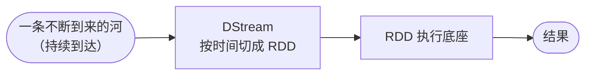
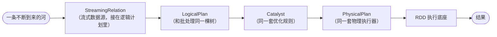
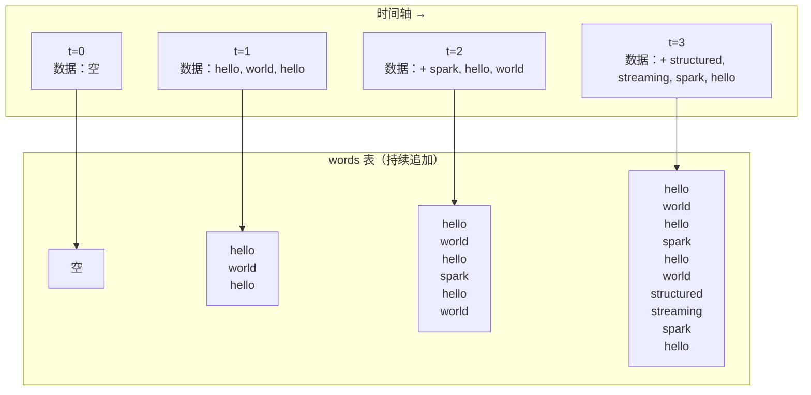
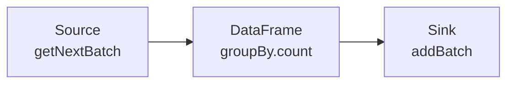
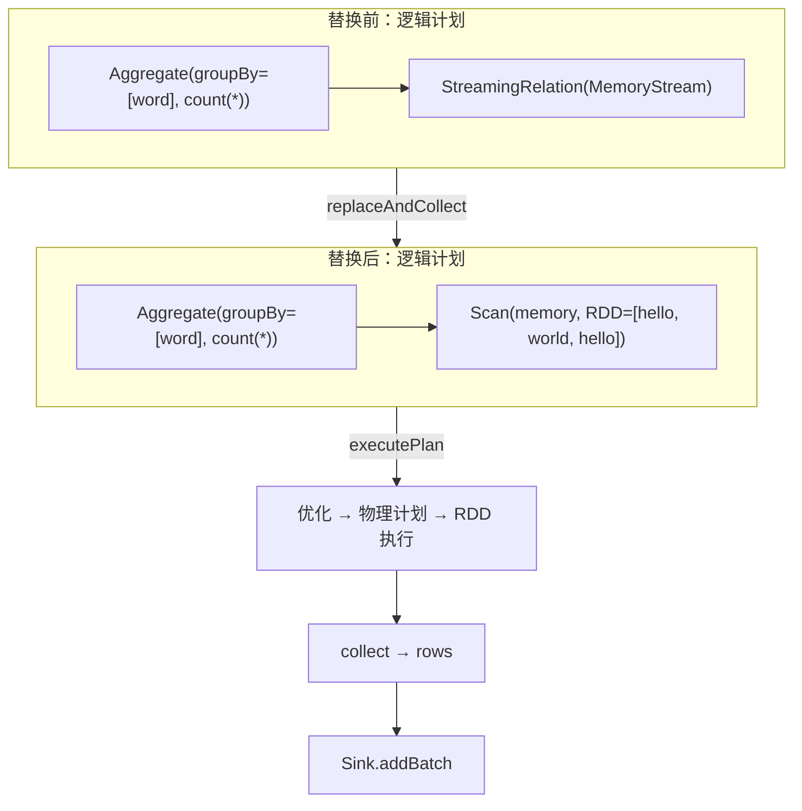
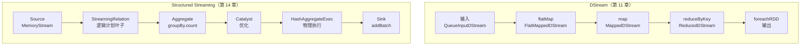

# 第 14 章 · Structured Streaming

> 💻 本章完整代码：[GitHub 查看](https://github.com/rchaocai/mini-spark/tree/main/ch14-structured-streaming)
>
> 构建运行：`mvn -pl ch14-structured-streaming package`
>
> 运行示例：`java -Dfile.encoding=UTF-8 -cp ch14-structured-streaming/target/classes com.sparklearn.streaming.structured.Main`

第 11 章，你把流按时间切成 RDD，用 DStream 把每个时间点的 RDD 串起来：



第 12 章，你又在 RDD 上盖了一层 DataFrame：用户写声明式查询，Catalyst 把它优化成更好的逻辑计划，物理计划再落回 RDD 执行。

这两章各自独立看，都没问题。但把它们接在一起，你会问：**既然 DataFrame 这条查询链路已经跑通了，能不能让流计算也走这条链路？** 不用再写 `rdd.map(...).filter(...)`，而是像第 12 章那样写 `df.groupBy("word").count()`，只是把数据源从"一张静态表"换成"一条一直来的流"。

这就是 Structured Streaming 做的事。



注意最左边的框变了：不再是 DStream 那一层"按时间切成 RDD"，而是把流式数据源直接接进 DataFrame 的逻辑计划树里。优化和执行，用的还是第 12 章那套。

本章基于第 12 章的 SQL 实现，在 DataFrame 引擎上长出 Structured Streaming 的最小核心：偏移量、数据源、接收器、微批执行引擎。概念上呼应 Spark 的 `org.apache.spark.sql.execution.streaming` 包，但只保留教学必需的骨架。

> [!NOTE]
> 第 11 章的 DStream 和第 14 章的 Structured Streaming 都实现流式 WordCount。它们不是"升级版"和"旧版"的关系——它们是两种不同的编程模型：DStream 把流按时间切成 RDD，直接对 RDD 编程；Structured Streaming 把流包装成 DataFrame，用声明式查询编程。读完本章，你会对这两种模型有清晰的对照。

## 14.1 DStream 的边界

第 11 章用 DStream 做流式 WordCount 时，代码长这样：

```java
DStream<String> input = ssc.queueStream(lines);
DStream<String> words = input.flatMap(line -> List.of(line.split("\\s+")));
DStream<KeyValuePair<String, Integer>> wordCounts = words
        .map(word -> new KeyValuePair<>(word, 1))
        .reduceByKey(Integer::sum, 2);
wordCounts.foreachRDD((rdd, time) -> {
    /* 打印这个 batch 的结果 */
});
```

这段代码很直接，但也很原始。直接，是因为每一步都是你熟悉的 RDD 变换——`flatMap`、`map`、`reduceByKey`，和批处理一模一样。原始，是因为它让你自己操心"怎么算"：先拆词，再配 1，再按 key 归并。这些操作对 RDD 来说很自然，但意味着两件事：

**第一，优化器帮不上忙。** 第 12 章的 Catalyst 能做的事——谓词下推、列裁剪、投影合并——对 DStream 的 RDD 变换全都不起作用。RDD 里的 lambda 是黑箱，Catalyst 看不透。

**第二，状态管理要自己扛。** `reduceByKey` 只在一个 batch 内聚合。如果你要跨 batch 累积——比如"过去 1 小时的 UV"，DStream 给你的是 `updateStateByKey` 和 `window` 操作，但状态怎么存、怎么恢复，都得你自己写逻辑。

这些不是 DStream 的 bug，是它的设计取舍：RDD 执行底座上直接长出来的流，模型就是"每个时间点的 RDD 变换"。这个取舍让 DStream 和批处理统一了执行，但编程模型仍然是 RDD 级别的。

Structured Streaming 换了一种思路：**把流当成一张不断追加的表，用 DataFrame 的声明式查询去问它。**

## 14.2 把流看成一张表

这是 Structured Streaming 最核心的视角转换。

第 12 章里，你问一张静态表：

```sql
SELECT word, count(*)
FROM words
GROUP BY word
```

系统拿到这个查询，解析成逻辑计划，优化，执行——只跑一次，对当前这批数据。

Structured Streaming 把这个问题换成了：**如果 `words` 这张表一直在长，每隔一段时间就跑一次同样的查询，会怎样？**



这是一张**无界表（unbounded table）**——没有"最后一行"，数据一直在追加。每个微批到来时，新数据被追加到表里，然后对整张表跑一次查询。

但这里有一个关键简化：**每个微批的查询只算当前批新到的数据，而不是从头扫全表。** 这在 Spark 的术语里叫"append 模式"——一个微批处理完，结果追加到 Sink，下一个微批只处理新数据。本章的 `StreamExecution.advance()` 实现的正是这个模式：每次只从 Source 取新数据，对这批新数据跑查询，结果写入 Sink。

> [!INFO]
> **Spark 的三种输出模式**
>
> Spark Structured Streaming 有三种输出模式：
> - **Append**：只把新行的结果追加到 Sink（新数据 = 新结果行）
> - **Complete**：每次把整张表的最新结果全部写回 Sink（适合有状态聚合）
> - **Update**：只写更新过的行
>
> 本章只实现 Append，它最直接，也最接近微批的直觉：来一批，算一批，写一批。

## 14.3 先跑起来：流式 WordCount

先把代码跑起来：

```bash
mvn -pl ch14-structured-streaming package
java -Dfile.encoding=UTF-8 -cp ch14-structured-streaming/target/classes com.sparklearn.streaming.structured.Main
```

演示没有接真实的网络端口。它用 `MemoryStream` 模拟一条流，分三批往里加数据：

```text
第 1 批：hello, world, hello
第 2 批：spark, hello, world
第 3 批：structured, streaming, spark, hello
```

每加一批，就调用 `execution.advance()` 推进一个微批，然后打印 Sink 中累积的结果。

先把查询的逻辑计划打印出来。你会看到：

```text
流式查询逻辑计划：
Aggregate(groupBy=[word], count(*))
  └── StreamingRelation(MemoryStream[offset=-1, batches=0])
```

这棵树和第 12 章的聚合查询几乎一样，只差一个地方：最底下的叶子节点不是 `Scan(employees)`，而是 `StreamingRelation(MemoryStream[...])`。`Scan` 对着一个静态 RDD，`StreamingRelation` 对着一个会不断有新数据到来的 `Source`。

程序跑起来，三个批次的结果是这样的：

```text
--- 第 1 批数据 ---
Sink 结果：
  {word=hello, count=2}
  {word=world, count=1}

--- 第 2 批数据 ---
Sink 结果（累积）：
  {word=hello, count=2}
  {word=world, count=1}
  {word=hello, count=1}
  {word=world, count=1}
  {word=spark, count=1}

--- 第 3 批数据 ---
Sink 结果（累积）：
  ...（所有 9 行）
总共执行了 3 个微批
Sink 共接收 3 个批次
```

注意 "Sink 结果（累积）"——每批独立算，Sink 把所有批的结果都存着，所以你能看到越来越长的输出。每个微批都完整走了一遍"优化 → 物理执行 → RDD 执行"的路径，和第 12 章批处理里的 `groupBy().count()` 是同一套。

## 14.4 演示代码怎么搭的

回到那一小段演示代码，拆开看它的结构：

```java
// 1. 创建流式数据源（schema: word STRING）
Schema wordSchema = Schema.of(new Field("word", DataType.STRING));
MemoryStream source = new MemoryStream(sql, wordSchema);

// 2. 构建流式 DataFrame 并定义查询
DataFrame streamDF = source.toDF();
DataFrame resultDF = streamDF
        .groupBy("word")
        .count();

// 3. 创建输出 Sink
MemorySink sink = new MemorySink();

// 4. 创建流式执行引擎
StructuredStreaming ss = new StructuredStreaming(sql);
StreamExecution execution = ss.startQuery(resultDF, sink);

// 5. 模拟流式数据到达
source.addData(List.of(
        Row.of("word", "hello"),
        Row.of("word", "world"),
        Row.of("word", "hello")));
execution.advance();
```

步骤 1 和 2 和第 12 章一模一样：定义 schema，构建 DataFrame，链式调用 `groupBy().count()`。唯一的区别是 `source.toDF()` 返回的 DataFrame 底层不是 `Scan`，而是 `StreamingRelation`。

步骤 3 和 4 创建了一个 `MemorySink`（内存接收器），然后用 `StructuredStreaming.startQuery()` 把查询和 Sink 绑在一起，得到一个 `StreamExecution`。

步骤 5 是流计算特有的：`source.addData()` 模拟新数据到达，`execution.advance()` 手动推进一个微批。在生产系统里，`advance()` 会由一个定时器反复调用（或者等待数据源通知有新数据），这里为了方便看清每一步，直接手动推。

步骤 1 到 4 是搭框架，做一次；步骤 5 是流计算的核心循环，反复做。下面把每个组件拆开看。

## 14.5 三个基础对象：Offset、Batch、Source/Sink 接口

在拆 `StreamExecution` 之前，先看它依赖的三个基础对象。它们很小，但概念上要清楚，因为它们构成了 Structured Streaming 的"数据模型"。

### 14.5.1 Offset：流中的"读到哪了"

偏移量是流计算进度管理的核心。它回答一个简单的问题：**这条流已经处理到哪个位置了？**

```java
public interface Offset extends Comparable<Offset> {
}
```

`Offset` 只是一个接口——它唯一的要求是"能比较大小"。因为要知道"5 是不是比 3 大"，才知道"从 3 继续往后读"。

本章的实现是 `LongOffset`，用一个 long 做最简单的递增：

```java
public record LongOffset(long offset) implements Offset {

    public LongOffset {
        if (offset < -1) {
            throw new IllegalArgumentException("offset must be >= -1: " + offset);
        }
    }

    public LongOffset increment() {
        return new LongOffset(offset + 1);
    }

    @Override
    public int compareTo(Offset other) {
        if (!(other instanceof LongOffset that)) {
            throw new IllegalArgumentException(
                    "cannot compare LongOffset with " + other.getClass().getSimpleName());
        }
        return Long.compare(offset, that.offset);
    }
}
```

初始偏移量是 `-1`，表示"还没处理过任何数据"。每加一批数据，偏移量就 `+1`。`getNextBatch(-1)` 表示"从还没处理过的地方开始，给我下一批"。

Spark 里真实的数据源偏移量比这复杂得多——Kafka 的 offset 是 `(topic, partition, offset)` 三元组，文件源是文件路径 + 行号。但不管多复杂，它都遵循同一个接口：**能比较大小，能知道从哪里继续读。**

### 14.5.2 Batch：一个微批

一个微批 = 一个偏移量 + 一个 DataFrame：

```java
public record Batch(Offset end, DataFrame data) {
    public Batch {
        Objects.requireNonNull(end, "end");
        Objects.requireNonNull(data, "data");
    }
}
```

`end` 是这批数据对应的偏移量，`data` 是这批数据本身。`Batch` 不记录"起始偏移量"，因为起始偏移量由上一批的 `end` 决定，不需要在每个 `Batch` 里重复存。

### 14.5.3 Source：数据从哪来

```java
public interface Source {
    Schema schema();
    Optional<Batch> getNextBatch(Optional<Offset> start);
    Offset getCurrentOffset();
}
```

三个方法分别回答三个问题：

```text
schema()          —— 这些数据长什么样？（列名、类型）
getNextBatch()    —— 从某个偏移量开始，下一批数据是什么？
getCurrentOffset()—— 当前数据源的最新偏移量是多少？
```

`getNextBatch` 的 `start` 参数是 `Optional<Offset>`。空表示"从头开始"，有值表示"从这个偏移量之后继续读"。返回也是 `Optional<Batch>`：有新数据就返回一个 `Batch`，没有就返回空。

### 14.5.4 Sink：结果写到哪

```java
public interface Sink {
    void addBatch(Batch batch);
    Optional<Offset> currentOffset();
}
```

`Sink` 比 `Source` 更简单：它只接收结果，不产出数据。`addBatch` 写入一个批次的结果，`currentOffset` 返回"已经写到哪了"。

这两个接口合在一起，定义了 Structured Streaming 的数据流：**从 Source 读，经过 DataFrame 查询，往 Sink 写。**



## 14.6 MemoryStream：用内存模拟一条流

`MemoryStream` 是对 `Source` 接口的最简单实现。它内部维护一个 `List<Batch>`，用户通过 `addData()` 往里加数据，引擎通过 `getNextBatch()` 往外取数据。

```java
public class MemoryStream implements Source {
    private final List<Batch> batches = new ArrayList<>();
    private LongOffset currentOffset = new LongOffset(-1);

    public synchronized Offset addData(List<Row> rows) {
        currentOffset = currentOffset.increment();
        DataFrame df = sqlContext.createDataFrame("memory", rows, 1);
        batches.add(new Batch(currentOffset, df));
        return currentOffset;
    }
}
```

`addData` 做了三件事：偏移量 +1，把 rows 包成 DataFrame，存入 `batches` 列表。要注意 `synchronized`——真实场景里，数据到达和引擎读取可能发生在不同线程。

`getNextBatch` 做的是"从某个偏移量之后，把所有新数据合并成一批，返回"：

```java
public synchronized Optional<Batch> getNextBatch(Optional<Offset> start) {
    long startIndex = start
            .map(offset -> ((LongOffset) offset).offset() + 1)
            .orElse(0L);

    if (startIndex >= batches.size()) {
        return Optional.empty();
    }

    // 合并从 startIndex 到 currentOffset 的所有批次
    List<Row> allRows = new ArrayList<>();
    for (long i = startIndex; i < batches.size(); i++) {
        allRows.addAll(batches.get((int) i).data().collect());
    }

    DataFrame combined = sqlContext.createDataFrame("memory", allRows, 1);
    return Optional.of(new Batch(currentOffset, combined));
}
```

`start.map(offset -> offset + 1)` 是"偏移量转索引"的转换：`start = -1`（空）→ 索引 0；`start = 0`（已处理到第 0 批）→ 索引 1。然后从 `startIndex` 开始，把所有新批次的 Row 合并在一起，包成一个 DataFrame 返回。

`toDF()` 方法返回一个有效的 DataFrame，但底层逻辑计划不是 `Scan`，而是 `StreamingRelation`：

```java
public DataFrame toDF() {
    return new DataFrame(sqlContext, new StreamingRelation(this));
}
```

这就是"把流接进 DataFrame 查询树"的关键一步。

## 14.7 MemorySink：用内存存所有结果

`MemorySink` 是 `Sink` 接口的最简单实现，把所有批次的结果都存下来：

```java
public class MemorySink implements Sink {
    private final List<Batch> batches = new ArrayList<>();

    @Override
    public synchronized void addBatch(Batch batch) {
        batches.add(batch);
    }

    @Override
    public synchronized Optional<Offset> currentOffset() {
        if (batches.isEmpty()) {
            return Optional.empty();
        }
        return Optional.of(batches.get(batches.size() - 1).end());
    }
}
```

它额外提供了 `allData()` 和 `batchCount()` 两个方法，方便测试时检查结果。

## 14.8 StreamingRelation：逻辑计划里的流式叶子节点

第 12 章的逻辑计划树，叶子节点是 `Scan`——它内部有一个静态 RDD，`children()` 返回空列表：

```java
// 第 12 章的静态表
Scan(employees, columns=[name, salary], pushedFilters=[salary > 50000])
```

第 14 章在逻辑计划里引入了一个新叶子节点——`StreamingRelation`：

```java
public record StreamingRelation(Source source) implements LogicalPlan {

    @Override
    public List<LogicalPlan> children() {
        return List.of();
    }

    @Override
    public Schema schema() {
        return source.schema();
    }
}
```

它和 `Scan` 一样，`children()` 返回空列表（叶子节点），`schema()` 返回数据源的 schema。但它内部不存静态 RDD，而是存一个 `Source`。数据不在这里，在 `Source` 里，要等"这个时间点"到了才能取出来。

这就引出了核心问题：**逻辑计划树里有一个 `StreamingRelation`，它不能直接跑。怎么把它变成能跑的实际数据？**

## 14.9 StreamExecution：把流式节点替换成实际数据

`StreamExecution` 是这一章的核心。它的职责是：在逻辑计划树里找到 `StreamingRelation`，把它替换成当前批次的实际数据（`Scan`），然后走第 12 章的优化→执行→落 RDD 整条链路。



看 `advance()` 方法：

```java
public boolean advance() {
    if (stopped) {
        return false;
    }

    // 1. 替换 StreamingRelation 为实际数据，收集新偏移量
    ReplacementResult result = replaceAndCollect(logicalPlan);
    if (!result.hasNewData()) {
        return false;
    }

    // 2. 通过 SQL 引擎优化并执行
    QueryExecution queryExecution = sqlContext.executePlan(result.plan());
    List<Row> rows = queryExecution.executed().execute().collect();

    // 3. 更新进度
    for (Map.Entry<Source, Offset> entry : result.newOffsets().entrySet()) {
        streamProgress.put(entry.getKey(), entry.getValue());
    }

    // 4. 将结果写入 Sink
    Offset batchEnd = result.newOffsets().values().iterator().next();
    if (rows.isEmpty()) {
        sink.addBatch(new Batch(batchEnd,
                sqlContext.createDataFrame("stream_result", List.of(Row.of()), 1)));
    } else {
        DataFrame resultDf = sqlContext.createDataFrame("stream_result", rows, 1);
        sink.addBatch(new Batch(batchEnd, resultDf));
    }

    batchesExecuted++;
    return true;
}
```

四个步骤非常清晰，每一步都对应前面某个章节的概念：

```text
第 1 步：替换流式节点 → 本章新增的逻辑
第 2 步：优化并执行 → 第 12 章（Catalyst + 物理计划 + RDD 执行）
第 3 步：更新进度 → 记录偏移量，为下一个微批做准备
第 4 步：写入 Sink → 结果持久化
```

### 14.9.1 替换流式节点：递归遍历逻辑计划树

`replaceAndCollect` 是这个引擎的"发动机"。它递归遍历整棵逻辑计划树，找到 `StreamingRelation` 节点，向 `Source` 要当前批次的数据，把 `StreamingRelation` 替换成 `Scan`（实际数据的逻辑计划）：

```java
private ReplacementResult replaceAndCollect(LogicalPlan plan, Map<Source, Offset> newOffsets) {
    if (plan instanceof StreamingRelation sr) {
        Source source = sr.source();
        Offset prevOffset = streamProgress.get(source);
        Optional<Batch> batchOpt = source.getNextBatch(
                prevOffset != null ? Optional.of(prevOffset) : Optional.empty());

        if (batchOpt.isPresent()) {
            Batch batch = batchOpt.get();
            newOffsets.put(source, batch.end());
            return new ReplacementResult(batch.data().logicalPlan(), newOffsets, true);
        }
        // 没有新数据，保留原 StreamingRelation 节点
        return new ReplacementResult(plan, newOffsets, false);
    }

    // 递归处理子节点
    List<LogicalPlan> children = plan.children();
    if (children.isEmpty()) {
        return new ReplacementResult(plan, newOffsets, false);
    }

    boolean hasNewData = false;
    List<LogicalPlan> newChildren = new ArrayList<>();
    for (LogicalPlan child : children) {
        ReplacementResult childResult = replaceAndCollect(child, newOffsets);
        newChildren.add(childResult.plan());
        if (childResult.hasNewData()) {
            hasNewData = true;
        }
    }

    if (newChildren.equals(children)) {
        return new ReplacementResult(plan, newOffsets, hasNewData);
    }
    return new ReplacementResult(plan.withNewChildren(newChildren), newOffsets, hasNewData);
}
```

这段代码做的事，和第 12 章 Catalyst 的 `TreeNode.transformUp` 是同一类操作：**递归遍历一棵不可变树，逐层替换节点。** 区别在于，Catalyst 的规则是"匹配树形 → 改写树形"，`replaceAndCollect` 是"匹配到 `StreamingRelation` → 向 `Source` 要数据 → 替换成 `Scan`"。

关键的一行是 `batch.data().logicalPlan()`。`batch.data()` 是一个 DataFrame，它的 `logicalPlan()` 是 `Scan`。所以 `StreamingRelation` 被替换成了 `Scan`——和静态表一模一样的节点。

替换完成后，整棵树里不再有 `StreamingRelation`。此时再走 `executePlan`，优化器、物理计划器看到的都是普通节点，和第 12 章完全一样。为了防止物理计划器意外碰到没替换的 `StreamingRelation`，`PhysicalPlanner` 里也加了一行显式检查：

```java
if (logicalPlan instanceof StreamingRelation sr) {
    throw new IllegalStateException(
            "StreamingRelation should be replaced before physical planning. "
            + "Source: " + sr.source());
}
```

### 14.9.2 更新进度：记住处理到哪了

`streamProgress` 是一个 `Map<Source, Offset>`，记录每个数据源已经处理到了哪个偏移量。每次 `advance()` 成功执行后，`replaceAndCollect` 返回的 `newOffsets` 会写回 `streamProgress`。下一个微批再调用 `getNextBatch` 时，就会从上次结束的位置继续。

这就是"偏移量管理"——它保证了：**不丢、不重、按顺序。**

真实 Spark 里，偏移量不仅要记在内存里（`streamProgress`），还要写到 WAL 或 checkpoint 目录——因为 Driver 重启后，内存里的偏移量就没了，得从持久化存储里恢复。本章只做内存版本，概念路径是一样的。

### 14.9.3 写入 Sink：收尾

第 4 步把 `queryExecution.executed().execute().collect()` 的结果包成 DataFrame，写入 `Sink.addBatch()`。这几行代码和第 12 章 `df.collect()` 几乎一样，只是多了一层 `Sink` 的包装。

## 14.10 StructuredStreaming 入口：把查询和 Sink 绑在一起

`StructuredStreaming` 是入口类，类似于第 11 章的 `StreamingContext`。它负责创建 `StreamExecution` 引擎：

```java
public class StructuredStreaming {
    private final SQLContext sqlContext;

    public StreamExecution startQuery(DataFrame resultDataFrame, Sink sink) {
        Objects.requireNonNull(resultDataFrame, "resultDataFrame");
        Objects.requireNonNull(sink, "sink");
        return new StreamExecution(sqlContext, resultDataFrame.logicalPlan(), sink);
    }
}
```

`startQuery` 接收一个 `DataFrame`（流式查询的结果）和一个 `Sink`，创建 `StreamExecution`。之后用户通过 `execution.advance()` 手动推进，或者将来可以改成定时器自动推进。

## 14.11 两张图对照：DStream 与 Structured Streaming

第 11 章和第 14 章都实现了流式 WordCount。把它们的执行模型并排放在一起：



DStream 那条线，每个节点都是 RDD 变换：`flatMap`、`map`、`reduceByKey`。用户写的是"怎么做"。

Structured Streaming 那条线，用户只写了 `groupBy("word").count()`。引擎知道"要什么"（分组聚合），剩下的优化、物理计划、执行——全部由 Catalyst 和物理计划器接管。

两者都落在同一台 RDD 执行底座上。但 Structured Streaming 多了一层"声明式查询 → 逻辑计划 → 优化 → 物理计划"的链路，这是 DStream 没有的。

| 对比维度 | DStream（第 11 章） | Structured Streaming（第 14 章） |
|---|---|---|
| 编程模型 | RDD 变换（`map`、`flatMap`、`reduceByKey`） | DataFrame 声明式查询（`groupBy`、`count`） |
| 数据模型 | 每个时间点一个 RDD | 每个微批一个 DataFrame |
| 优化器 | 无（RDD lambda 是黑箱） | 有（Catalyst 规则优化） |
| 输入抽象 | `InputDStream`（需要自己实现） | `Source` 接口（`getNextBatch`） |
| 输出抽象 | `foreachRDD`（对 RDD 做 action） | `Sink` 接口（`addBatch`） |
| 状态管理 | `updateStateByKey`、`window` | 可叠加在 DataFrame 查询上（本章未实现） |
| 执行引擎 | 每个 batch 提交一个 job | 替换流式节点 → 走 `executePlan` |
| 与批处理的关系 | 同一套 RDD 底座 | 同一套 RDD 底座 + 同一套 SQL 引擎 |

## 14.12 源码入口（选读）

Structured Streaming 在 Spark 2.0 开始引入，相关源码在 `sql/core/src/main/scala/org/apache/spark/sql/execution/streaming/` 下：

> [!INFO]
> **Spark 源码里的对应入口**
>
> ```text
> sql/core/src/main/scala/org/apache/spark/sql/execution/streaming/Offset.scala
> sql/core/src/main/scala/org/apache/spark/sql/execution/streaming/LongOffset.scala
> sql/core/src/main/scala/org/apache/spark/sql/execution/streaming/StreamExecution.scala
> sql/core/src/main/scala/org/apache/spark/sql/execution/streaming/Source.scala
> sql/core/src/main/scala/org/apache/spark/sql/execution/streaming/Sink.scala
> sql/core/src/main/scala/org/apache/spark/sql/execution/streaming/StreamingRelation.scala
> sql/core/src/main/scala/org/apache/spark/sql/execution/streaming/MemoryStream.scala
> sql/core/src/main/scala/org/apache/spark/sql/execution/streaming/MemorySink.scala
> ```
>
> 真实 Spark 的 `StreamExecution` 比本章复杂很多：它包含触发器（Trigger）、多数据源协调、WAL 和 checkpoint 持久化、watermark 和事件时间处理、状态存储（StateStore）等。但核心骨架——"替换流式节点 → 优化 → 执行 → 写入 Sink"——和本章是一致的。

## 14.13 本章小结

这一章做的事，一句话总结：

**在第 12 章的 DataFrame 引擎上，用"替换流式节点"的方式，把流计算接进了同一套查询链路。**

具体来说是四样东西：

1. **Offset 和 Batch**：定义了流式数据的时间模型——偏移量标记进度，Batch 封装一个微批的数据和结束位置。
2. **Source 和 Sink**：定义了数据如何进、结果如何出——`getNextBatch` 拉数据，`addBatch` 写结果。
3. **StreamingRelation**：逻辑计划树里的流式叶子节点，把 `Source` 包装成"逻辑计划树认得的形状"。
4. **StreamExecution**：微批引擎，核心是 `replaceAndCollect`——递归遍历逻辑计划树，把 `StreamingRelation` 替换成实际数据，然后走完整的优化→执行链路。

执行底座是同一台（RDD + Stage + Task），SQL 引擎是同一套（Catalyst + 物理计划），只是把"数据源"从静态 RDD 换成了会持续到来的 `Source`。

下一章会把这台 mini-spark 和真实的 Apache Spark 源码并排对照，看它们从 RDD 到 DataFrame 到 Streaming 的关键路径是不是同一套。